## Stanford CS224d笔记之神经网络
### backgroup
Logisitc Regression是一种简单有效地分类方法，产生一个线性的boundary decision。但是，在非线性的数据空间中，很难有效、精准地对数据进行分类处理；另外该方法在小数据量的数据集中性能较好，但是在海量的数据集中，性能受限严重。

然后，数据科学家们就提出了一种有效结合LR的方法，来改善LR本身的一些弱点。Neural Network，相对于LR，NN能学习更加复杂的数据函数，解决非线性boundary的问题。

NN中的每一个unit实质即为一个LR model
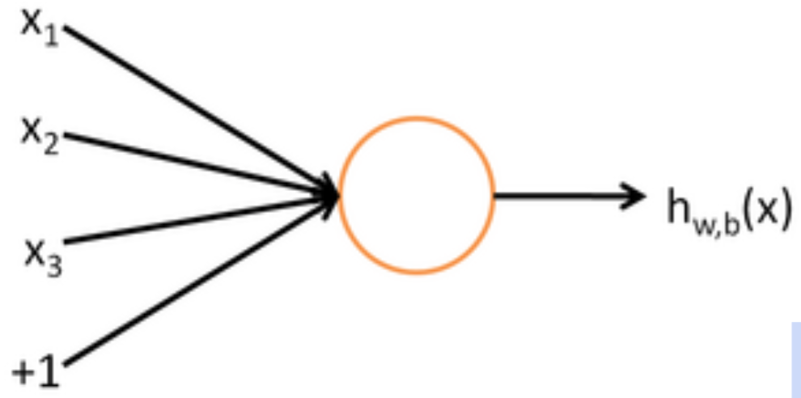
其中$$$h_{w,b}=G(WX+b),G(x)=sigmoid(X)=\frac{1}{1+exp(-x)}$$$

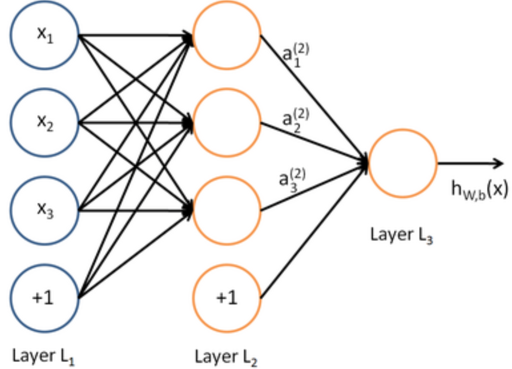

因此，我们称NN为一个同事运行多个LR model的model。
### 定义Cost函数
由前面backgroup可知，NN每一个unit都是一个LR model。因此，我们定义其cost函数也与LR类似：
$$Logistic Cost Function: J(\theta)=\frac{1}{m}[\sum_{i=1}^{m}y^{(i)}log(h_{\theta}(x^{(i)}))+(1-y^{(i)})log(1-h_{\theta}{(x^{(i)}})]+\frac{\lambda}{2m}\sum_{j=1}^{n}\theta_{j}^{2}$$
这里其实只是一个针对LR的一个变体，其实质其实为cross entropy，可写为：
$$J(\theta) = \frac{1}{m}\sum_{i=1}^{m}y^{(i)}log(\hat y^{(i)})+\frac{\lambda}{2m}\sum_{j=1}^{n}\theta_{j}^{2}$$

NN也是采用这样的一个Cost函数，只不过是在每一个unit中计算cost，然后做weight的更新，NN整体的cost函数：$$$J(\theta) = \frac{1}{m}\sum_{i=1}^{m}\sum_{k=1}^{K}y_{k}^{(i)}log(\hat y_{k}^{i})+\frac{\lambda}{2m}\sum_{l=1}^{L}\sum_{i=1}^{s_{l}}\sum_{j=1}^{s_{l+1}}(\theta_{ji}^{l})^2$$$

###ForwardPropagation
当我们有一个NN和原始的数据后，NN是如何工作，如何学习到最适合地权重，来对各种不同的任务进行处理呢。其中，主要分成两个部分：forwardPropagation和backpropagation。
其中forwardPropagation逻辑比较简单，相当于从上一层传递权重到下一次，unit每次从输入调整到输出，多层上进行调整，直到输出层。
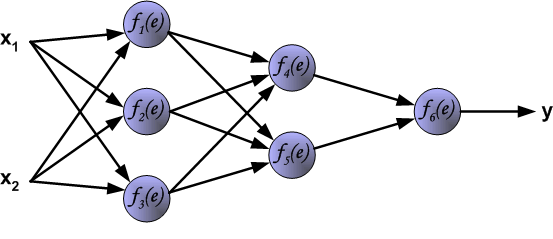
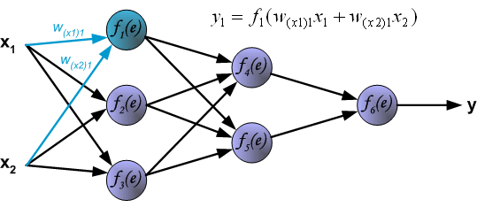
...
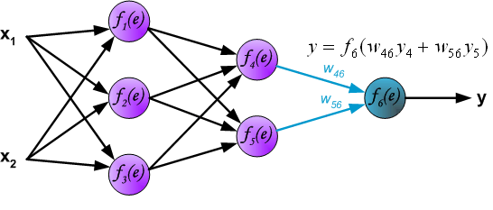
```
	F1 = sigmoid(X.dot(W1) + b1)
	F2 = sigmoid(f1.dot(W2)+b2)
	scores = softmax(f2.dot(W3) + b3)
```
这里我们使用sigmoid对节点得到的上层的输入数据做一个类似于0-1的转换，这里还有很多其他类似的函数，比如tanh、relu等等，如想深入了解可以看看[keras的activations的文档](http://keras.io/activations/)

###BackPropagation
相对于FowardPropagation来说，BackPropagation比较复杂，而且涉及到一些基本的数学知识，比如梯度下降。
如果你准备好了，就接下来往下看吧：
FP到输出层后，我们可以对比当前状态下的model参数最终产生的输出**z**与真实数据labels **y**的残差：
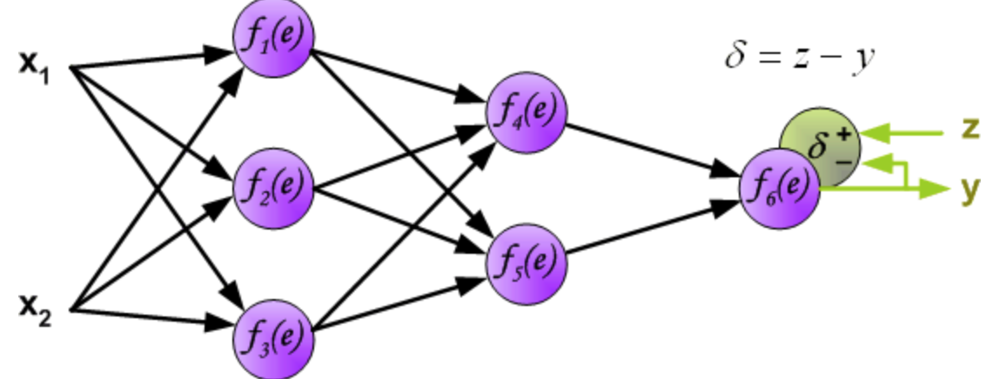
然后反向传播残差：
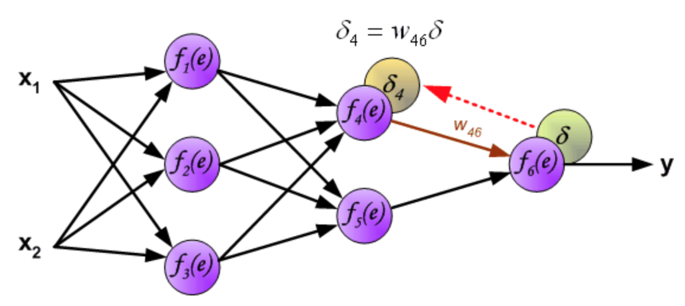
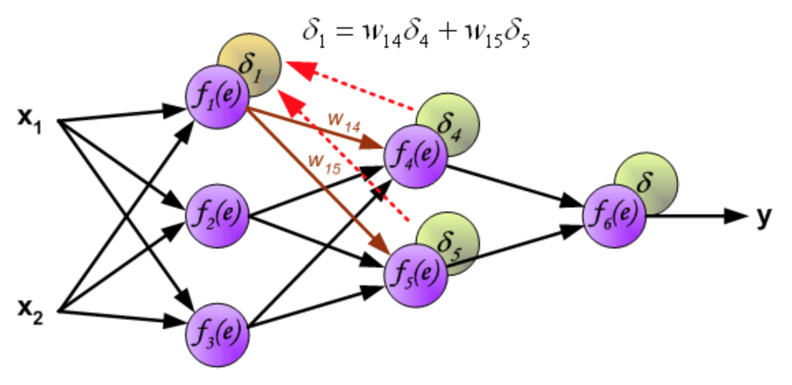
到输入层后，对输入层到下一层之间做权重更新
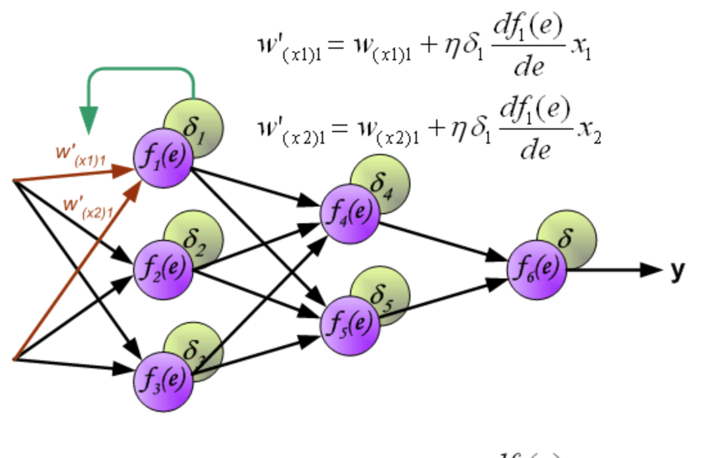
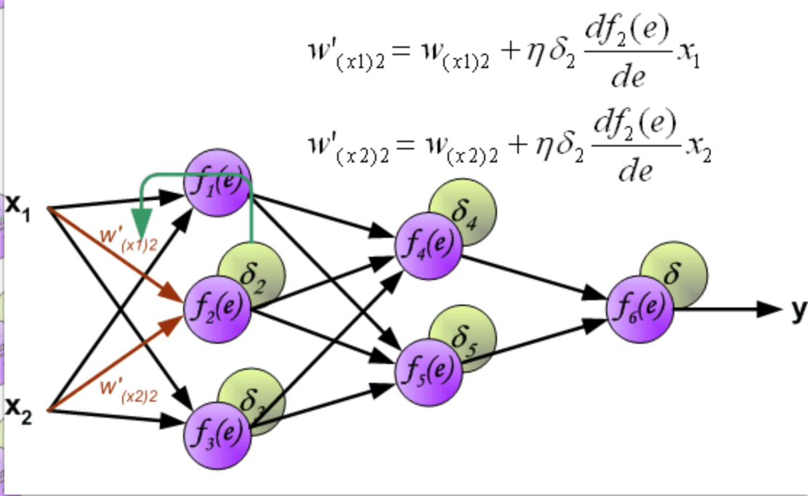

so，为什么要向图中那样更新呢？这里有一套严谨的数学推导：
这里，定义NN的总误差为：$$$E=\frac{1}{2}(y-z)^2$$$

为什么不用前面提到的Cross-entropy的方式？这里不作深究，只能说，他们实质是一样的。
其实，NN的总体模型就是更新参数来最小化E，$$$\Delta W \propto \frac{\partial E}{\partial W}$$$

每一层按照$$$W_{ij}^{l}= W_{ij}^{l}+\Delta W_{ij}^{l}=W_{ij}^{l}-\alpha \frac{\partial E}{\partial W_{ij}^{l}}$$$

因此，我们需要求出E对W的偏导才能对参数做更新
在最后一层中：
$$\delta_{i}^{(L)} = \frac{\partial E}{\partial z_i^{(l)}}=\frac{\partial \frac{1}{2}(y-S_i^{(L)})^2}{\partial z_i^{(l)}}=\frac{\partial [\frac{1}{2}(y-f(z_i^{(L)}))^2]}{\partial z_i^{(L)}}= (f_i^{(L)}-y)\cdot f{’}(z_i^{(L)})$$
对于前面每一层来说：
$$\delta_{i}^{(l)} = \frac{\partial E}{\partial z_i^{(l)}}=\sum_{j}^{N^{(l+1)}} \frac{\partial E}{\partial z_j^{(l+1)}} \cdot \frac{\partial z_j^{(l+1)}}{\partial z_i^{(l)}}\\ = \sum_{j}^{N^{(l+1)}} \delta_{j}^{(l+1)}\cdot \frac{\partial [\sum_{k}^{N^{l}}W_{jk}\cdot f(z_k^{(l)})] }{\partial z_i^{(l)}},i\in k\\ =\sum_{j}^{N^{(l+1)}} (\delta_{j}^{(l+1)}\cdot W_{ji}) \cdot f{'}(z_i)$$
故最终，参数的更新为：
$$\frac{\partial E}{\partial W_{ji}^{l}} = \frac{\partial E}{\partial z_i^{(l+1)}}\cdot \frac {\partial z_i^{(l+1)}}{\partial W_{ji}^{l}} =\delta_i^{(l+1)}\cdot a_j^{(l)}$$

$$ W_{ji}^{l} = W_{ji}^{l}-\alpha\cdot \delta_i^{(l+1)}\cdot a_j^{(l)}$$
到这而基本上就讲完了，下面是对nn的一个简单的实现

###code
backPropagrate逻辑相对比较复杂，贴出代码，想要NN的用来做鸢尾花分类的demo，请移步[simpleML](https://github.com/burness/simpleML)
```
def backpropagate(self, W, o, t, learning_rate, alpha=0.9):
        '''
            Perform single optimization step for weights W of network from input x.
            Weights are updated in steepest descent direction using backpropagation.
        '''
        W_count = len(W)
        d_W = self.create_d_W_array(W)
        deltas = [[] for i in range(0, W_count)]
        # Iterate through all weight layers
        for l_rev, w in enumerate(reversed(W)):
            # Define parameters
            l = W_count - l_rev - 1
            n_neurons = w.shape[0]
            n_out = w.shape[1]

            # Get output
            o_in  = np.concatenate((o[l], [1]))
            o_out = o[l+1]

            # Define bool
            is_output_layer = (l == (W_count - 1))

            # Iterate through each edge going out of neuron i
            for j in range(0, n_out):
                # Define neuron output values
                o_j = o_out[j]

                # 输出层
                if is_output_layer:
                    # neuron j is in output layer
                    d_j = (t[j] - o_j)*o_j*(1-o_j)
                    deltas[l_rev].append(d_j)
                else:
                    # 隐层
                    d_j = o_j*(1-o_j)*np.sum(deltas[l_rev-1]*W[l+1][j,:])
                    deltas[l_rev].append(d_j)

                # Iterate through each neuron in layer l
                for i in range(0, n_neurons):
                    # Calculate delta_j
                    o_i = o_in[i]

                    # Compute step
                    d_w_ij = learning_rate*d_j*o_i + alpha * d_W[l][i,j]

                    # Update weight
                    w[i,j] = w[i,j] + d_w_ij
            deltas[l_rev] = np.array(deltas[l_rev])
        return W

```
实验结果：
代码当为hidden层数为1的model，最终training accuracy为0.96，改变hidden中unit个数以及其中的learning_rate、正则系数alpha，都可能使模型更优。
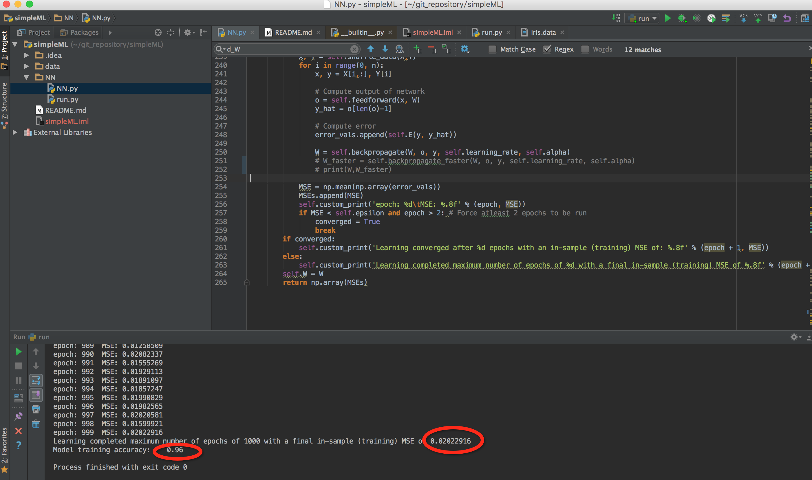

###Reference

1.[Stanford机器学习---第五讲. 神经网络的学习 Neural Networks learning](http://blog.csdn.net/abcjennifer/article/details/7758797)
2.[Keras Activations](http://keras.io/activations/)
3.[Principles of training multi-layer neural network using backpropagation](http://galaxy.agh.edu.pl/%7Evlsi/AI/backp_t_en/backprop.html)


