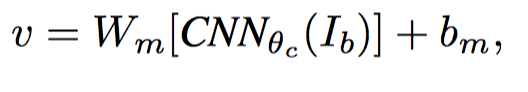
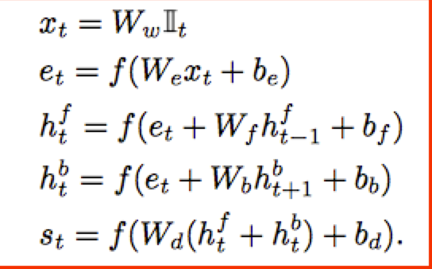
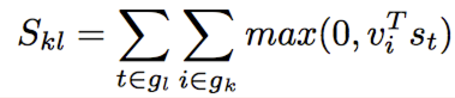
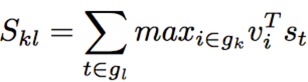
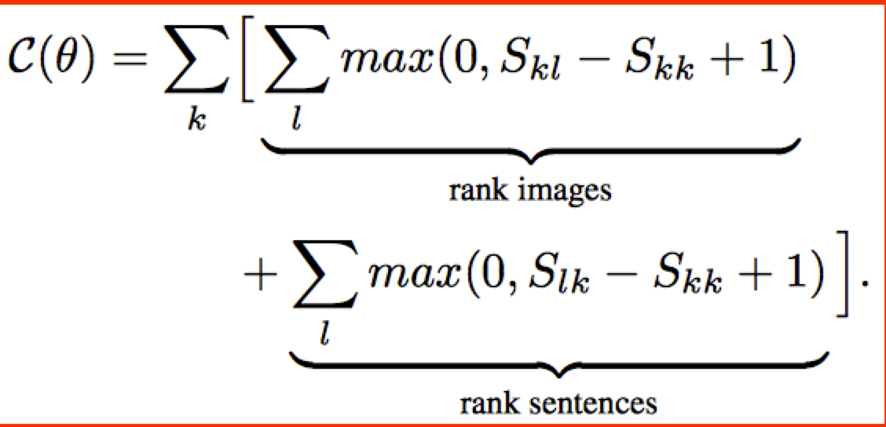
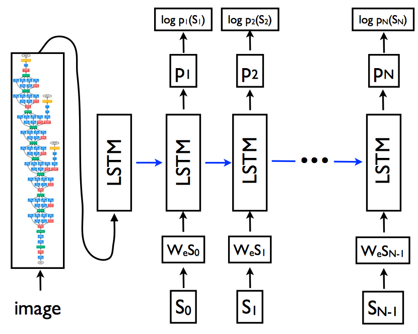
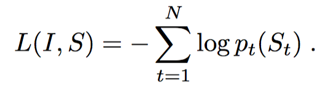
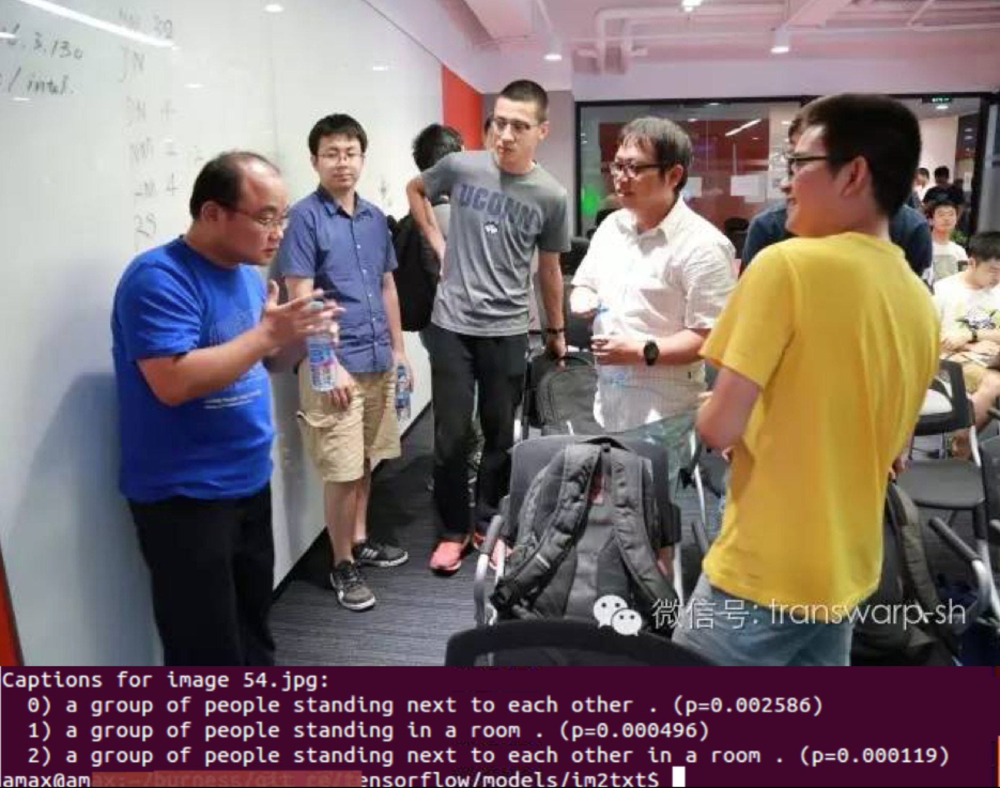

##前言
如何对图像进行文本描述是人工智能中，计算机视觉与自然语言处理的交叉学科，前端时间TensorFlow官方model中有推出[Neural Image Caption](https://github.com/tensorflow/models/tree/master/im2txt),之前也在南京deeplearning meetup分享中提到这块的东西，因为当时还没有跑完，没有做进一步描述，这段时间也在仔细看了相关的几篇paper和项目，主要是stanford的[neuraltalk](https://github.com/karpathy/neuraltalk)，[neuraltalk2](https://github.com/karpathy/neuraltalk2),[Deep Visual-Semantic Alignments for Generating Image Descriptions](http://cs.stanford.edu/people/karpathy/cvpr2015.pdf),[Show and Tell: Lessons learned from the 2015 MSCOCO Image Captioning Challenge](https://arxiv.org/pdf/1609.06647.pdf),[Show and tell: A neural image caption generator](https://arxiv.org/pdf/1411.4555.pdf)。算是对Image Caption做了一个基本的了解，接下来这篇文章会详细描述下如何做Image Caption这一项集合了计算机视觉与自然语言处理工作的任务。

##Paper原理
主要对比了Google和stanford的两篇paper，感觉差不多，感觉stanford的paper写的更详细、更细节；基本上包括以下几个部分：

### Representing images
[Deep Visual-Semantic Alignments for Generating Image Descriptions](http://cs.stanford.edu/people/karpathy/cvpr2015.pdf)这篇paper里面使用的RCNN(Region Convolu- tional Neural Network)([Rich feature hierarchies for accurate object detection and semantic segmentation](https://arxiv.org/pdf/1311.2524v5.pdf)),主要用来做object detection，使用的是ImageNet 200 classes的pre-trained的model，使用top 19个检测的位置加上全图，然后计算每一个bounding box的所有像素通过pre-trained模型后到分类器的4096维向量，即将bounding box下的所有像素做CNN的计算，类似于做特征表示：

经过改公式后每一张图像可以表示为{v_i,|i=1,..,20}，W_m是h*4096的矩阵，作者实验中h在1000到1600之间，每一张图像可以由20个h维向量表示。

Google的paper中，直接把inception-v3最后分类之前的向量表示作为Image的representation，认为这部分的Image representation已经有足够的表征力了，在这部分处理的很简单。可以看看ShowAndTellModel 和ops下的image_embedding，im2txt中使用的是slim，这里要看懂代码需要稍微了解下slim的model还有怎么读入model即可。

### Representing sentences
传统的方法是讲所有的独立的词映射为词向量，但是这类方法没有考虑词的顺序和句子中词的上下文信息。一种提升的方法是用二元组的方法，但是这个一定程度上也会有其他的问题，stanford那篇文章使用的是bidirectional Recurrent Neural Network（双向RNN？NLP这块我不是特别懂，有弄错的可以评论指出来下）去来算词向量，主要是建模单词序列的问题，将每一个词转换为h维向量，建模会考虑每一个单词的不定长的向下文影响：

W_w是使用word2vec生成的词的向量表示（在实际中，作者发现即使是使用随机初始化，最终结果的性能也相差不大），用来作为初始化，II_t是词在词库中的index， h_t^b和h_t^f分别从不同方向来建模context，最终的结果是词的表示会考虑到周围（前后）上下文的影响，这里就解决了如何去表示sentences。
### Alignment object
前面描述了如果将图像与和句子表示成为计算机能够理解的向量，这里文章中设定了一个image-sentence score来表示句子描述与图像匹配程度，，从里面有提到使用点乘，一种相似度度量的标准来作为图像和句子之间的得分：

而stanford的这篇paer中使用了一种简化的方法来衡量图像和句子的得分：

有了相似性度量的方法后，接下来是定义loss函数，也就是说定义怎么让计算机去找更优的目标函数：

图中S_kk表示训练数据中存在的image-sentence pair，这个公式实质感觉是感觉做了一个trade-off，双层循环遍历训练数据中的sentence之后在遍历image数据，来找最大化，这个目标函数的意思就是保证所有训练数据中的图像生成的sentences的得分最大化，能够保证aligned的image-sentences pairs相对于misaligned的image-sentences pairs有更高的得分。

而google的paper则是另外一种设计方法，和stanford的那篇paper不同的是，这里使用LSTM,建模前后依赖关系，而不像stanford的会在image和sentence向量化之后考虑最大化sentence-images pair的得分:

通过训练数据集中的image和sentence的向量化数据，建模sentence各个word之间的关系，通过最小化所有sentences的word的在每个LSTM step中的正确性：

整个设计考量比stanford的更简单，更粗暴。

## code
两篇paper都在github上有各自的开源项目：[neuraltalk](https://github.com/karpathy/neuraltalk)， [neuraltalk2](https://github.com/karpathy/neuraltalk2),这两个是torch的实现，基本源于上面说的stanford的paper， [im2text](https://github.com/tensorflow/models/tree/master/im2txt)，跑了下各自的代码，谈谈个人感受吧，在测试多个图像之后，个人主观（纯属个人意见）感觉im2text的性能整体感觉不如neuraltalk2，从模型原理上来看不如stanford的那篇paper的模型设计严谨，而且RCNN可能在object detection下的性能更好的体现在对图像内容尤其是region信息这块，后续的与此相应地相似度度量设计和目标函数的设计，主观上感觉更加严谨，不过这个是我的个人感觉，可能完全不正确，希望看到这篇博客的对image caption研究比较深的能够给点对比意见。再从代码可读性来说，可能我python和tensorflow比较熟，所以感觉代码这块im2text写的比较好，代码量不多，大家有兴趣的可以感受下，不过如果要重现结果的话，还是用点比较好的GPU，我使用k20，跑了大概两周到三周的样子。
照例贴出一些跑的例子：

