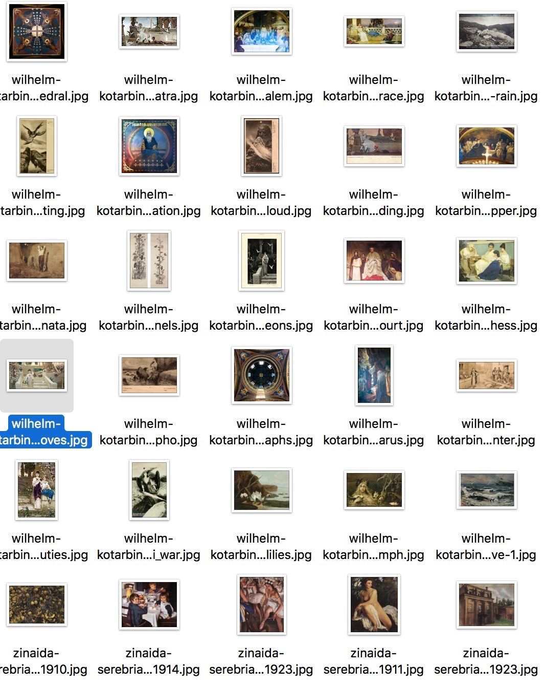
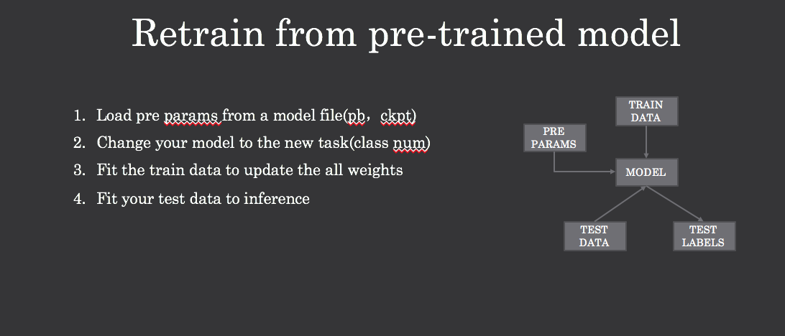
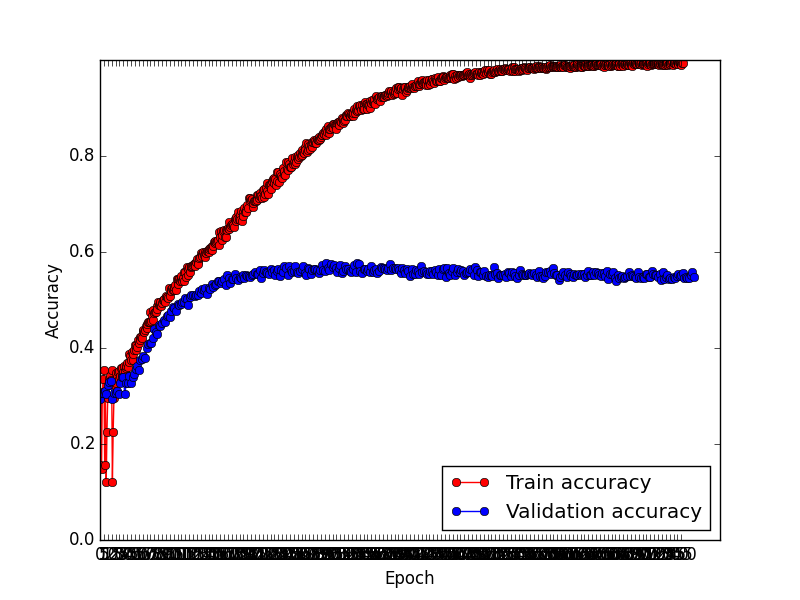
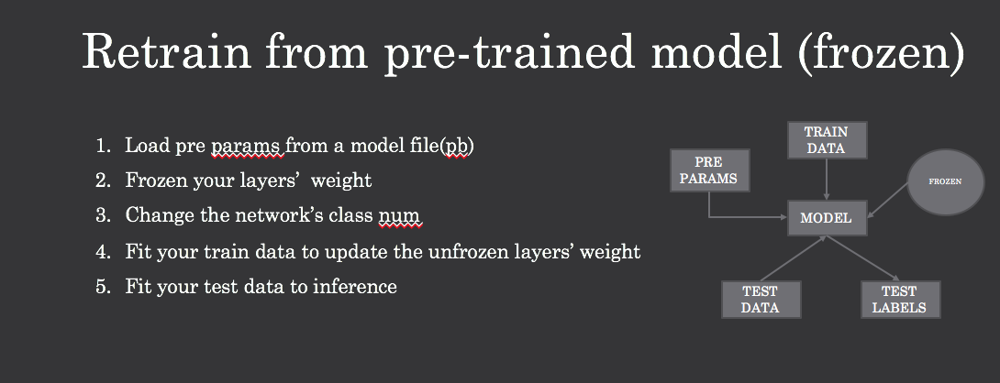

## 前言
前面一篇[MXnet初体验之inception-resnet-v2从Model到Predict](http://hacker.duanshishi.com/?p=1733)介绍了如何使用MXnet定义inception-resnet-v2，然后在102flowers数据集上对模型进行训练，然后这种train from scratch的方式在小数据集上效果不好，尤其是在数据分布差异化很大的场景下（flowers数据集只是花，数据相对分布比较一致，所以效果还不错），然后就有了pre-trained+finetuning的方法，pre-trained+finetuning通常有两种方式：
 - 载入模型，和train from scratch不同的是，初始化不再是随机，而是载入已在大规模数据集上pretrained的模型，修改模型配置，比如分类数目，然后训练更新模型参数；
 - 载入模型，和第一种不同的时，会限制一些层，使一些层frozen，不再更新，只更新少量部分；

下面我会就两种方法如何在MXnet上实现，做一个简单的分享， 数据集使用的是wikiart，我这里会将处理好的数据集放到百度云盘，整个数据集分为10类style，总共图片10000张，为啥要用wikiart呢,因为这里有个线上课程用caffe+alexnet pretrained model来完成相应的homework，所以我也想尝试下，下图是该数据集中的部分图片:

## Pretrained + finetuing
这里有张图是之前在南京Meetup和极视角微信群视频分享的时候的图，很容易解释pretrained + finetuning的逻辑：

### Pretrained Model Download
首先，我们会download在ImageNet上pretrained的模型，这里我们使用Inception-v3这个模型， mxnet上有个Tensorflow转成mxnet的模型可以直接拿来用:[Inception-V3 Network](https://github.com/dmlc/mxnet-model-gallery/blob/master/imagenet-1k-inception-v3.md)。
`wget http://data.dmlc.ml/mxnet/models/imagenet/inception-v3.tar.gz`

### How to use your Dataset
和前面一样，将数据集转换为binary file，具体参考[How to covert the dataset to binary file](https://github.com/burness/mxnet-101/tree/master/day2)，有很详细的如何使用im2rec的指南，切记在生成lst文件的时候保证做过shuffle处理。

### Change Your Network

前面下载下来的model是ImageNet的pretrained的model，因此，最后层的输出类别数是1000， 前面提到我们的wikistyle的类别数是10类，因此网络如果直接使用的话很显然会存在问题，所以我们这里需要修改最后一层的分类数，tensorflow中很容易，各种不同的api有不同的做法，我之前有用过在上海bot比赛使用，slim更简单只需要将restore_logits设置为False，相应的操作会在网络构造的layer中使restore参数为false，之后再讲改成的输出修改为对应的数据类别数即可，具体实现可以关注[inception on tensorflow](https://github.com/tensorflow/models/blob/master/inception)，其中inception_model.py Line 249：

	aux_logits = tf.identity(end_points['mixed_17x17x768e'])
    with tf.variable_scope('aux_logits'):
        aux_logits = ops.avg_pool(aux_logits, [5, 5], stride=3,
                                  padding='VALID')
        aux_logits = ops.conv2d(aux_logits, 128, [1, 1], scope='proj')
        # Shape of feature map before the final layer.
        shape = aux_logits.get_shape()
        aux_logits = ops.conv2d(aux_logits, 768, shape[1:3], stddev=0.01,
                                padding='VALID')
        aux_logits = ops.flatten(aux_logits)
        aux_logits = ops.fc(aux_logits, num_classes, activation=None,
                            stddev=0.001, restore=restore_logits)

同理，在mxnet中我们也需要改变网络最后的输出，然后最后层的输出不从model文件中load即可，实现这样的步骤包含两个部分：

 - 将wikistyle数据集类别数传给symbol，构造最后fc时使用该类别数；
 - 修改最后fc的name，mxnet是通过layer的name来load对应的weights，但新layer与model文件中name不一致时，会重新初始化；

具体可以看mxnet github上的issue：[How to finetune mxnet model with a different net architecture? #1313](https://github.com/dmlc/mxnet/issues/1313)， "If a layer has different dimensions, it should have a different name, then it will be initialized by default initializer instead of loaded."
ok， 知道怎么做了很快就可以解决。
首先是Load pretrained的model参数权重（这里我为了方便直接把所有代码都贴出来，具体修改只需要关注FeedForward的initializer）：
**train_model.py**

	import mxnet as mx
    import logging
    import os

    def fit(args, network, data_loader):
        # kvstore
        kv = mx.kvstore.create(args.kv_store)

        # logging
        head = '%(asctime)-15s Node[' + str(kv.rank) + '] %(message)s'
        if 'log_file' in args and args.log_file is not None:
            log_file = args.log_file
            log_dir = args.log_dir
            log_file_full_name = os.path.join(log_dir, log_file)
            if not os.path.exists(log_dir):
                os.mkdir(log_dir)
            logger = logging.getLogger()
            handler = logging.FileHandler(log_file_full_name)
            formatter = logging.Formatter(head)
            handler.setFormatter(formatter)
            logger.addHandler(handler)
            logger.setLevel(logging.DEBUG)
            logger.info('start with arguments %s', args)
        else:
            logging.basicConfig(level=logging.DEBUG, format=head)
            logging.info('start with arguments %s', args)
            logger = logging

        # load model
        model_prefix = args.model_prefix
        if model_prefix is not None:
            model_prefix += "-%d" % (kv.rank)
        model_args = {}
        if args.load_epoch is not None:
            assert model_prefix is not None
            tmp = mx.model.FeedForward.load(model_prefix, args.load_epoch)
            model_args = {'arg_params' : tmp.arg_params,
                          'aux_params' : tmp.aux_params,
                          'begin_epoch' : args.load_epoch}

        if args.finetune_from is not None:
            assert args.load_epoch is None
            finetune_from_prefix, finetune_from_epoch = args.finetune_from.rsplit('-', 1)
            finetune_from_epoch = int(finetune_from_epoch)
            logger.info('finetune from %s at epoch %d', finetune_from_prefix, finetune_from_epoch)
            tmp = mx.model.FeedForward.load(finetune_from_prefix, finetune_from_epoch)
            model_args = {'arg_params' : tmp.arg_params,
                          'aux_params' : tmp.aux_params}

        # save model
        checkpoint = None if model_prefix is None else mx.callback.do_checkpoint(model_prefix, args.save_epoch)

        # data
        (train, val) = data_loader(args, kv)

        # train
        devs = mx.cpu() if args.gpus is None else [
            mx.gpu(int(i)) for i in args.gpus.split(',')]

        epoch_size = args.num_examples / args.batch_size

        if args.kv_store == 'dist_sync':
            epoch_size /= kv.num_workers
            model_args['epoch_size'] = epoch_size

        if 'lr_factor' in args and args.lr_factor < 1:
            model_args['lr_scheduler'] = mx.lr_scheduler.FactorScheduler(
                step = max(int(epoch_size * args.lr_factor_epoch), 1),
                factor = args.lr_factor)

        if 'clip_gradient' in args and args.clip_gradient is not None:
            model_args['clip_gradient'] = args.clip_gradient

        # disable kvstore for single device
        if 'local' in kv.type and (
                args.gpus is None or len(args.gpus.split(',')) is 1):
            kv = None

        # optimizer
        batch_size = args.batch_size
        # reference: model.FeedForward.fit()
        if kv and kv.type == 'dist_sync':
            batch_size *= kv.num_workers
        if args.finetune_from is not None:
            lr_scale = {}
            net_args = network.list_arguments()
            for i, name in enumerate(net_args):
                if args.dataset in name:
                    lr_scale[i] = args.finetune_lr_scale
            logger.info('lr_scale: %s', {net_args[i]: s for i,s in lr_scale.items()})

        params = args.finetune_from + '.params'
        model = mx.model.FeedForward(
            ctx                = devs,
            symbol             = network,
            num_epoch          = args.num_epochs,
            initializer        = mx.init.Load(params,default_init = mx.init.Xavier(factor_type="in", magnitude=2.34)),
            learning_rate = args.lr,
            momentum = 0.9,
            wd = 0.00001,
            **model_args)

        eval_metrics = ['ce']
        model.fit(
            X                  = train,
            eval_data          = val,
            kvstore            = kv,
            eval_metric = eval_metrics,
            batch_end_callback = mx.callback.Speedometer(args.batch_size, 50),
            epoch_end_callback = checkpoint)
        model.save(args.dataset)

为了不从model文件中load fc1的参数，修改fc1 name：
**symbol_inception-v3.py**

	"""

    Inception V3, suitable for images with around 299 x 299

    Reference:

    Szegedy, Christian, et al. "Rethinking the Inception Architecture for Computer Vision." arXiv preprint arXiv:1512.00567 (2015).

    """

    import mxnet as mx

    def Conv(data, num_filter, kernel=(1, 1), stride=(1, 1), pad=(0, 0), name=None, suffix=''):
        conv = mx.sym.Convolution(data=data, num_filter=num_filter, kernel=kernel, stride=stride, pad=pad, no_bias=True, name='%s%s_conv2d' %(name, suffix))
        bn = mx.sym.BatchNorm(data=conv, name='%s%s_batchnorm' %(name, suffix), fix_gamma=True)
        act = mx.sym.Activation(data=bn, act_type='relu', name='%s%s_relu' %(name, suffix))
        return act

    def Inception7A(data,
                    num_1x1,
                    num_3x3_red, num_3x3_1, num_3x3_2,
                    num_5x5_red, num_5x5,
                    pool, proj,
                    name):
        tower_1x1 = Conv(data, num_1x1, name=('%s_conv' % name))
        tower_5x5 = Conv(data, num_5x5_red, name=('%s_tower' % name), suffix='_conv')
        tower_5x5 = Conv(tower_5x5, num_5x5, kernel=(5, 5), pad=(2, 2), name=('%s_tower' % name), suffix='_conv_1')
        tower_3x3 = Conv(data, num_3x3_red, name=('%s_tower_1' % name), suffix='_conv')
        tower_3x3 = Conv(tower_3x3, num_3x3_1, kernel=(3, 3), pad=(1, 1), name=('%s_tower_1' % name), suffix='_conv_1')
        tower_3x3 = Conv(tower_3x3, num_3x3_2, kernel=(3, 3), pad=(1, 1), name=('%s_tower_1' % name), suffix='_conv_2')
        pooling = mx.sym.Pooling(data=data, kernel=(3, 3), stride=(1, 1), pad=(1, 1), pool_type=pool, name=('%s_pool_%s_pool' % (pool, name)))
        cproj = Conv(pooling, proj, name=('%s_tower_2' %  name), suffix='_conv')
        concat = mx.sym.Concat(*[tower_1x1, tower_5x5, tower_3x3, cproj], name='ch_concat_%s_chconcat' % name)
        return concat

    # First Downsample
    def Inception7B(data,
                    num_3x3,
                    num_d3x3_red, num_d3x3_1, num_d3x3_2,
                    pool,
                    name):
        tower_3x3 = Conv(data, num_3x3, kernel=(3, 3), pad=(0, 0), stride=(2, 2), name=('%s_conv' % name))
        tower_d3x3 = Conv(data, num_d3x3_red, name=('%s_tower' % name), suffix='_conv')
        tower_d3x3 = Conv(tower_d3x3, num_d3x3_1, kernel=(3, 3), pad=(1, 1), stride=(1, 1), name=('%s_tower' % name), suffix='_conv_1')
        tower_d3x3 = Conv(tower_d3x3, num_d3x3_2, kernel=(3, 3), pad=(0, 0), stride=(2, 2), name=('%s_tower' % name), suffix='_conv_2')
        pooling = mx.symbol.Pooling(data=data, kernel=(3, 3), stride=(2, 2), pad=(0,0), pool_type="max", name=('max_pool_%s_pool' % name))
        concat = mx.sym.Concat(*[tower_3x3, tower_d3x3, pooling], name='ch_concat_%s_chconcat' % name)
        return concat

    def Inception7C(data,
                    num_1x1,
                    num_d7_red, num_d7_1, num_d7_2,
                    num_q7_red, num_q7_1, num_q7_2, num_q7_3, num_q7_4,
                    pool, proj,
                    name):
        tower_1x1 = Conv(data=data, num_filter=num_1x1, kernel=(1, 1), name=('%s_conv' % name))
        tower_d7 = Conv(data=data, num_filter=num_d7_red, name=('%s_tower' % name), suffix='_conv')
        tower_d7 = Conv(data=tower_d7, num_filter=num_d7_1, kernel=(1, 7), pad=(0, 3), name=('%s_tower' % name), suffix='_conv_1')
        tower_d7 = Conv(data=tower_d7, num_filter=num_d7_2, kernel=(7, 1), pad=(3, 0), name=('%s_tower' % name), suffix='_conv_2')
        tower_q7 = Conv(data=data, num_filter=num_q7_red, name=('%s_tower_1' % name), suffix='_conv')
        tower_q7 = Conv(data=tower_q7, num_filter=num_q7_1, kernel=(7, 1), pad=(3, 0), name=('%s_tower_1' % name), suffix='_conv_1')
        tower_q7 = Conv(data=tower_q7, num_filter=num_q7_2, kernel=(1, 7), pad=(0, 3), name=('%s_tower_1' % name), suffix='_conv_2')
        tower_q7 = Conv(data=tower_q7, num_filter=num_q7_3, kernel=(7, 1), pad=(3, 0), name=('%s_tower_1' % name), suffix='_conv_3')
        tower_q7 = Conv(data=tower_q7, num_filter=num_q7_4, kernel=(1, 7), pad=(0, 3), name=('%s_tower_1' % name), suffix='_conv_4')
        pooling = mx.sym.Pooling(data=data, kernel=(3, 3), stride=(1, 1), pad=(1, 1), pool_type=pool, name=('%s_pool_%s_pool' % (pool, name)))
        cproj = Conv(data=pooling, num_filter=proj, kernel=(1, 1), name=('%s_tower_2' %  name), suffix='_conv')
        # concat
        concat = mx.sym.Concat(*[tower_1x1, tower_d7, tower_q7, cproj], name='ch_concat_%s_chconcat' % name)
        return concat

    def Inception7D(data,
                    num_3x3_red, num_3x3,
                    num_d7_3x3_red, num_d7_1, num_d7_2, num_d7_3x3,
                    pool,
                    name):
        tower_3x3 = Conv(data=data, num_filter=num_3x3_red, name=('%s_tower' % name), suffix='_conv')
        tower_3x3 = Conv(data=tower_3x3, num_filter=num_3x3, kernel=(3, 3), pad=(0,0), stride=(2, 2), name=('%s_tower' % name), suffix='_conv_1')
        tower_d7_3x3 = Conv(data=data, num_filter=num_d7_3x3_red, name=('%s_tower_1' % name), suffix='_conv')
        tower_d7_3x3 = Conv(data=tower_d7_3x3, num_filter=num_d7_1, kernel=(1, 7), pad=(0, 3), name=('%s_tower_1' % name), suffix='_conv_1')
        tower_d7_3x3 = Conv(data=tower_d7_3x3, num_filter=num_d7_2, kernel=(7, 1), pad=(3, 0), name=('%s_tower_1' % name), suffix='_conv_2')
        tower_d7_3x3 = Conv(data=tower_d7_3x3, num_filter=num_d7_3x3, kernel=(3, 3), stride=(2, 2), name=('%s_tower_1' % name), suffix='_conv_3')
        pooling = mx.sym.Pooling(data=data, kernel=(3, 3), stride=(2, 2), pool_type=pool, name=('%s_pool_%s_pool' % (pool, name)))
        # concat
        concat = mx.sym.Concat(*[tower_3x3, tower_d7_3x3, pooling], name='ch_concat_%s_chconcat' % name)
        return concat

    def Inception7E(data,
                    num_1x1,
                    num_d3_red, num_d3_1, num_d3_2,
                    num_3x3_d3_red, num_3x3, num_3x3_d3_1, num_3x3_d3_2,
                    pool, proj,
                    name):
        tower_1x1 = Conv(data=data, num_filter=num_1x1, kernel=(1, 1), name=('%s_conv' % name))
        tower_d3 = Conv(data=data, num_filter=num_d3_red, name=('%s_tower' % name), suffix='_conv')
        tower_d3_a = Conv(data=tower_d3, num_filter=num_d3_1, kernel=(1, 3), pad=(0, 1), name=('%s_tower' % name), suffix='_mixed_conv')
        tower_d3_b = Conv(data=tower_d3, num_filter=num_d3_2, kernel=(3, 1), pad=(1, 0), name=('%s_tower' % name), suffix='_mixed_conv_1')
        tower_3x3_d3 = Conv(data=data, num_filter=num_3x3_d3_red, name=('%s_tower_1' % name), suffix='_conv')
        tower_3x3_d3 = Conv(data=tower_3x3_d3, num_filter=num_3x3, kernel=(3, 3), pad=(1, 1), name=('%s_tower_1' % name), suffix='_conv_1')
        tower_3x3_d3_a = Conv(data=tower_3x3_d3, num_filter=num_3x3_d3_1, kernel=(1, 3), pad=(0, 1), name=('%s_tower_1' % name), suffix='_mixed_conv')
        tower_3x3_d3_b = Conv(data=tower_3x3_d3, num_filter=num_3x3_d3_2, kernel=(3, 1), pad=(1, 0), name=('%s_tower_1' % name), suffix='_mixed_conv_1')
        pooling = mx.sym.Pooling(data=data, kernel=(3, 3), stride=(1, 1), pad=(1, 1), pool_type=pool, name=('%s_pool_%s_pool' % (pool, name)))
        cproj = Conv(data=pooling, num_filter=proj, kernel=(1, 1), name=('%s_tower_2' %  name), suffix='_conv')
        # concat
        concat = mx.sym.Concat(*[tower_1x1, tower_d3_a, tower_d3_b, tower_3x3_d3_a, tower_3x3_d3_b, cproj], name='ch_concat_%s_chconcat' % name)
        return concat

    def get_symbol(num_classes=1000, dataset='imagenet'):
        data = mx.symbol.Variable(name="data")
        # stage 1
        conv = Conv(data, 32, kernel=(3, 3), stride=(2, 2), name="conv")
        conv_1 = Conv(conv, 32, kernel=(3, 3), name="conv_1")
        conv_2 = Conv(conv_1, 64, kernel=(3, 3), pad=(1, 1), name="conv_2")
        pool = mx.sym.Pooling(data=conv_2, kernel=(3, 3), stride=(2, 2), pool_type="max", name="pool")
        # stage 2
        conv_3 = Conv(pool, 80, kernel=(1, 1), name="conv_3")
        conv_4 = Conv(conv_3, 192, kernel=(3, 3), name="conv_4")
        pool1 = mx.sym.Pooling(data=conv_4, kernel=(3, 3), stride=(2, 2), pool_type="max", name="pool1")
        # stage 3
        in3a = Inception7A(pool1, 64,
                           64, 96, 96,
                           48, 64,
                           "avg", 32, "mixed")
        in3b = Inception7A(in3a, 64,
                           64, 96, 96,
                           48, 64,
                           "avg", 64, "mixed_1")
        in3c = Inception7A(in3b, 64,
                           64, 96, 96,
                           48, 64,
                           "avg", 64, "mixed_2")
        in3d = Inception7B(in3c, 384,
                           64, 96, 96,
                           "max", "mixed_3")
        # stage 4
        in4a = Inception7C(in3d, 192,
                           128, 128, 192,
                           128, 128, 128, 128, 192,
                           "avg", 192, "mixed_4")
        in4b = Inception7C(in4a, 192,
                           160, 160, 192,
                           160, 160, 160, 160, 192,
                           "avg", 192, "mixed_5")
        in4c = Inception7C(in4b, 192,
                           160, 160, 192,
                           160, 160, 160, 160, 192,
                           "avg", 192, "mixed_6")
        in4d = Inception7C(in4c, 192,
                           192, 192, 192,
                           192, 192, 192, 192, 192,
                           "avg", 192, "mixed_7")
        in4e = Inception7D(in4d, 192, 320,
                           192, 192, 192, 192,
                           "max", "mixed_8")
        # stage 5
        in5a = Inception7E(in4e, 320,
                           384, 384, 384,
                           448, 384, 384, 384,
                           "avg", 192, "mixed_9")
        in5b = Inception7E(in5a, 320,
                           384, 384, 384,
                           448, 384, 384, 384,
                           "max", 192, "mixed_10")
        # pool
        pool = mx.sym.Pooling(data=in5b, kernel=(8, 8), stride=(1, 1), pool_type="avg", name="global_pool")
        flatten = mx.sym.Flatten(data=pool, name="flatten")
        if "imagenet" != dataset:
            fc1 = mx.symbol.FullyConnected(data=flatten, num_hidden=num_classes, name='fc1-'+dataset)
        else:
            fc1 = mx.symbol.FullyConnected(data=flatten, num_hidden=num_classes, name='fc1')
        softmax = mx.symbol.SoftmaxOutput(data=fc1, name='softmax')
        return softmax
这里get_symbol多了个dataset的参数，但dataset不是imagenet时，fc1的name不再是model里面的fc1，这样在处理时，该层不会从model文件中load，而是会重新初始化该层参数。

### Result

这边验证集大概到了差不多0.59+，准确率好低（这里我epoch设置太多了，后面train-accuracy很典型的过拟合了）
， 在Kaggle有个用alexnet做wikiart数据集的对比，accuracy最高的是0.53500， 我这边验证集也很少，只能达到0.59+，可能是这个任务比较难吧，我自己看了下数据集，反正我是分别不出来那幅画属于哪个流派。反正就是个流程吧，这里如果有人后面用inception-v3+finetuning能达到比较高的准确度，请与我联系。

## Pretrained + finetuing the Last layer's params

很多时候，由于计算力的限制，我们甚至都不需要更新模型所有层的参数，我们认为基于ImageNet数据集的特征表征能力已经足够强，可能在某些数据集上已经有了足够的表示能力，我们可以选择将其中某些层的参数frozen，使其不再更新，只更新部分layer的参数，下面我们会frozen除fc1外的所有参数，直接利用pretrained的大部分参数。
其实方法很简单，就是直接把最后一层的输入拉出来，作为所有图像的features，直接作为新的全连接层的输入来更新全连接层的参数。这里比较简单，直接参考
[cifar10-recipe.ipynb on mxnet](https://github.com/dmlc/mxnet/blob/1931cf591d40b5191fa8027d11c882ed7db8d145/example/notebooks/cifar10-recipe.ipynb) 最后一块，把图的所有的feature maps拉出来，然后构造简单的一层fc+softmax去做新的分类，这里就不实践了

## Summary
好受打击呀！！！！本来看到MXnet上没有特别好的finetuning的例子，才写的这篇文章，今天再一看MXnet，李沐大神已经把example image-classification的这部分代码重构了，直接扔了个finetuning的例子,大家要想看finetuning的还是直接去官方看如何做finetuning，.
不过照例也总结一下：
Mxnet更改新的layer的name，来使该层参数不load原有checkpoint中的参数，而tensorflow的有高层api如slim或者我比较熟悉的tflearn，会有对每层有一个是否restore的参数，这两种方法感觉原理都差不多，但是感觉后者在接口的易用性上会更高点，前者会更贴近实现的底层（通过name restore对应的模型文件中的参数值）。

**PS**
在李沐大神写重构代码之前，确实finetuning比较麻烦，文档没有，是在issue里面看到DMLC的一些小伙伴的指导才一步步试清楚怎么做finetuning，不过MXnet短短1年多能够做到大部分功能都支持已经很棒了。最近工作内容focus在Super-Resolution，用Tensorflow写了SRCNN的model:[tf_super_resolution](https://github.com/burness/tf_super_resolution), 也打算工作之余用mxnet重构下，之前tensorflow上实现的SRCNN，还是会发现MXnet现在在易用性上确实和tensorflow差了一点，现在在mxnet上重构SRCNN这类任务时发现了一些可能会需要改善或者说mxnet比较独特的一些地方：

 - 因为SRCNN的训练数据和普通的图像分类不太一样，输入数据是low-resoltion的图像，label信息是正常图像，这样，原来的做dataiter就不好使用，看了下项亮的基于mxnet的OCR的是一个实现[ocr on mxnet](https://github.com/xlvector/learning-dl/tree/master/mxnet/ocr)，大概知道需要自己去实现下SRIter，正在看MXnet源上的NDArrayIter来参考这部分重写一下，但是也希望MXnet能早点吧自定义训练数据结构的example写出来一个(tf里面有很多example教怎么构造不同任务的自定义训练数据结构)，或者把自定义训练数据搞出个高效的接口，毕竟大部分像我这样搞算法的小伙伴在写代码的能力上还是差点。
 - 另一个问题就是自定义loss的问题，原来的image-classification上的example中，没有写如何去定义一个loss，然后通过类似于sgd的优化手段去minimize,不过没有关系，mxnet的neural style实现里面有自定义content loss, style loss,然后去最小化，但是相比tensorflow，这里接口也不是特别友好，tf可以很简单地两句，来完成这样的 功能：`loss = tf.sqrt(tf.reduce_mean(tf.square(tf.sub(labels, gen_outputs)))) train_op = tf.train.MomentumOptimizer(0.0001, 0.9).minimize(loss=loss, global_step=global_step)`。

有大神看到这篇文章，在mxnet上有过这两部分经验的地方希望给点指导，有文档的更好，谢谢
最后希望MXnet越来越好，大神们努力添砖加瓦，我们也跟着好好学习学习， 还有之前的inception-resnet-v2被merge了，很开心呀\^_^
