##Spark构建分类器
在本章中，我们会了解基本的分类器以及在Spark如何使用，以及一套如何对model进行评价、调参。MLlib在这一块还是比较强大的，但是对比sklearn无论是算法种类以及配套功能还是有很大的差距。不过，据传spark最近正在修改ml，参考sklearn中的pipeline框架，将所有对数据的操作写成一个管道，在model的选择、调参、评估将更加方便，像sklearn一样,下面是一些Kaggle比赛当中的一些代码，用一个Pipeline把数据流的所有操作集合在一起，这样就很方便地进行调参。
```
clf = pipeline.Pipeline([
    ('union', FeatureUnion(
            transformer_list = [
                ('cst',  cust_regression_vals()),
                ('txt1', pipeline.Pipeline([('s1', cust_txt_col(key='search_term')), ('tfidf1', tfidf)])),
                ('txt2', pipeline.Pipeline([('s2', cust_txt_col(key='product_title')), ('tfidf2', tfidf), ('tsvd2', tsvd)])),
                ('txt3', pipeline.Pipeline([('s3', cust_txt_col(key='product_description')), ('tfidf3', tfidf), ('tsvd3', tsvd)])),
                ('txt4', pipeline.Pipeline([('s4', cust_txt_col(key='brand')), ('tfidf4', tfidf), ('tsvd4', tsvd)]))
            ],
            transformer_weights = {
                'cst': 1.0,
                'txt1': 0.5,
                'txt2': 0.25,
                'txt3': 0.0,
                'txt4': 0.5
            },
            n_jobs = 1
    )),
    ('xgbr', xgbr)])

```

下面我们将分为以下几部分来聊下Spark MLlib中的分类器模块：
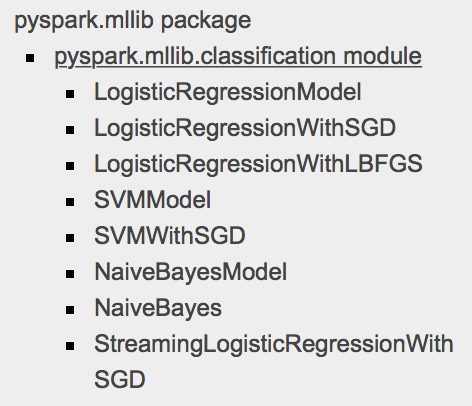

 - 了解MLlib中支持的基本的分类器算法
 - 利用Spark从原始数据当中提取特征
 - 利用MLlib训练各种有代表性的模型
 - 使用训练好的模型对数据进行预测
 - 使用标准的评估手段对分类器模型来进行评估
 - 使用一些数据处理的方法来提升model性能
 - 探索在Spark MLlib如何进行Hyperparameter tuning，以及使用CV，来选择对应最优参数

### MLlib中支持的分类器算法
#### Linear models
线性模型，顾名思义，在空间定一条直线来分割数据，从而来对数据进行判断，基本的model：
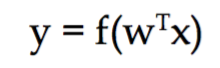
其中，y是目标变量，w是model的权重向量，x是输入的特征向量。这里我们可以变化f来更改model。
f确定后，一般会对应的decost函数。然后，我们在权重向量的参数空间寻优，找到cost函数值最小的一组最优参数，常用的cost函数包括logistic loss（logistic regression）、hinge loss（Linear Support Vector）以及最常见的Zero-one loss:
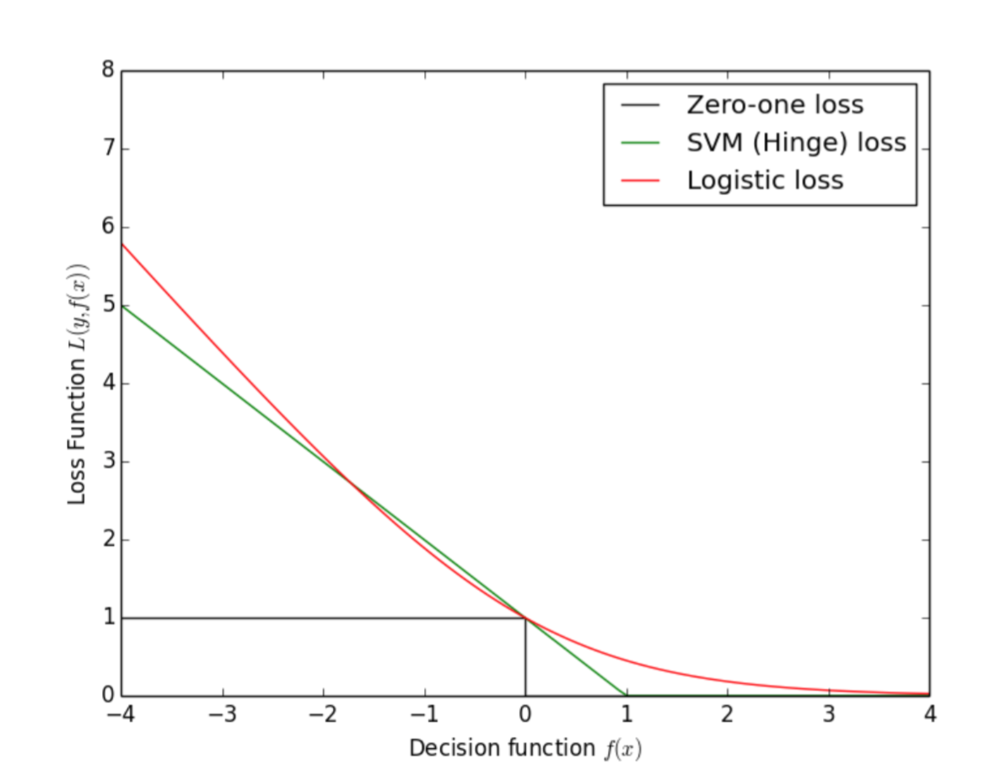
##### Logistic regression
在Logistic Regression中，f就是所谓的sigmoid函数：
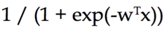
##### Linear Support Vector Machines
在线性支持向量机中，f就是一个对等函数（？这里其实我也不知道为啥是这个名字），也就是本身：
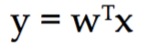
在Linear Support Vector Machines中，我们使用的cost函数为**hinge loss**：
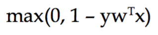
Logistic Regression和Support Vector Machines的分割线示意图：
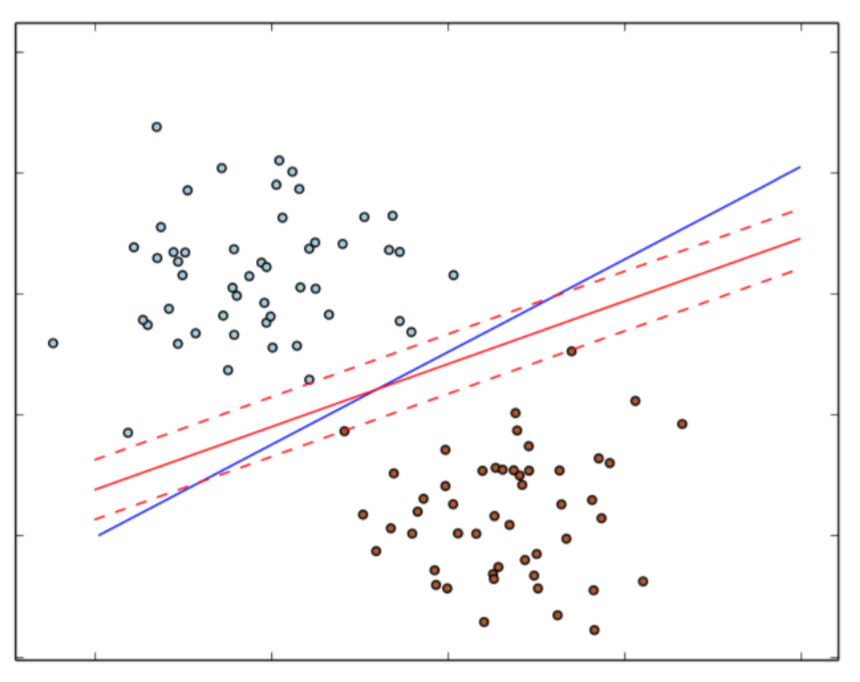
#### Naive Bayes Model
Naive Bayes要求特征质检条件独立，是一种实际当中应用很多的分类方法
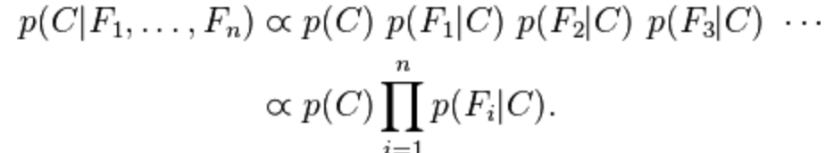
特征之间的属于类变量的概率相互独立，然后计算所有类变量，选择概率最大的那个C即是我们分给的类别。
一个简单的二值分类器的结果：
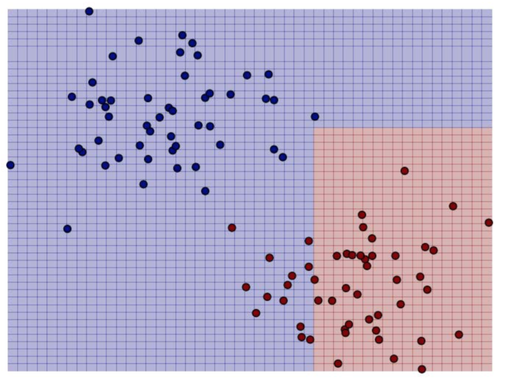

#### Decision trees
决策树的基本原理就是通过某些metrics选出最重要的属性node来对数据进行分割，然后依次进行分割，决策树是一个很流行的算法，也是一种很容易过拟合的算法，为了减少过拟合的产生，有其他ensemble的高级版，如Random Forest、GBDT，用来增强决策树算法的性能和鲁棒性
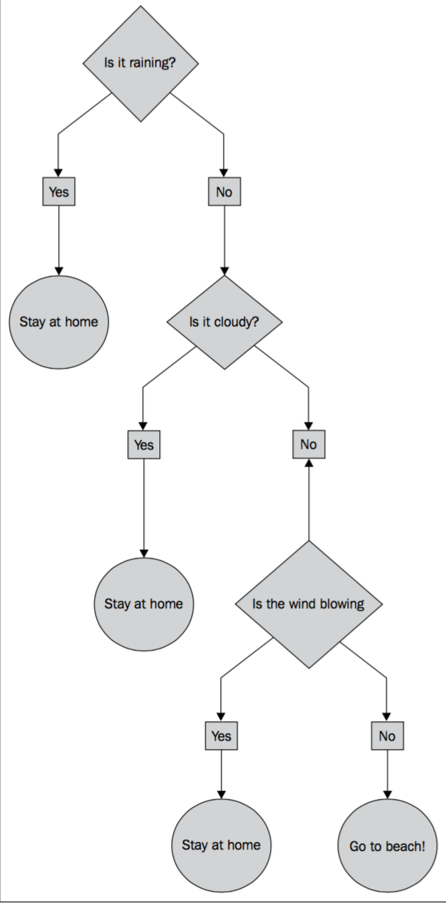
一个简单的决策树
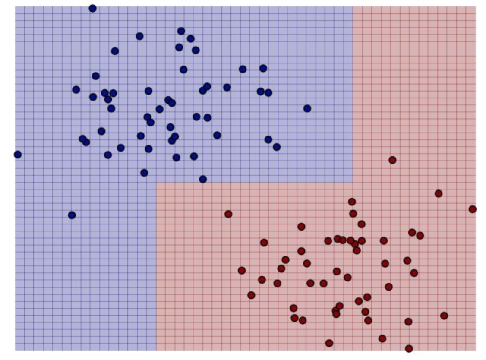

### 从原始数据中提取合适的特征
在Supervised Learning中，提供LabeledPoint数据类型，
```
case class LabeledPoint(label: Double, features: Vector)
```
#### 从Kaggle StumbleUpon evergreen Dataset提取features
```
# 去掉train中的header信息
!sed 1d ../data/evergreen_classification/train.tsv > ../data/evergreen_classification/train_noheader.tsv
# 读入数据，以\t分割
rawData = sc.textFile('../data/evergreen_classification/train_noheader.tsv')
records = rawData.map(lambda x : x.split('\t'))
records.take(4)
```
数据内容如图：

取其中有用字段，并做初步处理（将？取代为0.0）
```
from pyspark.mllib.regression import LabeledPoint
from pyspark.mllib.linalg import Vectors
trimmed = records.map(lambda x: [xx.replace('\\',' ') for xx in x])
# data.first()
label = trimmed.map(lambda x : x[-1])
# label.take(5)
# features =  trimmed.map(lambda x: x[4:-1]).map(lambda x: [ 0.0 if x=='?' else float(xx.replace("\"","")) for xx in x])
# data = LabeledPoint(label,Vectors.dense(features))
# data = trimmed.map(lambda x:(x[-1],x[4:-1])).map(lambda (x,y): (x,[ 0.0 if yy =='?' else float(yy.replace("\"","")) for yy in y])).map(LabeledPoint(label,features))
# ?号时，文本里面存的是"?"
data = trimmed.map(lambda x:(x[-1],x[4:-1])).map(lambda (x,y): (x.replace("\"","") ,[ 0.0 if yy =='\"?\"' else yy.replace("\"","") for yy in y])).map(lambda (x,y):(int(x),[float(yy) for yy in y])).map(lambda (x,y):LabeledPoint(x,Vectors.dense(y)))
# features.take(5)
data.take(5)
```

这里有一个小的细节就是里面存的是"123"而非123，在做处理时需要注意，这里代码写的比较粗糙，就先这样看看，后面再做类似处理的时候回先把这些""处理掉，scala的代码中没有出现问题，具体不知道为什么，不过这个是小问题，注意下就可以了，这里就生成了后面做分类的数据结构LabeledPoint，很简单是不是。
下面，我们意义处理下nbData，为后面做Naive Bayes的数据，因为NB中是不允许存在负数的，这个很好理解，概率是不存在负的，对吧，但是数据当中有些，这里我们先不看具体意义，直接和书上一样，把负数做0.0处理，实际当中可能需要具体了解数据库，或者可能会对原先的数据进行一个概率统计才能用相关的Naive Bayes的算法。
```
# naive bayes要求feature为非负features
nbdata = trimmed.map(lambda x:(x[-1],x[4:-1])).map(lambda (x,y): (int(x.replace("\"","")) ,[ 0.0 if yy =='\"?\"' else float(yy.replace("\"","")) for yy in y])).map(lambda (x,y): (x,[0.0 if yy<0 else yy for yy in y])).map(lambda (x,y):LabeledPoint(x,Vectors.dense(y)))
# nbdata = trimmed.map(lambda x:(x[-1],x[4:-1])).map(lambda (x,y): (x.replace("\"","") ,[ 0.0 if yy =='\"?\"' else yy.replace("\"","") for yy in y])).map(lambda (x,y):(int(x),[float(yy) for yy in y])).map(lambda (x,y):[0.0 if yy<0  else float(yy) for yy in y]).map(lambda (x,y):LabeledPoint(x,Vectors.dense(y)))
print nbdata.take(5)
# nbdata.cache
```

### 模型训练
这部分，我们直接调用Spark MLlib里面的分类器的接口，然后训练好对应的LR、SVM、NB、DT

```
#Training a classifier using logistic regression, SVM, naïve Bayes, and a decision tree
from pyspark.mllib.classification import LogisticRegressionWithSGD
from pyspark.mllib.classification import SVMWithSGD
from pyspark.mllib.classification import NaiveBayes
from pyspark.mllib.tree import DecisionTree
# import pyspark.mllib.tree.
numIteration = 10
maxTreeDepth = 5
numClass = label.distinct().count()
print numClass
lrModel = LogisticRegressionWithSGD.train(data, numIteration)
svmModel = SVMWithSGD.train(data, numIteration)
nbModel = NaiveBayes.train(nbdata)
# dtModel = DecisionTree.trainClassifier(data,2,impurity='entropy')
dtModel = DecisionTree.trainClassifier(data,numClass,{},impurity='entropy', maxDepth=maxTreeDepth)
print lrModel
print dtModel
```

###使用模型对数据进行预测
直接调用predict，对数据进行预测，很简单，直接看代码：
```
# using these models
dataPoint = data.first()
prediction = lrModel.predict(dataPoint.features)
trueLabel = dataPoint.label
print 'The true label is %s, and the predict label is %s'%(trueLabel, prediction)
```
###模型评估
####Accuracy and Prediction Error
```
# Evaluating the classifier
lrTotalCorrect = data.map(lambda lp : 1 if(lrModel.predict(lp.features)==lp.label) else 0).sum()
svmTotalCorrect = data.map(lambda lp : 1 if(svmModel.predict(lp.features)==lp.label) else 0).sum()
nbTotalCorrect = nbdata.map(lambda lp: 1 if (nbModel.predict(lp.features) == lp.label) else 0).sum()
# dtTotalCorrect = data.map(lambda lp: 1 if (dtModel.predict(lp.features) == lp.label) else 0).sum()
# 要查下这里为什么会有问题，只能用后面的写法
# dtTotalCorrect = data.map(lambda lp: 1 if (dtModel.predict(lp.features) == lp.label) else 0).sum()
# predictionAndLabel = data.map(lambda lp: (dtModel.predict(lp.features),lp.label))
# print predictionAndLabel.take(5)
# dtTotalCorrect = predictionAndLabel.map(lambda (x,y): 1.0 if x==y else 0.0).sum()
# labels = data.map(lambda lp:lp.label).zip(prediction)


predictList= dtModel.predict(data.map(lambda lp: lp.features)).collect()
trueLabel = data.map(lambda lp: lp.label).collect()
# # diff = abs(predictList-trueLabel)
dtTotalCorrect = sum([1.0 if predictVal == trueLabel[i] else 0.0 for i, predictVal in enumerate(predictList)])
# dtTotalCorrect = sum(diff)
# print dtTotalCorrect
lrAccuracy = lrTotalCorrect/(data.count()*1.0)
svmAccuracy = svmTotalCorrect/(data.count()*1.0)
nbAccuracy = nbTotalCorrect/(1.0*nbdata.count())
dtAccuracy = dtTotalCorrect/(1.0*data.count())
print '------------data count: %s------------'%data.count()
print '------------lr Model Accuracy: %s------------'%lrAccuracy
print '------------svm Model Accuracy: %f------------'%svmAccuracy
print '------------nb Model Accuracy: %f------------'%nbAccuracy
print '------------dt Model Accuracy: %f------------'%dtAccuracy
print '-----------------------done-----------------------'

```
模型Accuracy：

#####Precision and Recall
有了前面的Accuracy，为什么又要多一个Precision and Recall呢？其实，评估标准在机器学习里面算是特别重要的一块，具体可以看看，需要指出的是，Precision and Recall在这篇文章中讲的是Ranking Metrics，原理差不多都是一个准确率和召回率的综合考虑,抛开召回率，单独谈准确率是一个非常不专业的行为，下图是一个spark中各种metrics的基本解释：
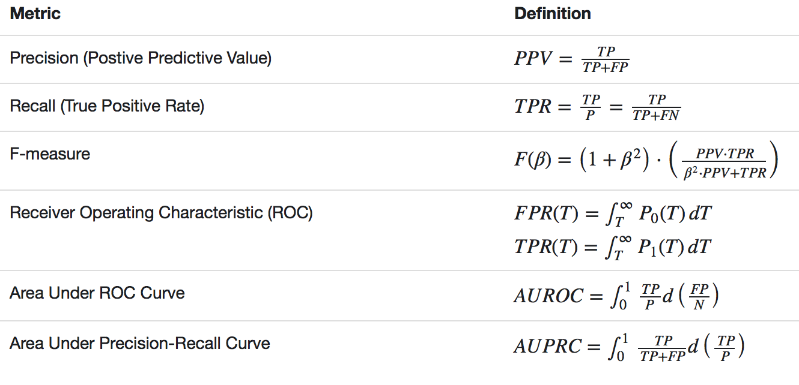
一个分类器的Percision-recall curve:
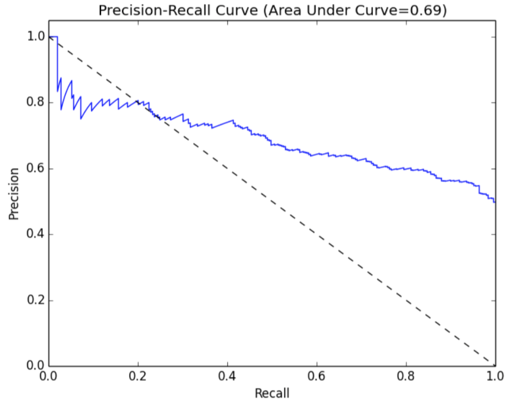
#####ROC curve and AUC
ROC和PR曲线类似，用来表明特点False Positive Rate下的True Positive Rate,这里我就直接用英文表示了，感觉翻译的真阳性、假阳性感觉好二。举个例子来说明，一个垃圾邮件分类器，TPR表示的是所有被正确分类为垃圾邮件的数量与所有垃圾邮件数量的比值，FPR表示所有被判断为垃圾邮件的正常邮件与所有正常邮件的比值。FPR和TPR构建x,y坐标轴，然后就会有对应的ROC Curve。
```
# 计算AUC、和AUPR
# import pyspark.mllib.evaluation.BinaryClassificationMetrics
from pyspark.mllib.evaluation import BinaryClassificationMetrics
all_models_metrics = []
for model in [lrModel,svmModel]:
    scoresAndLabels = data.map(lambda point:(model.predict(point.features),point.label)).collect()
    scoresAndLabels = [(float(i),j) for (i,j) in scoresAndLabels]
    scoresAndLabels_sc = sc.parallelize(scoresAndLabels)
    metrics = BinaryClassificationMetrics(scoresAndLabels_sc)
    all_models_metrics.append((model.__class__.__name__,metrics.areaUnderROC, metrics.areaUnderPR))

print all_models_metrics
for model in [nbModel]:
    # float(model.predict(point.features)) is important or get a error 
    #'DoubleType can not accept object in type <type 'numpy.float64'>'
    scoresAndLabels = nbdata.map(lambda point:(float(model.predict(point.features)),point.label)).collect()
    #scoresAndLabeles = [(1.0*i,j) for (i,j) in scoresAndLabeles]
    #print scoresAndLabeles
    scoresAndLabels_sc = sc.parallelize(scoresAndLabels)
    #print scoresAndLabeles
    scoresAndLabeles_sc = scoresAndLabels_sc
    nb_metrics = BinaryClassificationMetrics(scoresAndLabels_sc)
    all_models_metrics.append((model.__class__.__name__, nb_metrics.areaUnderROC, nb_metrics.areaUnderPR))
print all_models_metrics
for model in [dtModel]:
#     scoresAndLabeles = data.map(lambda point:(model.predict(point.features),point.label)).collect()
    predictList= dtModel.predict(data.map(lambda lp: lp.features)).collect()
    trueLabel = data.map(lambda lp: lp.label).collect()
#     scoresAndLabeles = [(1.0*i,j) for (i,j) in scoresAndLabeles]
#     print scoresAndLabeles
    scoresAndLabels = [(predictList[i],true_val) for i, true_val in enumerate(trueLabel)]
    scoresAndLabels_sc = sc.parallelize(scoresAndLabels)
#     print scoresAndLabeles
    scoresAndLabels_sc = scoresAndLabels_sc.map(lambda (x,y): (float(x),float(y)))
    dt_metrics = BinaryClassificationMetrics(scoresAndLabels_sc)
    all_models_metrics.append((model.__class__.__name__, dt_metrics.areaUnderROC, dt_metrics.areaUnderPR))
print all_models_metrics
```
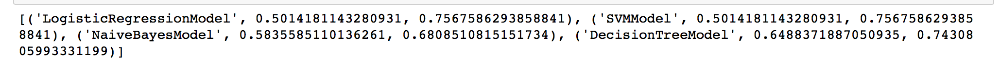
###模型调参、提高模型性能
####特征标准化
在机器学习的方法中，对特征进行标准化是特别重要的工作，何为standardization？!举个例子，小明数学考了82分、语文考了90分，那我们能说明小明语文考的比数学好吗 ？显然不是，我们必须知道全班其他学生的考试情况，才能对比小明语文和数学谁考的更好，那么说了这么多，到底为啥要做standardization呢？这里截取了一张Andrew Ng课程上的截图来说明：
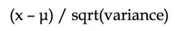
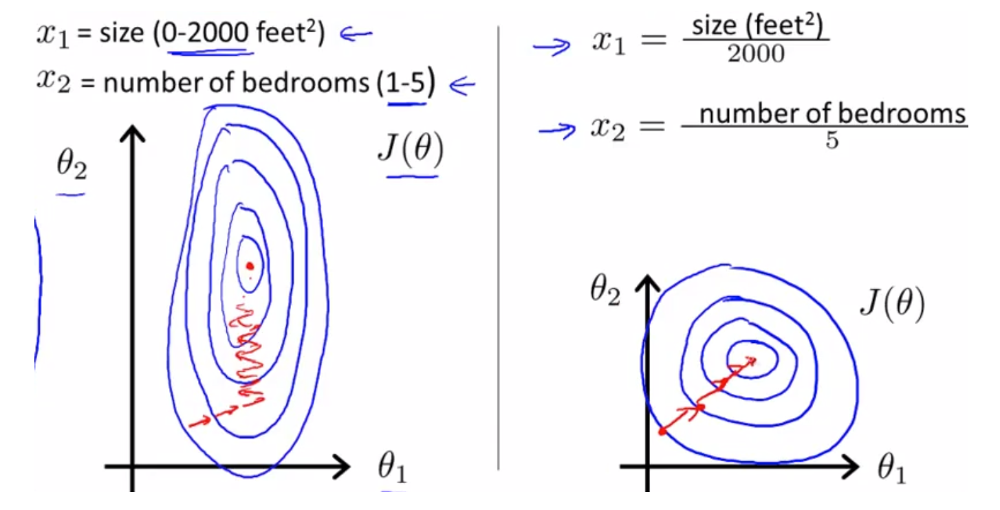
如果不在同一个标准下，很容易出现左图中的情况，这样一个寻优路径上很容易为"之"字形，而右图则相对于左图的"之"字形能快速寻优，达到更快速的收敛，在一定程度上提高模型精确性。
```
from pyspark.mllib.feature import StandardScalerModel,StandardScaler
scaler = StandardScaler(withMean=True, withStd=True).fit(vectors)
labels = data.map(lambda lp: lp.label)
features = data.map(lambda lp: lp.features)
print features.take(5)
scaled_data = labels.zip(scaler.transform(features))
scaled_data = scaled_data.map(lambda (x,y): LabeledPoint(x,y))
print scaled_data.first().features
print data.first().features
# 用标准化数据来训练lr模型
lrModelScaled = LogisticRegressionWithSGD.train(scaled_data, numIteration)
lrTotalCorrectScaled = scaled_data.map(lambda lp : 1 if(lrModelScaled.predict(lp.features)==lp.label) else 0).sum()
lrAccuracyScaled = lrTotalCorrectScaled/(1.0*data.count())
print 'lrAccuracyscaled : %f'%lrAccuracyScaled
all_models_metrics =[]
for model in [lrModelScaled]:
    scoresAndLabels = scaled_data.map(lambda point:(model.predict(point.features),point.label)).collect()
    scoresAndLabels = [(float(i),j) for (i,j) in scoresAndLabels]
    scoresAndLabels_sc = sc.parallelize(scoresAndLabels)
    metrics = BinaryClassificationMetrics(scoresAndLabels_sc)
    all_models_metrics.append((model.__class__.__name__,metrics.areaUnderROC, metrics.areaUnderPR))

print all_models_metrics

```
Accuracy:0.620960
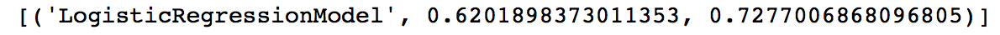
最终结果，相对于未标准化的数据模型在accuracy和AUC上有比较明显的提升，PR为啥没有提升，不是特别清楚，书上也没有说。。。
####增加数据特征
这里我们将原始数据中的第4列（category variable）编码为K为二值变量（dummies）：
```
categories = records.map(lambda x: x[3]).distinct().zipWithIndex().collect()
category_dict = {}
categories
for  (x,y) in [(key.replace('\"','') ,val) for (key, val) in categories]:
    category_dict[x] = y
num_categories = len(category_dict)
otherdata = trimmed.map(lambda x:(x[-1],x[4:-1])).map(lambda (x,y): (x.replace("\"","") ,[ 0.0 if yy =='\"?\"' else yy.replace("\"","") for yy in y])).map(lambda (x,y):(int(x),[float(yy) for yy in y])).map(lambda (x,y):LabeledPoint(x,Vectors.dense(y)))
otherdata.take(5)

def func1(x):
	# 这里把前面的合在一起做了，然后最终把category_feature和other_feature合在一起
    import numpy as np
    label = x[-1].replace('\"','')
    other_feature = [0.0 if yy == '?' else yy for yy in [ y.replace('\"','') for y in x[4:-1]]]
    category_Idx = category_dict[x[3].replace('\"','')]
    category_feature = np.zeros(num_categories)
    category_feature[category_Idx] = 1
    return LabeledPoint(label, Vectors.dense(list(category_feature)+other_feature))
category_data = trimmed.map(lambda x:func1(x))
category_data.take(5)
# category_data.take(5)
category_labels = category_data.map(lambda lp: lp.label)
category_features = category_data.map(lambda lp: lp.features)
scaler2 = StandardScaler(withMean=True, withStd=True).fit(category_features)
print category_features.take(5)
scaled_category_data = category_labels.zip(scaler2.transform(category_features))
scaled_category_data = scaled_category_data.map(lambda (x,y): LabeledPoint(x,y))
print scaled_category_data.take(5)

# 取出label和features，然后对features做Standardization
category_labels = category_data.map(lambda lp: lp.label)
category_features = category_data.map(lambda lp: lp.features)
scaler2 = StandardScaler(withMean=True, withStd=True).fit(category_features)
print category_features.take(5)
scaled_category_data = category_labels.zip(scaler2.transform(category_features))
scaled_category_data = scaled_category_data.map(lambda (x,y): LabeledPoint(x,y))
print scaled_category_data.take(5)

# fit添加了category var的数据
lrModel_category_scaled = LogisticRegressionWithSGD.train(scaled_category_data, numIteration)
lr_totalCorrect_category_scaled = scaled_category_data.map(lambda lp : 1 if(lrModel_category_scaled.predict(lp.features)==lp.label) else 0).sum()
lr_accuracy_category_scaled = lr_totalCorrect_category_scaled/(1.0*data.count())
print 'lrModel_category_scaled : %f'%lr_accuracy_category_scaled

all_models_metrics =[]
for model in [lrModel_category_scaled]:
    scoresAndLabels = scaled_category_data.map(lambda point:(model.predict(point.features),point.label)).collect()
    scoresAndLabels = [(float(i),j) for (i,j) in scoresAndLabels]
    scoresAndLabels_sc = sc.parallelize(scoresAndLabels)
    metrics = BinaryClassificationMetrics(scoresAndLabels_sc)
    all_models_metrics.append((model.__class__.__name__,metrics.areaUnderROC, metrics.areaUnderPR))

print all_models_metrics

```
Accuray：0.665720
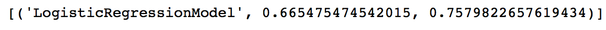
在添加了category variables后，分类器性能进一步提升：Accuracy由0.620960->0.665720,AUC由0.62->0.665,说明增加了这些特征数据后，是很有效的。

### Hyperparameter tuning
####Linear Models
#####Iterations
这里就是如何取最优参数，具体直接看代码吧，很容易的，包括对Iterations，step size，regularization params。
```
def train_with_params(input, reg_param, num_iter, step_size):
    lr_model = LogisticRegressionWithSGD.train(input,iterations=num_iter, regParam=reg_param, step=step_size)
    return lr_model
def create_metrics(tag, data, model):
    score_labels = data.map(lambda x: (model.predict(x.features)*1.0,x.label*1.0))
#     score_labels_sc = sc.parallelize(score_labels)
    metrics = BinaryClassificationMetrics(score_labels)
    return tag,metrics.areaUnderROC

for i in [1,5,10,50]:
    model = train_with_params(scaled_category_data, 0.0, i, 1.0)
    label, roc = create_metrics('%d iterations'%i,scaled_category_data,model)
    print '%s,AUC = %2.2f%%'%(label,roc*100)
for s in [0.001, 0.01, 0.1, 1.0, 10.0]:
    model = train_with_params(scaled_category_data, 0.0, 10, s)
    label, roc = create_metrics('%f step size'%s,scaled_category_data,model)
    print '%s,AUC = %2.2f%%'%(label,roc*100)
for r in [0.001, 0.01, 0.1, 1.0, 10.0]:
    model = train_with_params(scaled_category_data, 0.0, 1.0, r)
    label, roc = create_metrics('%f regularization parameter'%r,scaled_category_data,model)
    print '%s,AUC = %2.2f%%'%(label,roc*100)
```
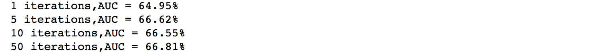
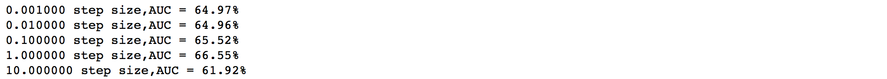
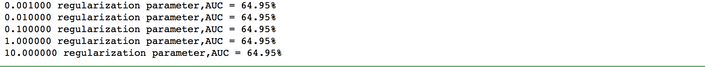
####Decision trees
#####Depth and impurity
决策树，我们来看看maxTreeDepth和impurity对最终决策树的性能影响：
```
def train_with_params_dt(input, impurity, maxTreeDepth):
    dt_model = DecisionTree.trainClassifier(input,numClass,{},impurity, maxDepth=maxTreeDepth)
    return dt_model
def create_metrics_dt(tag, data, model):
    predictList= model.predict(data.map(lambda lp: lp.features)).collect()
    trueLabel = data.map(lambda lp: lp.label).collect()
    scoresAndLabels = [(predictList[i],true_val) for i, true_val in enumerate(trueLabel)]
    scoresAndLabels_sc = sc.parallelize(scoresAndLabels)
    scoresAndLabels_sc = scoresAndLabels_sc.map(lambda (x,y): (float(x),float(y)))
    dt_metrics = BinaryClassificationMetrics(scoresAndLabels_sc)
    return tag,dt_metrics.areaUnderROC
for dep in [1,2,3,4,5,10,20]:
    for im in ['entropy','gini']:
        model=train_with_params_dt(data,im,dep)
        tag, roc = create_metrics_dt('impurity: %s, %d maxTreeDepth:'%(im,dep),data,model)
        print '%s, AUC = %2.2f'%(tag,roc*100)

```
最终结果：
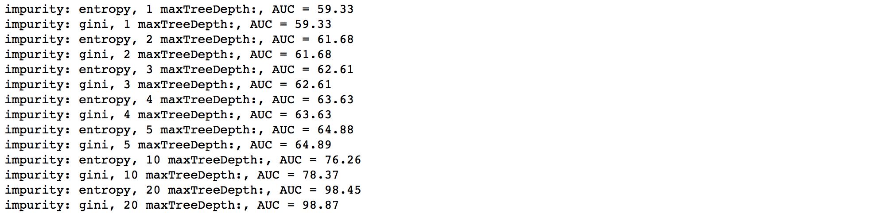
####Naive Bayes Model
朴素贝叶斯模型比较简单，直接上代码吧：
```
def train_with_params_nb(input, lambda1):
    nb_model = NaiveBayes.train(input,lambda1)
    return nb_model
def create_metrics_nb(tag, nbbata, model):
    scoresAndLabels = nbdata.map(lambda point:(float(model.predict(point.features)),point.label))
    nb_metrics = BinaryClassificationMetrics(scoresAndLabels)
    return tag,nb_metrics.areaUnderROC
for la in [0.001, 0.01, 0.1, 1.0, 10.0]:
    model=train_with_params_nb(nbdata,la)
    tag, roc = create_metrics_dt('%f lambda' %la,data,model)
    print '%s, AUC = %2.2f'%(tag,roc*100)
```
结果：
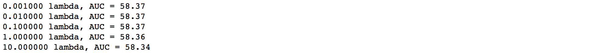
### Cross-Validation
交叉验证，通常是离线评判的一种手段，尤其是对于小数据集，一般我们会对数据集进行按比率划分为训练集和测试机，然后用测试集下的数据来验证我们在训练集下的模型，这样会使模型更具有泛型能力，不多话，上代码：
```
train_test_split = scaled_category_data.randomSplit([0.6,0.4],123)
train = train_test_split[0]
test = train_test_split[1]
for r in [0.0, 0.001, 0.0025, 0.005, 0.01]:
    model = train_with_params(train, 0.0, 1.0, r)
    label, roc = create_metrics('%f regularization parameter'%r,test,model)
    print '%s,AUC = %2.2f%%'%(label,roc*100)
```

