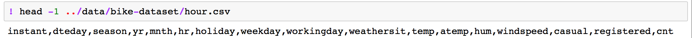
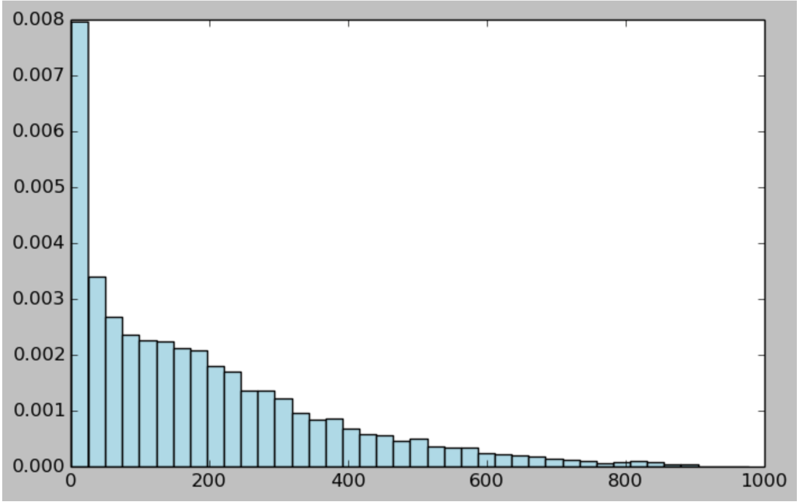
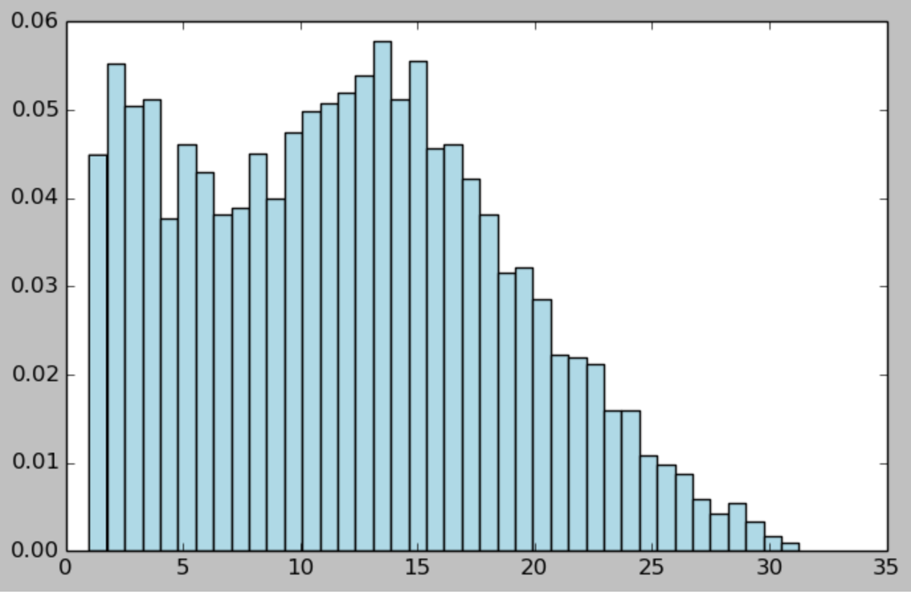
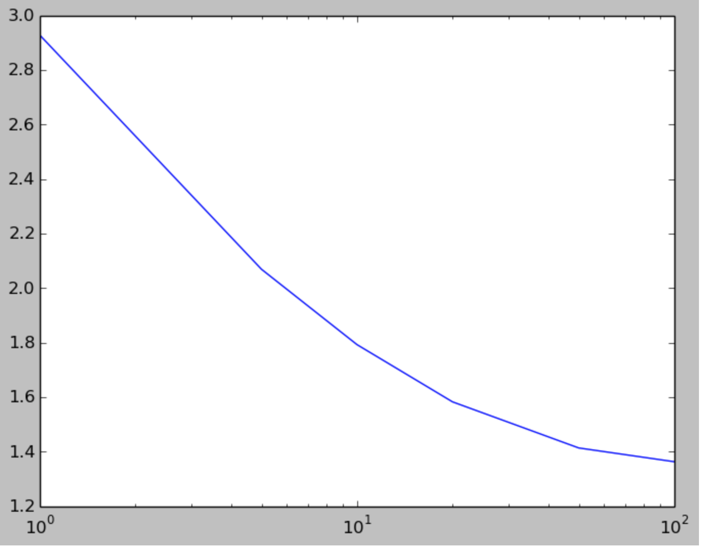
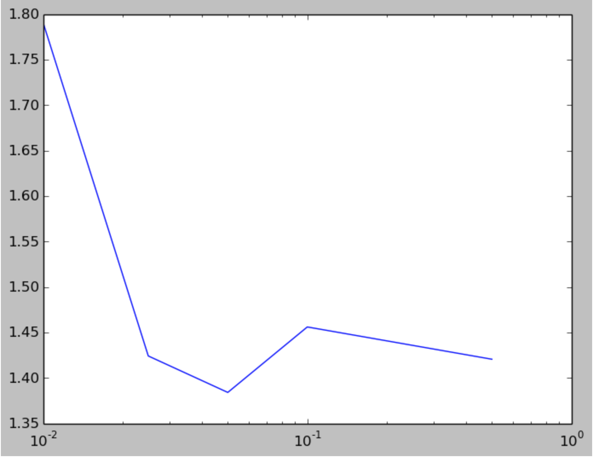
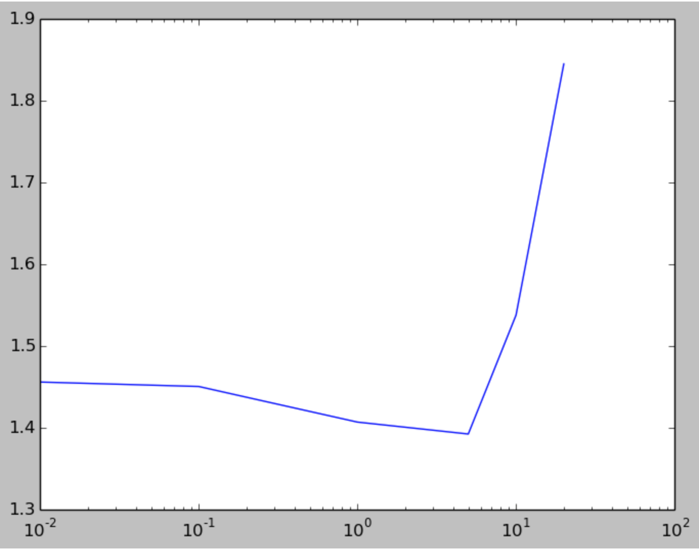
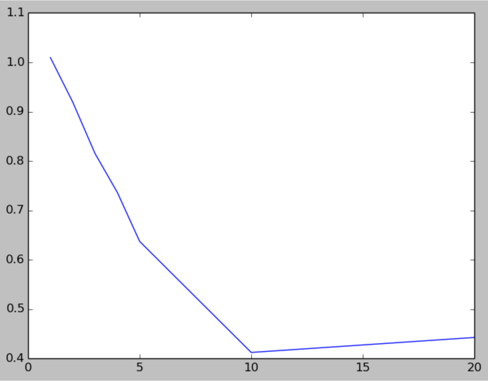
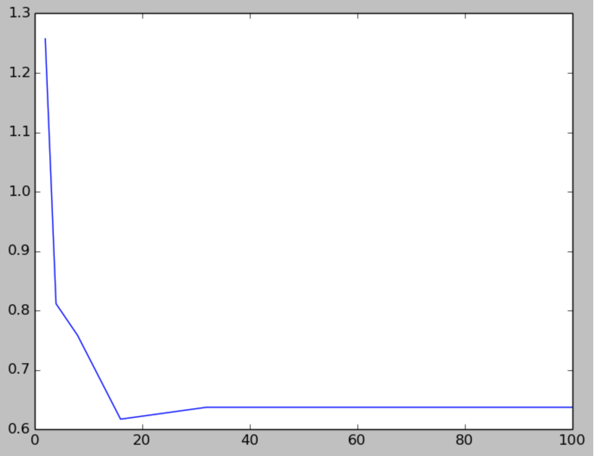

##Spark构建回归模型
分类和回归是Supervised Machine Learning中比较重要的两个方面，两者差别在于，前者的label值为离散而回归的label为连续。话不多说，本文将为你介绍如何利用Spark MLlib在建立一个回归模型，并优化模型参数提高预测性能。
Spark中回归模型支持的还是很多的，《Machine Learning With Spark》归纳的比较好，主要包括线性模型、决策树模型，但是他上面没有细分，我这里去找了下Spark的文档和源码，支持做回归模型的方法主要包括以下几块：

 - 线性模型
 	- Linear Regression
 	- Ridge Regression
 	- Lasso Regression
 	- Isotonic Regression
 - 决策树模型
 	- Decision Tree Regression
 - 组合模型
 	- Random Forest Regression
 	- Gradient-Boosted Tree Regression
 - 其他
 	- survival regression(这个我也不知道是什么东西)

本文中还是按照《Machine Learning With Spark》讲述的回归算法来探讨如何在Spark下建立一个可用的回归模型
###线性回归和决策树回归
线性回归大家都知道，通过最小化Wx与y直接的平方差，对参数进行修正来耦合真实数据的分布，升级版本的有ridge regression和lasso，分布式对模型权重进行L2和L1范数修正。
决策树做回归，可能一般人最开始反应不过来，其原理是通过某种标准，将数据集不断地划分为子集，具体原理可见[决策树系列2:CART回归树](http://blog.typedef.me/2014/12/03/决策树系列-2-回归树/)

原理不多说了，要想深入了解可以去google下具体算法的原理，接下来，我们将会直接用python在spark上开撸

####特征提取
这里，我们拿一个公开的数据集[bike sharing dataset](http://archive.ics.uci.edu/ml/datasets/Bike+Sharing+Dataset)，其中包括自行车租赁系统中的各种数据，另外还包括当日的天气、假期信息等等，我们用来预测每个小时自行车租赁的次数，数据具体字段名如下：

使用sed 1d删除feature 字段：

	!sed 1d ../data/bike-dataset/hour.csv > ../data/bike-dataset/hour_noheader.csv
我们拉下第一条数据来看看：

	import numpy as np
	hour_path = '../data/bike-dataset/hour_noheader.csv'
    raw_data = sc.textFile(hour_path)
    num_data = raw_data.count()
	records =raw_data.map(lambda x: x.split(','))
    first = records.first()
	print first
	print num_data
    
    # 结果如下，第一条：
    the first data:
	[u'1', u'2011-01-01', u'1', u'0', u'1', u'0', u'0', u'6', u'0', u'1', u'0.24', u'0.2879', u'0.81', u'0', u'3', u'13', u'16']
	the data num in this dataset: 17379

接下来，我们来做feature的提取，首先我们要持久化records，后面会经常使用到。由数据集的readme文件了解到，数据集中在滤除id、date，忽视掉casual 和registered count之后，还有12个feature，其中有8个feature位category variables，这里我们将feature进行dummmies表示，举个例子：如果某个feature有四种可能性0,1,2,3，则我们可以使用0000，0001，0010，0100来表示这四种，代码如下：

	records.cache()
    def get_mapping(rdd, ):
    	return rdd.map(lambda fields: fields[idx]).distinct().zipWithIndex().collectAsMap()
    print "Mapping of first categorical feature column %s "%get_mapping(records,2)
    mappings = [get_mapping(records, i) for i in range(2,10)]
	cat_len = sum(map(len, mappings))
	num_len = len(records.first()[11:15])
	map(len,mappings)
	total_len = num_len+cat_len
    print 'Feature vector length for categorical features %d'%cat_len
	print 'Feature vector length for numerical features %d'%num_len
	print 'Total feature vector length: %d' % total_len
    
    # 输出如下：
    Mapping of first categorical feature column {u'1': 0, u'3': 1, u'2': 2, u'4': 3} 
    Feature vector length for categorical features 57
	Feature vector length for numerical features 4
	Total feature vector length: 61
    
上面将所有，所有category variables所有出现的可能数目，计算所有category variables的feature长度，然后将其中对应位置赋"1"：

	from pyspark.mllib.regression import LabeledPoint
	import numpy as np
	def extract_features(record):
    	cat_vec = np.zeros(cat_len)
    	step = 0
    	for i,field in enumerate(record[2:9]):
        	m = mappings[i]
        	idx = m[field]
        	cat_vec[idx+step] = 1
        	step = step+len(m)
    	num_vec = np.array([float(field) for field in record[10:14]])
    	return np.concatenate((cat_vec, num_vec))
    def extract_label(record):
    	return float(record[-1])
    data = records.map(lambda r: LabeledPoint(extract_label(r),extract_features(r)))
    first_point = data.first()
	print 'raw data: '+str(first[2:])
	print 'label: ' + str(first_point.label)
	print 'feature vector: \n' + str(first_point.features)
	print 'feature vector length:' + str(len(first_point.features))
    
    # 输出如下：
    raw data: [u'1', u'0', u'1', u'0', u'0', u'6', u'0', u'1', u'0.24', u'0.2879', u'0.81', u'0', u'3', u'13', u'16']
	label: 16.0
	feature vector: 
	[1.0,0.0,0.0,0.0,0.0,1.0,0.0,0.0,0.0,1.0,0.0,0.0,0.0,0.0,0.0,0.0,0.0,0.0,0.0,0.0,0.0,0.0,0.0,1.0,0.0,0.0,0.0,0.0,0.0,0.0,0.0,0.0,0.0,0.0,0.0,0.0,0.0,0.0,0.0,0.0,0.0,0.0,0.0,1.0,0.0,0.0,0.0,0.0,0.0,0.0,1.0,0.0,1.0,0.0,0.0,0.0,0.0,0.24,0.2879,0.81,0.0]
	feature vector length:61
    
在基于决策树的回归模型中，不需要对category variables做dummies处理，只需要原始特征即可：

	def extract_features_dt(record):
    	return np.array(map(float, record[2:14]))
    data_dt = records.map(lambda r: (extract_label(r), extract_features_dt(r)))
    first_point_dt = data_dt.first()
    print 'Decision Tree vector: '+str(first_point_dt.features)
	print 'Decision Tree vector: '+str(len(first_point_dt.features))
    
    # 输出如下：
    Decision Tree vector: [1.0,0.0,1.0,0.0,0.0,6.0,0.0,1.0,0.24,0.2879,0.81,0.0]
	Decision Tree vector: 12
    
### 模型训练
得到数据后，开始训练线性回归模型：

	from pyspark.mllib.regression import LinearRegressionWithSGD
	from pyspark.mllib.tree import DecisionTree
	# help(LinearRegressionWithSGD.train)
	# help(DecisionTree.trainRegressor)
	linear_model = LinearRegressionWithSGD.train(data, iterations=10, step=0.1, intercept =False)
    true_vs_predicted = data.map(lambda p:(p.label,linear_model.predict(p.features)))
    print 'Linear Model predictions: '+ str(true_vs_predcited.take(5))
    # 输出如下：
    Linear Model predictions: [(16.0, 117.89250386724844), (40.0, 116.22496123192109), (32.0, 116.02369145779232), (13.0, 115.67088016754431), (1.0, 115.56315650834316)]
    
对比误差好像很大，不过这里没关系，我们先不关心，然后我们训练决策树回归模型：

	dt_model = DecisionTree.trainRegressor(data_dt,{})
	preds = dt_model.predict(data_dt.map(lambda p: p.features))
	actual = data.map(lambda p:p.label)
	true_vs_predicted_dt = actual.zip(preds)
	print 'Decision Tree predictions: '+str(true_vs_predcited_dt.take(5))
	print 'Decision Tree depth: ' + str(dt_model.depth())
	print 'Decision Tree number of nodes: '+str(dt_model.numNodes())
    
    # 输出如下：
    Decision Tree predictions: [(16.0, 54.913223140495866), (40.0, 54.913223140495866), (32.0, 53.171052631578945), (13.0, 14.284023668639053), (1.0, 14.284023668639053)]
	Decision Tree depth: 5
	Decision Tree number of nodes: 63
    
### 模型性能评估
常用的回归模型性能函数包括squared_error,abs_error以及squared_log_error，我们可以根据这类指标来衡量我们模型的好坏，而不用直观去感受

	def squared_error(actual, pred):
    	return (pred-actual)**2
    def abs_error(actual, pred):
    	return np.abs(pred-actual)
    def squared_log_error(pred, actual):
    	return (np.log(pred+1)-np.log(actual+1))**2

	# Linear Regression
	mse = true_vs_predicted.map(lambda (t, p): squared_error(t, p)).mean()
	mae = true_vs_predicted.map(lambda (t, p): abs_error(t, p)).mean()
	rmsle = np.sqrt(true_vs_predicted.map(lambda (t, p): squared_log_error(t, p)).mean())
	print "Linear Model - Mean Squared Error: %2.4f" % mse
	print "Linear Model - Mean Absolute Error: %2.4f" % mae
	print "Linear Model - Root Mean Squared Log Error: %2.4f" % rmsle
    
    # 输出如下：
    Linear Model - Mean Squared Error: 30679.4539
	Linear Model - Mean Absolute Error: 130.6429
	Linear Model - Root Mean Squared Log Error: 1.4653
    
    # Decision Tree
    mse_dt = true_vs_predicted_dt.map(lambda (t, p): squared_error(t, p)).mean()
	mae_dt = true_vs_predicted_dt.map(lambda (t, p): abs_error(t, p)).mean()
	rmsle_dt = np.sqrt(true_vs_predicted_dt.map(lambda (t, p): squared_log_error(t, p)).mean())
	print "Decision Tree - Mean Squared Error: %2.4f" % mse_dt
	print "Decision Tree - Mean Absolute Error: %2.4f" % mae_dt
	print "Decision Tree - Root Mean Squared Log Error: %2.4f" %rmsle_dt
    
    # 输出如下：
	Decision Tree - Mean Squared Error: 11560.7978
	Decision Tree - Mean Absolute Error: 71.0969
	Decision Tree - Root Mean Squared Log Error: 0.6259

对比之下，此时决策树回归模型在bike sharing dataset下误差更小，性能比较好。

### 模型优化

#### 目标值转换
这里，我们先把数据集所有target的分布拉出来看看：

	import matplotlib
	import numpy as np
	import matplotlib.pyplot as plt
	%matplotlib inline  
	targets = records.map(lambda r: float(r[-1])).collect()
	hist(targets, bins=40, color='lightblue', normed=True)
	fig = matplotlib.pyplot.gcf()
	fig.set_size_inches(16, 10)
    
target分布如下：

	log_targets = records.map(lambda r : np.log(float(r[-1]))).collect()
	plt.hist(log_tartgets, bins = 40, color ='lightblue', normed =True)
	fig = plt.gcf()
	fig.set_size_inches(8,5)

log化之后：
！

	sqrt_targets = records.map(lambda r: np.sqrt(float(r[-1]))).collect()
	plt.hist(sqrt_targets, bins=40, color='lightblue', normed=True)
	fig = matplotlib.pyplot.gcf()
	fig.set_size_inches(8, 5)
sqrt之后：

我们把log之后的target作为我们最后耦合的目标值，来train模型：

	data_log = data.map(lambda lp: LabeledPoint(np.log(lp.label),lp.features))
	model_log = LinearRegressionWithSGD.train(data_log, iterations=10, step=0.1)
    true_vs_predicted_log = data_log.(lambda p: (np.exp(p.label),np.exp(model_log.predict(p.features))))
    mse_log = true_vs_predicted_log.map(lambda (t, p): squared_error(t,p)).mean()
	mae_log = true_vs_predicted_log.map(lambda (t, p): abs_error(t, p)).mean()
	rmsle_log = np.sqrt(true_vs_predicted_log.map(lambda (t, p): squared_log_error(t, p)).mean())
	print "Mean Squared Error: %2.4f" % mse_log
	print "Mean Absolue Error: %2.4f" % mae_log
	print "Root Mean Squared Log Error: %2.4f" % rmsle_log
	print "Non log-transformed predictions:\n" + str(true_vs_predicted.take(3))
	print "Log-transformed predictions:\n" + str(true_vs_predicted_log.take(3))
    
    # 输出如下：
	Mean Squared Error: 50685.5559
	Mean Absolue Error: 155.2955
	Root Mean Squared Log Error: 1.5411
	Non log-transformed predictions:
	[(16.0, 117.89250386724844), (40.0, 116.22496123192109), (32.0, 116.02369145779232)]
	Log-transformed predictions:
	[(15.999999999999998, 28.080291845456212), (40.0, 26.959480191001763), (32.0, 26.654725629457996)]
    
可以看出，在这三个指标上，我们都没有提升，书上面在RMSLE上有一些提升，不太清楚是哪方面造成的，可能是spark的一些默认参数不同造成的

	data_dt_log = data_dt.map(lambda lp:LabeledPoint(np.log(lp.label), lp.features))
	dt_model_log = DecisionTree.trainRegressor(data_dt_log,{})
	preds_log = dt_model_log.predict(data_dt_log.map(lambda p:p.features))
	actual_log = data_dt_log.map(lambda p: p.label)
	true_vs_predicted_dt_log = actual_log.zip(preds_log).map(lambda (t,p): (np.exp(t), np.exp(p)))
	mse_log_dt = true_vs_predicted_dt_log.map(lambda (t, p): squared_error(t, p)).mean()
	mae_log_dt = true_vs_predicted_dt_log.map(lambda (t, p): abs_error(t,p)).mean()
	rmsle_log_dt = np.sqrt(true_vs_predicted_dt_log.map(lambda (t, p):
	squared_log_error(t, p)).mean())
	print "Mean Squared Error: %2.4f" % mse_log_dt
	print "Mean Absolue Error: %2.4f" % mae_log_dt
	print "Root Mean Squared Log Error: %2.4f" % rmsle_log_dt
	print "Non log-transformed predictions:\n" + str(true_vs_predicted_dt.take(3))
	print "Log-transformed predictions:\n" +str(true_vs_predicted_dt_log.take(3))
    # 输出如下：
    
    Mean Squared Error: 14781.5760
	Mean Absolue Error: 76.4131
	Root Mean Squared Log Error: 0.6406
	Non log-transformed predictions:
	[(16.0, 54.913223140495866), (40.0, 54.913223140495866), (32.0, 53.171052631578945)]
	Log-transformed predictions:
	[(15.999999999999998, 37.530779787154508), (40.0, 37.530779787154508), (32.0, 7.2797070993907127)]

同样，效果也没有提升，不过没有关系，这里只是提供一种转换target的方法来进行拟合，不能提升也没有多大关系。

#### 模型调参
首先，我们将原始数据按比率划分为train，test数据集,原书当中pyspark版本还没有randomSplit这个函数，所以用：

	data_with_idx = data.zipWithIndex().map(lambda (k,v):(v,k))
	test = data_with_idx.sample(False, 0.2, 42)
	train = data_with_idx.subtractByKey(test)
我们这里直接使用randomSplit：

	train_test_data_split = data.randomSplit([0.8,0.2],123)
    train = train_test_data_split[0]
	test1 = train_test_data_split[1]
    print test.count()
    print train.count()
    #输出如下：
    3519
	13860
同理，dt的数据也做相同的处理

	train_test_data_dt_split = data_dt.randomSplit([0.8,0.2],123)
    train_dt = train_test_data_dt_split[0]
	test_dt = train_test_data_dt_split[1]

写一个评估函数：

	def evaluate(train, test, iterations, step, regParam, regType, intercept):
    	model = LinearRegressionWithSGD.train(train, iterations, step, regParam=regParam, regType=regType,intercept=intercept)
    	tp = test.map(lambda p:(p.label, model.predict(p.features)))
    	rmsle = np.sqrt(tp.map(lambda (t,p):squared_log_error(t,p)).mean())
    	return rmsle

看看迭代次数对metrics的影响：
	
    params = [1, 5, 10, 20, 50, 100]
	metrics = [evaluate(train1, test1,param, 0.01, 0.0,'l2',False) for param in params]
	for i in range(len(params)):
    	print 'the rmsle: %f when iterations :%d'%(metrics[i],params[i])
    # 输出如下：
	the rmsle: 2.927743 when iterations :1
	the rmsle: 2.068696 when iterations :5
	the rmsle: 1.792306 when iterations :10
	the rmsle: 1.582446 when iterations :20
	the rmsle: 1.413309 when iterations :50
	the rmsle: 1.362821 when iterations :100

图示如下：

	plt.plot(params, metrics)
	fig = plt.gcf()
	plt.xscale('log')

不同step影响：

	params = [0.01, 0.025, 0.05, 0.1, 10]
	metrics = [evaluate(train_data, test_data, 10,param,0.0,'l2',False) for param in params]
	for i in range(len(params)):
    	print 'the rmsle: %f when step :%f'%(metrics[i],params[i])
    # 输出入下：
    the rmsle: 1.790424 when step :0.010000
	the rmsle: 1.424106 when step :0.025000
	the rmsle: 1.384013 when step :0.050000
	the rmsle: 1.456006 when step :0.100000
	the rmsle: 1.420514 when step :0.500000

图示如下：

不同正则化系数影响：

	params = [0.0, 0.01, 0.1, 1.0, 5.0, 10.0, 20.0]
	metrics = [evaluate(train_data, test_data, 10, 0.1, param, 'l2', False) for param in params]
	for i in range(len(params)):
    	print 'the rmsle: %f when regParam :%f'%(metrics[i],params[i])
    # 输出如下：
    the rmsle: 1.456006 when regParam :0.000000
	the rmsle: 1.455391 when regParam :0.010000
	the rmsle: 1.449963 when regParam :0.100000
	the rmsle: 1.406437 when regParam :1.000000
	the rmsle: 1.391879 when regParam :5.000000
	the rmsle: 1.537280 when regParam :10.000000
	the rmsle: 1.844356 when regParam :20.000000
	
    plt.plot(params, metrics)
	fig = matplotlib.pyplot.gcf()
	plt.xscale('log')
    

接下来我们来看看正则type lasso（l2）和ridge(l1)的区别：

	model_l1 = LinearRegressionWithSGD.train(train_data, 10, 0.1,regParam=1.0, regType='l1', intercept=False)
	model_l2 = LinearRegressionWithSGD.train(train_data, 10, 0.1,regParam=1.0, regType='l2', intercept=False)
	model_l1_10 = LinearRegressionWithSGD.train(train_data, 10, 0.1,regParam=10.0, regType='l1', intercept=False)
	model_l2_10 = LinearRegressionWithSGD.train(train_data, 10, 0.1,regParam=10.0, regType='l2', intercept=False)
	model_l1_100 = LinearRegressionWithSGD.train(train_data, 10, 0.1,regParam=100.0, regType='l1', intercept=False)
	model_l2_100 = LinearRegressionWithSGD.train(train_data, 10, 0.1,regParam=100.0, regType='l2', intercept=False)
	print "L1 (1.0) number of zero weights: " + str(sum(model_l1.weights.array == 0))
	print "L2 (1.0) number of zero weights: " + str(sum(model_l2.weights.array == 0))
	print "L1 (10.0) number of zeros weights: " + str(sum(model_l1_10.weights.array == 0))
	print "L2 (10.0) number of zeros weights: " + str(sum(model_l2_10.weights.array == 0))
	print "L1 (100.0) number of zeros weights: " +str(sum(model_l1_100.weights.array == 0))
	print "L2 (100.0) number of zeros weights: " +str(sum(model_l2_100.weights.array == 0))
    # 输出如下：
    L1 (1.0) number of zero weights: 5
	L2 (1.0) number of zero weights: 4
	L1 (10.0) number of zeros weights: 33
	L2 (10.0) number of zeros weights: 4
	L1 (100.0) number of zeros weights: 58
	L2 (100.0) number of zeros weights: 4
L1相对于L2来说，影响系数当中的零值数量，在正则系数变大时，系数稀疏程度会越来越大。

同理，我们来对decision来做一个相同的探讨：

	def evaluate_dt(train, test, maxDepth, maxBins):
    	model = DecisionTree.trainRegressor(train, {},impurity='variance', maxDepth=maxDepth, maxBins=maxBins)
    	preds = model.predict(test.map(lambda p: p.features))
    	actual = test.map(lambda p: p.label)
    	tp = actual.zip(preds)
    	rmsle = np.sqrt(tp.map(lambda (t, p): squared_log_error(t,p)).mean())
    	return rmsle
        
树的不同最大深度对性能影响：

	params = [1, 2, 3, 4, 5, 10, 20]
	metrics = [evaluate_dt(train_data_dt, test_data_dt, param, 32) for
	param in params]
	for i in range(len(params)):
    	print 'the rmsle: %f when maxDepth :%d'%(metrics[i],params[i])
    # 输出如下：
    the rmsle: 1.009668 when maxDepth :1
	the rmsle: 0.919700 when maxDepth :2
	the rmsle: 0.815384 when maxDepth :3
	the rmsle: 0.736622 when maxDepth :4
	the rmsle: 0.637440 when maxDepth :5
	the rmsle: 0.412534 when maxDepth :10
	the rmsle: 0.442855 when maxDepth :20
	plt.plot(params, metrics)
	fig = matplotlib.pyplot.gcf()

每个节点分支时最大bin数：

	params = [2, 4, 8, 16, 32, 64, 100]
	metrics = [evaluate_dt(train_data_dt, test_data_dt, 5, param) for param in params]
	for i in range(len(params)):
    	print 'the rmsle: %f when maxBins :%d'%(metrics[i],params[i])
	plt.plot(params, metrics)
	fig = matplotlib.pyplot.gcf()
    # 输出如下：
    the rmsle: 1.257196 when maxBins :2
	the rmsle: 0.811638 when maxBins :4
	the rmsle: 0.758462 when maxBins :8
	the rmsle: 0.617405 when maxBins :16
	the rmsle: 0.637440 when maxBins :32
	the rmsle: 0.637440 when maxBins :64
	the rmsle: 0.637440 when maxBins :100

    

## 总结
最后总结下，spark mllib的regression还是蛮强大的，文章最开头有具体介绍，本文只是简单地用了下Linear Regression和Decision Tree，其他model的用法也基本如此，为了说明，我们对单个参数进行寻优然后绘图示意，真正在工程中，我们一般会同时对多个参数的值进行组合，然后进行randomSearch或者gridSearch，来得到最优的参数组合，对于spark下的回归，暂时就先做到这里，以后如果有有意思的东西，可以再加上。

