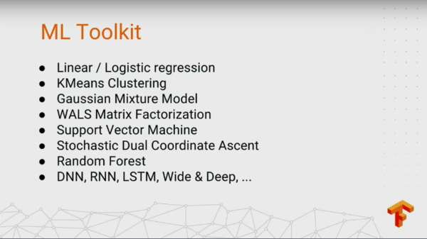
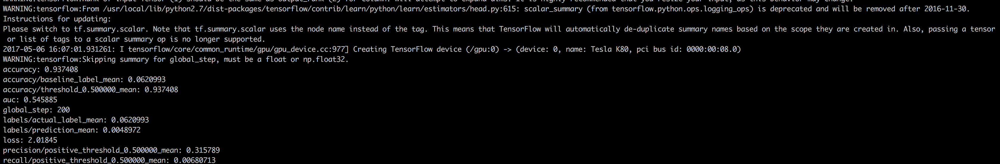
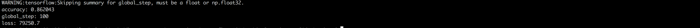
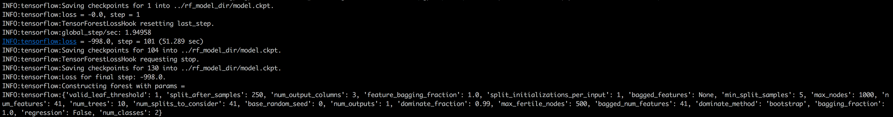
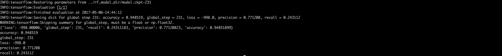
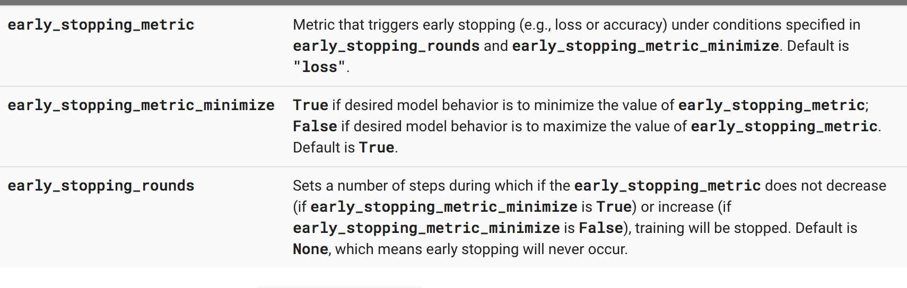
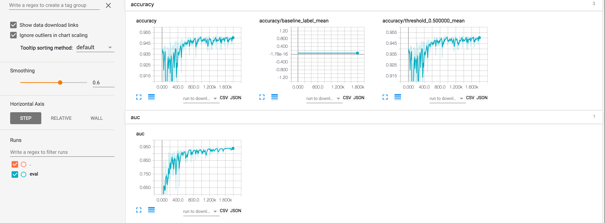
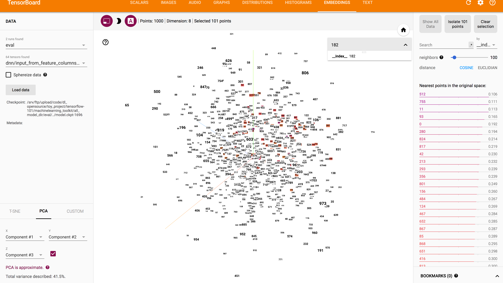

## 前言
前段时间内，Google在TensorFlow Dev Summit大会上吹了一帮使用TensorFlow做机器学习，说是仿照scikit-learn的api来写的，看着很有诱惑性

有一些算法可能官方文档里面没有，但是官方仓库里面是都有代码的，比如GMM和WALS:[contrib/factorization/python/ops](https://github.com/tensorflow/tensorflow/tree/master/tensorflow/contrib/factorization/python/ops).
第一弹，我们介绍基本的分类模型的使用，会主要介绍LinearClassifier\SVM\Random Forest\wide and deep，会由浅至深在每个算法中分别讲述需要注意的点。

## LinearClassifier
### 数据集描述
先描述下这里做实验的数据集，下载地址[census income mld](http://archive.ics.uci.edu/ml/machine-learning-databases/census-income-mld/)，是收集美帝的收入的记录，feature是一些个人信息包括工作、年纪、学历水平、家庭情况等等大概40个维度，标签是是否年收入在50k以上，即一个二类分类器。后面所有算法都是使用的相同的数据来做实验。

### 数据读入
数据集格式为csv，使用pandas可以快速读入数据，并格式化为DataFrame，做一些基本的预处理操作，如下，是从csv文件中读入数据的操作,因为Pandas内部会自动判断类型为object类型（categorical 值为02，40这类数字的值），在使用之前需要做转换，转为str类型，：

    TRAIN_FILE = '../data/census/census-income.data'
    TEST_FILE = '../data/census/census-income.test'

    df_train = pd.read_csv(TRAIN_FILE, names=COLUMNS, skipinitialspace=True)
    df_test = pd.read_csv(TEST_FILE, names=COLUMNS, skipinitialspace=True)
    df_train = df_train.dropna(how='any', axis=0)
    df_test = df_test.dropna(how='any', axis=0)
    df_train[[
        'detailed_industry_recode', 'detailed_occupation_recode', 'year',
        'own_business_or_self_employed', 'veterans_benefits'
    ]] = df_train[[
        'detailed_industry_recode', 'detailed_occupation_recode', 'year',
        'own_business_or_self_employed', 'veterans_benefits'
    ]].astype(str)
    df_test[[
        'detailed_industry_recode', 'detailed_occupation_recode', 'year',
        'own_business_or_self_employed', 'veterans_benefits'
    ]] = df_test[[
        'detailed_industry_recode', 'detailed_occupation_recode', 'year',
        'own_business_or_self_employed', 'veterans_benefits'
    ]].astype(str)

    df_train[LABEL_COLUMN] = (
        df_train[LABEL_COLUMN].apply(lambda x: '+' in x)).astype(int)
    df_test[LABEL_COLUMN] = (
        df_test[LABEL_COLUMN].apply(lambda x: '+' in x)).astype(int)
    dtypess = df_train.dtypes

从硬盘读入数据之后，如何标记每个维度的属性比如continue var还是categorical var，这个在sklearn上是很方便使用preprocessing.OneHotEncoder()可以很方便的处理，TF.learn内部也有类似的逻辑，相对会比较复杂:

    class_of_worker = tf.contrib.layers.sparse_column_with_hash_bucket(
    column_name='class_of_worker', hash_bucket_size=1000)
    detailed_industry_recode = tf.contrib.layers.sparse_column_with_hash_bucket(
        column_name='detailed_industry_recode', hash_bucket_size=1000)
    detailed_occupation_recode = tf.contrib.layers.sparse_column_with_hash_bucket(
        column_name='detailed_occupation_recode', hash_bucket_size=1000)
    education = tf.contrib.layers.sparse_column_with_hash_bucket(
        column_name='education', hash_bucket_size=1000)
    enroll_in_edu_inst_last_wk = tf.contrib.layers.sparse_column_with_hash_bucket(
        column_name='enroll_in_edu_inst_last_wk', hash_bucket_size=1000)
    marital_stat = tf.contrib.layers.sparse_column_with_hash_bucket(
        column_name='marital_stat', hash_bucket_size=1000)
    major_industry_code = tf.contrib.layers.sparse_column_with_hash_bucket(
        column_name='major_industry_code', hash_bucket_size=1000)
    major_occupation_code = tf.contrib.layers.sparse_column_with_hash_bucket(
        column_name='major_occupation_code', hash_bucket_size=1000)
    race = tf.contrib.layers.sparse_column_with_hash_bucket(
        column_name='race', hash_bucket_size=1000)
    hispanic_origin = tf.contrib.layers.sparse_column_with_hash_bucket(
        column_name='hispanic_origin', hash_bucket_size=1000)
    sex = tf.contrib.layers.sparse_column_with_keys(
        column_name='sex', keys=['Female', 'Male'])
    member_of_labor_union = tf.contrib.layers.sparse_column_with_hash_bucket(
        column_name='member_of_labor_union', hash_bucket_size=1000)
    reason_for_unemployment = tf.contrib.layers.sparse_column_with_hash_bucket(
        column_name='reason_for_unemployment', hash_bucket_size=1000)
    full_or_part_time_employment_stat = tf.contrib.layers.sparse_column_with_hash_bucket(
        column_name='full_or_part_time_employment_stat', hash_bucket_size=1000)
    tax_filer_stat = tf.contrib.layers.sparse_column_with_hash_bucket(
        column_name='tax_filer_stat', hash_bucket_size=1000)
    region_of_previous_residence = tf.contrib.layers.sparse_column_with_hash_bucket(
        column_name='region_of_previous_residence', hash_bucket_size=1000)
    state_of_previous_residence = tf.contrib.layers.sparse_column_with_hash_bucket(
        column_name='state_of_previous_residence', hash_bucket_size=1000)
    detailed_household_and_family_stat = tf.contrib.layers.sparse_column_with_hash_bucket(
        column_name='detailed_household_and_family_stat', hash_bucket_size=1000)
    detailed_household_summary_in_household = tf.contrib.layers.sparse_column_with_hash_bucket(
        column_name='detailed_household_summary_in_household',
        hash_bucket_size=1000)
    migration_code_change_in_msa = tf.contrib.layers.sparse_column_with_hash_bucket(
        column_name='migration_code_change_in_msa', hash_bucket_size=1000)
    migration_code_change_in_msa = tf.contrib.layers.sparse_column_with_hash_bucket(
        column_name='migration_code_change_in_msa', hash_bucket_size=1000)
    migration_code_change_in_reg = tf.contrib.layers.sparse_column_with_hash_bucket(
        column_name='migration_code_change_in_reg', hash_bucket_size=1000)
    migration_code_move_within_reg = tf.contrib.layers.sparse_column_with_hash_bucket(
        column_name='migration_code_move_within_reg', hash_bucket_size=1000)
    live_in_this_house_1year_ago = tf.contrib.layers.sparse_column_with_hash_bucket(
        column_name='live_in_this_house_1year_ago', hash_bucket_size=1000)
    migration_prev_res_in_sunbelt = tf.contrib.layers.sparse_column_with_hash_bucket(
        column_name='migration_prev_res_in_sunbelt', hash_bucket_size=1000)
    family_members_under18 = tf.contrib.layers.sparse_column_with_hash_bucket(
        column_name='family_members_under18', hash_bucket_size=1000)
    country_of_birth_father = tf.contrib.layers.sparse_column_with_hash_bucket(
        column_name='country_of_birth_father', hash_bucket_size=1000)
    country_of_birth_mother = tf.contrib.layers.sparse_column_with_hash_bucket(
        column_name='country_of_birth_mother', hash_bucket_size=1000)
    country_of_birth_self = tf.contrib.layers.sparse_column_with_hash_bucket(
        column_name='country_of_birth_self', hash_bucket_size=1000)
    citizenship = tf.contrib.layers.sparse_column_with_hash_bucket(
        column_name='citizenship', hash_bucket_size=1000)
    own_business_or_self_employed = tf.contrib.layers.sparse_column_with_hash_bucket(
        column_name='own_business_or_self_employed', hash_bucket_size=1000)
    fill_inc_questionnaire_for_veteran_admin = tf.contrib.layers.sparse_column_with_hash_bucket(
        column_name='fill_inc_questionnaire_for_veteran_admin',
        hash_bucket_size=1000)
    veterans_benefits = tf.contrib.layers.sparse_column_with_hash_bucket(
        column_name='veterans_benefits', hash_bucket_size=1000)
    year = tf.contrib.layers.sparse_column_with_keys(
        column_name='year', keys=['94', '95'])
    # Continuous base columns
    age = tf.contrib.layers.real_valued_column('age')
    age_buckets = tf.contrib.layers.bucketized_column(
        age, boundaries=[18, 25, 30, 35, 40, 45, 50, 55, 60, 65])
    wage_per_hour = tf.contrib.layers.real_valued_column('wage_per_hour')
    capital_gains = tf.contrib.layers.real_valued_column('capital_gains')
    capital_losses = tf.contrib.layers.real_valued_column('capital_losses')
    dividends_from_stocks = tf.contrib.layers.real_valued_column(
        'dividends_from_stocks')
    instance_weight = tf.contrib.layers.real_valued_column('instance_weight')
    weeks_worked_in_year = tf.contrib.layers.real_valued_column(
        'weeks_worked_in_year')
    num_persons_worked_for_employer = tf.contrib.layers.real_valued_column(
        'num_persons_worked_for_employer')

real_valued_column 主要做连续性的特征，对categorical var这里有两种处理方式：一种是sparse_column_with_keys；另一种是sparse_column_with_hash_bucket，把对应的categorical var转换为对应的数字index。

    def input_fn(df):
        # Creates a dictionary mapping from each continuous feature column name (k) to
        # # the values of that column stored in a constant Tensor.
        continuous_cols = {
            k: tf.constant(df[k].values)
            for k in CONTINUOUS_COLUMNS
        }
        # Creates a dictionary mapping from each categorical feature column name (k)
        # to the values of that column stored in a tf.SparseTensor.
        categorical_cols = {
            k: tf.SparseTensor(
                indices=[[i, 0] for i in range(df[k].size)],
                values=df[k].values,
                dense_shape=[df[k].size, 1])
            for k in CATEGORICAL_COLUMNS
        }
        # Merges the two dictionaries into one.
        feature_cols = dict(continuous_cols.items() + categorical_cols.items())
        # Converts the label column into a constant Tensor.
        label = tf.constant(df[LABEL_COLUMN].values)
        # Returns the feature columns and the label.
        return feature_cols, label
在经过特征的处理之后，由于我们这里数据没有直接格式化分开成data、target，所以我们要做一个input_fn的处理，将输入处理，参考仓库源码，将连续性特征转换为列名和constant值的dict，categorical转化为特殊格式的SparseTensor格式。

### 模型训练
数据处理好之后，做模型训练就比较容易了，如下图，配置好对应的FEATURE_COLUMNS和要保存model的路径就好了

    def train_input_fn():
        return input_fn(df_train)

    def eval_input_fn():
        return input_fn(df_test)

    model_dir = '../model_dir'

    model = tf.contrib.learn.LinearClassifier(
        feature_columns=FEATURE_COLUMNS, model_dir=model_dir)
    model.fit(input_fn=train_input_fn, steps=200)
    results = model.evaluate(input_fn=eval_input_fn, steps=1)
    for key in sorted(results):
        print("%s: %s" % (key, results[key]))

最终结果如下图：

这里，我仅仅是使用TF.Learn的LinearClassifier做了一个小的demo，后面会有其他算法，之后会加上更多的小技巧，如何更方便的在TF.Learn中用好机器学习。
具体代码见[tensorflow-101/machinelearning_toolkit/scripts/linear_classifier.py](https://github.com/burness/tensorflow-101/blob/master/machinelearning_toolkit/scripts/linear_classifier.py)

### Support Vector Machine
支持向量机使用方法差不多，基本上可以复用linear_classifier.py中的代码，这里有三个比较不同的地方：
 1. SVM需要有一个example_id的列需要指定，所以我们需要在input_fn中将其加上；
 2. SVM的调用底层有一个reshape的bug，我在玩svm的过程发现了，具体描述在这儿[check-failed-ndims-dims-2-vs-1-when-i-build-a-svm-model](http://stackoverflow.com/questions/43638488/check-failed-ndims-dims-2-vs-1-when-i-build-a-svm-model),大概原因是对连续值特征比如个数是200，而值的shape是(200,)而非(200, 1)，提了个issue [Check failed: NDIMS == dims() (2 vs. 1) when I build a svm model](https://github.com/tensorflow/tensorflow/issues/9505),后面RandomForest也有类似的问题，等着后续修复，暂时的解决方法是原先的continuous_cols修改为：`continuous_cols = {k: tf.constant(df[k].values) for k in CONTINUOUS_COLUMNS}`；
 3. 模型替代SVM：
    model_dir = '../svm_model_dir'
    model = svm.SVM(example_id_column='example_id',
                    feature_columns=FEATURE_COLUMNS,
                    model_dir=model_dir)
    model.fit(input_fn=train_input_fn, steps=10)
    results = model.evaluate(input_fn=eval_input_fn, steps=1)
    for key in sorted(results):
        print("%s: %s" % (key, results[key]))

 svm的代码见:[tensorflow-101/machinelearning_toolkit/scripts/tf-svm.py](https://github.com/burness/tensorflow-101/blob/master/machinelearning_toolkit/scripts/tf-svm.py)
 一个重现real column bug的例子[https://github.com/burness/tensorflow-101/blob/master/machinelearning_toolkit/scripts/simple-tf-svm.py](https://github.com/burness/tensorflow-101/blob/master/machinelearning_toolkit/scripts/simple-tf-svm.py)

 最终100个step的结果：
 

### RandomForest
随机森林的模型和linearClassifier的使用接口也有点差异，模型定义和训练的地方改为：

    validation_metrics = {
        "accuracy":
        tf.contrib.learn.MetricSpec(
            metric_fn=tf.contrib.metrics.streaming_accuracy,
            prediction_key='probabilities'
            ),
        "precision":
        tf.contrib.learn.MetricSpec(
            metric_fn=tf.contrib.metrics.streaming_precision,
            prediction_key='probabilities'
            ),
        "recall":
        tf.contrib.learn.MetricSpec(
            metric_fn=tf.contrib.metrics.streaming_recall,
            prediction_key='probabilities'
            )
        }

    hparams = tf.contrib.tensor_forest.python.tensor_forest.ForestHParams(
        num_trees=10,
        max_nodes=1000,
        num_classes=2,
        num_features=len(CONTINUOUS_COLUMNS) + len(CATEGORICAL_COLUMNS))
    classifier = random_forest.TensorForestEstimator(hparams, model_dir=model_dir, config=tf.contrib.learn.RunConfig(save_checkpoints_secs=60))

    classifier.fit(input_fn=train_input_fn, steps=200)
    results = classifier.evaluate(
        input_fn=eval_input_fn, steps=1, metrics=validation_metrics)
    print results
    for key in sorted(results):
        print("%s: %s" % (key, results[key]))

而且由于在训练的时候，前面linearClassifier和SVM都是没有任何输出，不是很友好，查了TensorFlow的文档，可以在训练过程中输出相关信息，只需要加一行`tf.logging.set_verbosity(tf.logging.INFO)`就可输出训练过程中的loss信息:
, 当然这里是很粗糙的,另外不知道怎么的RF的evaluate没有accuracy的输出，为了输出相关的信息，我这里定义了validation_metrics传递给evaluate即可，后面在wide and deep的实验中会详细描述，最终结果：

RF的源码见：[tensorflow-101/machinelearning_toolkit/scripts/tf-rf.py](https://github.com/burness/tensorflow-101/blob/master/machinelearning_toolkit/scripts/tf-rf.py)

### wide and deep

wide and deep可以很方便的在TF.Learn中定义使用，比较复杂的是做feature的一些处理，如wide column一般对实数列做bucket处理，如`age_buckets = tf.contrib.layers.bucketized_column(age, boundaries=[18, 25, 30, 35, 40, 45, 50, 55, 60, 65])`，这里需要给定boundaries，将连续值离散化，这里不知道是否有不需要指定boundaries的api或者按比例自己计算的，这个我后续调研下，离散后之后，可直接为wide列，但是通常会做更多的cross column：
    tf.contrib.layers.crossed_column(columns=[age_buckets, class_of_worker], hash_bucket_size=1000)
说道这里，想起前些日子的一些事情，不得不吐槽下之前的和某大厂的人聊，花了10分钟让我解释了简单特征组合相当于高纬度的特征，然后各种奇葩的弱智问题，拜托各位大厂的人招聘上上点心，面试官至少得靠谱点吧。
这里为了代码的简单，我就只错了两个维度的cross_column，以以前的经验来说，通常在特征维度上cross column这种效果提升会比较明显，尤其是linearClassifier这种线性模型。

deep的列通常不需要对连续性特征做多少处理，主要对categorical var在离线化之后需要向量化，通常会使用one_hot_column和embedding_column，通常one_hot_column会对sex、year这类值很容易穷举的，可取值不多，而embedding_column会重新向量化categorical var，官方源码里面有对这部分进行说明[tensorflow/contrib/layers/python/layers/feature_column.py](https://github.com/tensorflow/tensorflow/blob/r1.1/tensorflow/contrib/layers/python/layers/feature_column.py)具体里面的算法暂时还不太清楚，后面我会来细细研究下。

基本上feature的处理就是这样，然后就是模型了：

    validation_metrics = {
       "accuracy":
        tf.contrib.learn.MetricSpec(
            metric_fn=tf.contrib.metrics.streaming_accuracy,
            prediction_key="classes"),
        "precision":
        tf.contrib.learn.MetricSpec(
            metric_fn=tf.contrib.metrics.streaming_precision,
            prediction_key="classes"),
        "recall":
        tf.contrib.learn.MetricSpec(
            metric_fn=tf.contrib.metrics.streaming_recall,
            prediction_key="classes")
        }
    validation_monitor = tf.contrib.learn.monitors.ValidationMonitor(input_fn=eval_input_fn, 
        every_n_steps=10, metrics=validation_metrics, eval_steps=1)
    if FLAGS.classifier_mode == 'wide':
        model = tf.contrib.learn.LinearClassifier(model_dir=model_dir, 
            feature_columns=wide_columns, config=tf.contrib.learn.RunConfig(save_checkpoints_secs=60))
    elif FLAGS.classifier_mode == 'deep':
        model = tf.contrib.learn.DNNClassifier(model_dir=model_dir, feature_columns=deep_columns, hidden_units=[128, 64], config=tf.contrib.learn.RunConfig(save_checkpoints_secs=60))
    else:
        model = tf.contrib.learn.DNNLinearCombinedClassifier(
            model_dir=model_dir,
            linear_feature_columns=wide_columns,
            dnn_feature_columns=deep_columns,
            dnn_hidden_units=[128, 64],
            fix_global_step_increment_bug=True,
            config=tf.contrib.learn.RunConfig(save_checkpoints_secs=60))

    model.fit(input_fn=train_input_fn, steps=train_step, monitors=[validation_monitor])
    results = model.evaluate(input_fn=eval_input_fn, steps=1)
    for key in results:
        print "%s: %s" % (key, results[key])

这里我仿照了tutorial里面的写法，根据传参来定义不同模型，包括wide model、deep model 和 wide and deep model，在跑模型的过程中，配置log为INFO，只能打印loss，信息量太小， 这里使用validationMonitor，使用validationMonitor这里有个bug，必须要设置eval_steps=1才行，github 上有个issue专门提到过[tf.contrib.learn.monitors.ValidationMonitor hangs when passed input_fn parameter](https://github.com/tensorflow/tensorflow/issues/6727)，但是TensorFlow没有修复，原因是后续会使用Hooks来替代monitors，哎，动不动就重写，真是任性，这里为了使用validationMonitor，需要配置config才行，这里我每60s保存下ckpt，也可以用更多的策略来配置，也可以在validationMonitor中配置Early Stopping，使在对应的metrics变差时，及时停止训练：

最后实验的效果：

另外，某个dnn的input feature的embedding可视化界面：

这里本来想做下性能对比，但是因为没有对这个census的数据集做过特别深的分析，所以就先不做性能对比了，这里只是试下怎么在TF.Learn下做常规的机器学习应用，还有后面会继续关注下怎么更好的使用TensorBoard这个工具

## 总结
最后，照例总结一下，TensorFlow的机器学习工TF.Learn确实可以实现它所吹的TensorFlow Not Only DeepLearning，但是到目前为止来说还是有一些不方便的地方，尤其是在数据处理方面相对于hadoop+spark的生态还不是很强大，不过这本身就不是TensorFlow的强项，希望有第三方的公司能够开发出更方便做数据清洗、预处理的工具，而对比scikit-learn来说，无论是在算法模型的支持还是各种训练、验证的工具来说，还是差距很大的，当然TF.Learn也有其本身的优势，如支持GPU、很容易扩展到集群（看起来API很容易，还没有测试）、与TensorBoard的支持，希望Google能够把TF.Learn这套工具做下去，不仅仅是算法的支持，希望能有更多的文档还有一些小的做ML的工具，另外留一个坑在这儿，不知道怎么能够直接读disk的数据，考虑到当数据量特别大的时候可能内存放不下train dataset，是不是也有TensorFlow在训练深度模型的异步策略， 暂时还未发现，有了解的请告知下，谢谢，后续会做TF.Learn更深的一些分析，大家一起学习，所有的代码都在[burness/tensorflow-101](https://github.com/burness/tensorflow-101).