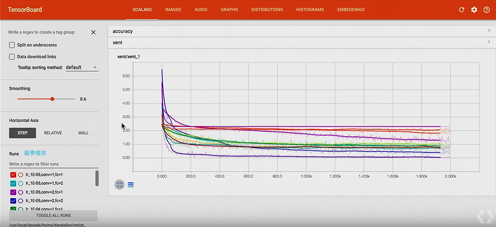
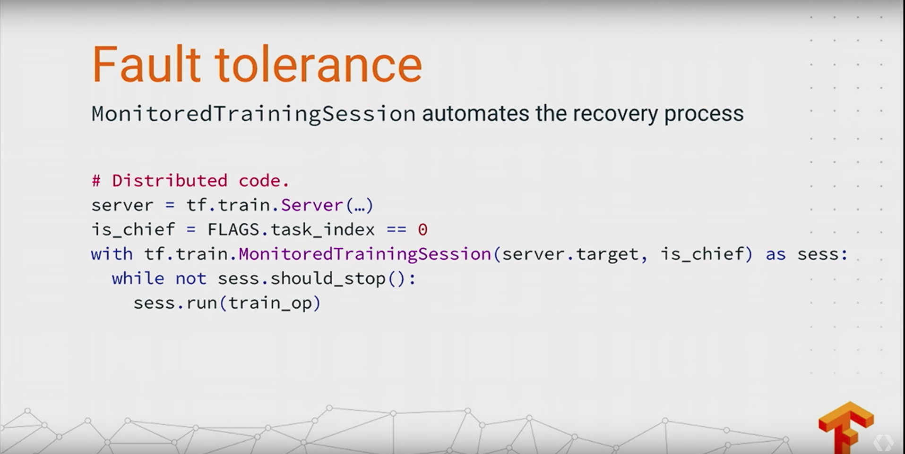
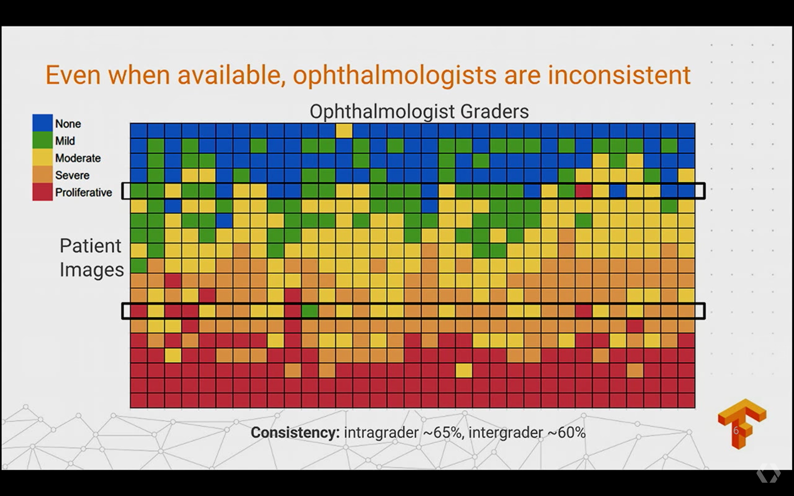

## 前言
前两天，Google的小伙伴们开了异常TensorFlow developer的Submit，熬夜看了差不多四个小时，后来坚持不住了，休息了，后来看相关的报道，对其他的细节很感兴趣，特意花了几天详细了解了
Submit上的这些talks，发现很多有意思、有用的地方，特整理成稿，与小伙伴们分享

### TensorFlow: Machine Learning for Everyone
video url [TensorFlow: Machine Learning for Everyone](https://www.youtube.com/watch?v=mWl45NkFBOc&index=1&list=PLOU2XLYxmsIKGc_NBoIhTn2Qhraji53cv)
主要是TensorFlow的过去一段时间获得成绩的一个基本介绍，主要内容覆盖以下几点：

 - TensorFlow被用在Google很多的内部应用包括：Gmail, Google Play Recommendation, Search, Translate, Map等等；
 - 在医疗方面，TensorFlow被科学家用来搭建根据视网膜来预防糖尿病致盲（后面也提到Stanford的PHD使用TensorFlow来预测皮肤癌，相关工作上了Nature封面）；
 - 通过在音乐、绘画这块的领域使用TensorFlow构建深度学习模型来帮助人类更好地理解艺术；
 - 使用TensorFlow框架和高科技设备，构建自动化的海洋生物检测系统，用来帮助科学家了解海洋生物的情况；
 - TensorFlow在移动客户端发力，有多款在移动设备上使用TensorFlow做翻译、风格化等工作；
 - TensorFlow在移动设备CPU（高通820）上，能够达到更高的性能和更低的功耗；
 - TensorFlow ecosystem结合其他开源项目能够快速地搭建高性能的生产环境；
 - TensorBoard Embedded vector可视化工作
 - 能够帮助PHD/科研工作者快速开展project研究工作。

### Keynote

#### Jean Dean

Google第一代分布式机器学习框架DistBelief不再满足Google内部的需求，Google的小伙伴们在DistBelief上做了在开发，引入各种计算设备的支持包括CPU/GPU/TPU，以及能够很好地运行在移动端，如安卓设置、ios、树莓派
等等，支持多种不同的语言支持（因为各种high-level的api，训练仅支持Python，inference支持包括C++，Go，Java等等），另外包括像TensorBoard这类很棒的工具，能够有效地提供深度学习研究工作者的效率。

TensorFlow在Google内部项目应用的增长也十分迅速：在Google多个产品都有应用如：Gmail，Google Play Recommendation， Search， Translate， Map等等；有将近100多project和paper使用TensorFlow做相关工作

TensorFlow在过去14个月的开源的时间内也获得了很多的成绩，包括475+ 非Google的Contributors，14000+次commit，超过5500标题中出现过TensorFlow的github project以及在Stack Overflow上有包括5000+个已被回答
的问题，平均每周80+的issue提交

过去1年，TensorFlow从最开始的0.5，差不多一个半月一个版本:

### TensorFlow 1.0
TensorFlow1.0也发布了，虽然改了好多api，但是也提供了tf_upgrade.py来对你的代码进行更新，具体可以看看这里[Transitioning to TensorFlow 1.0](https://www.tensorflow.org/install/migration),
TensorFlow 1.0在分布式训练inception-v3模型上，64张GPU可以达到58X的加速比，更灵活的高层抽象接口，以及更稳定的API。

#### New High Level API
对于新的抽象接口，TensorFlow相对于其他DeepLearning FrameWork做的比较好，layers能让人很容易build一个model，基于layer之上的包括tf.learn里面仿照scikit-learn风格的各种estimator设计以及之后将融入TensorFlow
官方支持的Keras，能够让小伙伴用几行配置模型结构、运行方式、模型输出等等;在这层之上就有canned Estimator，所谓的model in box，比如lr，kmeans这类。

#### Broad ML Support
在TensorFlow中有一些高兴的机器学习的算法实现，如LR， SVM、 Random Forest，在TF.Learn中有很多常用的机器学习算法的实现，用户可以很快的使用，而且API风格和scikit-learn很类似，而且在后续的video提到会有分布式的支持

#### XLA: An Experimental TensorFlow Compiler
TensorFlow XLA能够快速地将TensorFlow转成比较底层的实现（依赖device），这里后面有个talk，详细讲述了XLA

#### 广泛的合作

 - Included in IBM's PowerAI
 - Support movidus myriad 2 accelerator
 - Qualcomm's Hexagon DSP (8倍加速，这里还请了Qualcomm的产品负责人来站台) 

#### TensorFlow In Depth

TensorFlow在research和production上有很好的优势，如下图：

在模型训练上，1机8卡的性能无论是在一些标准的基准测试或者是真实数据上都有比较好的加速比：

当然在多机分布式训练上，能够达到64张GPU上58倍的加速比：

TensorFlow被一些顶尖的学术研究项目使用：
 - Neural Machine Translation
 - Neural Architecture Search
 - Show and Tell

当然TensorFlow在生产上也被广泛应用：

如Mobile Google Translate，Gmail等等，也被国内外很多大厂使用做为模型训练的工具。

#### 一些有趣的应用

 - 一对日本夫妻在他们学自动化的小孩的帮助下，构建了一套基于图像的自动区分黄瓜种类的系统，减少了母亲的手工工作；
 - 利用TensorFlow的构造图像分类模型，用来在早期检测糖尿病，能够大大降低致盲的可能性；
 - 利用TensorFlow的pretrain inception-v3模型，做皮肤癌检测，相关工作发表在nature上；

基本Keynote的内容就是这些，内容有点多，而且个人感觉这群google的小伙伴的ppt做的有点任性，不过谁叫他们牛逼呢，接下来几个talk比较有技术含量，相信各位会更加有兴趣

### XLA: TensorFlow, Compiled

TensorFlow的各方面的优势都很突出，除了在速度这块有些不足，如果，TensorFlow能在速度上做进一步优化，会怎么样呢 ？

是的，Google的开发者也意识到这个问题，于是有了这个XLA， XLA的优势：

 - 提高执行速度，编译子图会减少生命周期较短的op的时间，来至少TensorFlow执行是的时间；融合pipelined的op来减少内存的开销；
 - 通过分析和调节内存需求，来减少很多中间结果的缓存
 - 减少定制化op的依赖，通过提供自动化融合底层ops的性能来达到原先需要手工去融合定制化op的性能
 - 减少移动设备的内存占用，使用AOT编译子图来减少tensorflow执行时间，能够共享object/header file pair给其他应用，能够在Mobile Inference上减少几个数量级的内存占用
 - 提高了程序的可移植性，能够在不改变大部分tensorflow源码的前提下，很容易地更改以适应新的硬件设备，

XLA主要包括两种使用方式：JIT(Just in time)能够自动将Graph中的部分子图通过XLA融合某些操作来减少内存需求提高执行速度；AOT(Ahead of time)可以提前将Graph转换为可以执行的源码，减少生成的可执行文件的大小，
减少运行的时间消耗，一个很明显的应用场景是模型在移动设备上的Inference优化。

因为XLA原理涉及到编译器，这块不是我擅长的地方，所以这里就这样过了， 如果有兴趣的小伙伴可以关注下[xla docs](https://www.tensorflow.org/versions/master/experimental/xla/)还有此次TensorFlow Dev Submit
上XLA的talk[XLA: TensorFlow, Compiled!](https://www.youtube.com/watch?v=kAOanJczHA0&index=2&list=PLOU2XLYxmsIKGc_NBoIhTn2Qhraji53cv#t=108.706756)
最后贴几张XLA的一些评测性能：

### Hands On TensorBoard
这个talk主要是介绍了TensorBoard的一些应用，很多用法以前都没有尝试过，听演讲者描述之后受益匪浅

    # Define a simple convolutional layer 
    def conv_layer(input, channels_in, channels_out): 
        w = tf.Variable(tf.zeros([5, 5, channels_in, channels_out])) 
        b = tf.Variable(tf.zeros([channels_out])) 
        conv = tf.nn.conv2d(input, w, strides=[1, 1, 1, 1], padding="SAME") 
        act = tf.nn.relu(conv + b) 
        return act
    # And a fully connected layer 
    def fc_layer(input, channels_in, channels_out): 
        w = tf.Variable(tf.zeros([channels_in, channels_out])) 
        b = tf.Variable(tf.zeros([channels_out])) 
        act = tf.nn.relu(tf.matmul(input, w) + b) 
        return act
    # Setup placeholders, and reshape the data 
    x = tf.placeholder(tf.float32, shape=[None, 784]) 
    y = tf.placeholder(tf.float32, shape=[None, 10]) 
    x_image = tf.reshape(x, [-1, 28, 28, 1])
    # Create the network 
    conv1 = conv_layer(x_image, 1, 32) 
    pool1 = tf.nn.max_pool(conv1, ksize=[1, 2, 2, 1], strides=[1, 2, 2, 1], padding="SAME")
    conv2 = conv_layer(pooled, 32, 64) pool2 = tf.nn.max_pool(conv2, ksize=[1, 2, 2, 1], strides=[1, 2, 2, 1], padding="SAME") 
    flattened = tf.reshape(pool2, [-1, 7 * 7 * 64])
    fc1 = fc_layer(flattened, 7 * 7 * 64, 1024) 
    logits = fc_layer(fc1, 1024, 10)
    # Compute cross entropy as our loss function 
    cross_entropy = tf.reduce_mean( tf.nn.softmax_cross_entropy_with_logits(logits=logits, labels=y))
    # Use an AdamOptimizer to train the network 
    train_step = tf.train.AdamOptimizer(1e-4).minimize(cross_entropy)
    # compute the accuracy 
    correct_prediction = tf.equal(tf.argmax(logits, 1), tf.argmax(y, 1)) 
    accuracy = tf.reduce_mean(tf.cast(correct_prediction, tf.float32))
    # Initialize all the variables sess.run(tf.global_variables_initializer())
    # Train for 2000 steps for i in range(2000): 
    batch = mnist.train.next_batch(100)
    # Occasionally report accuracy 
    if i % 500 == 0: [train_accuracy] = sess.run([accuracy], feed_dict={x: batch[0], y: batch[1]}) 
        print("step %d, training accuracy %g" % (i, train_accuracy))
    # Run the training step 
    sess.run(train_step, feed_dict={x: batch[0], y_true: batch[1]})

很多小伙伴都写过类似的代码，构造网络，然后设定训练方式，最后输出一些基本的结果信息，如下：

    step 0, training accuracy 10% 
    step 500, training accuracy 12% 
    step 1500, training accuracy 9% 
    step 2000, training accuracy 13%

TensorFlow给你的不仅仅是这些，有一个特别棒的工具TensorBoard能够可视化训练过程中的信息，能让人直观的感受，当然需要一些简单的配置：

**写入Graph**

    writer = tf.summary.FileWriter("/tmp/mnist_demo/1") 
    writer.add_graph(sess.graph)

这里虽然能够可视化Graph，却感觉很杂乱，我们可以通过给一些node增加name，scope，让图变得更好看点：

    def conv_layer(input, channels_in, channels_out, name="conv"): 
        with tf.name_scope(name): 
            w = tf.Variable(tf.zeros([5, 5, channels_in, channels_out]), name="W") 
            b = tf.Variable(tf.zeros([channels_out]), name="B") 
            conv = tf.nn.conv2d(input, w, strides=[1, 1, 1, 1], padding="SAME") 
            act = tf.nn.relu(conv + b) 
            return tf.nn.max_pool(act, ksize=[1, 2, 2, 1], strides=[1, 2, 2, 1], padding="SAME")
            
    def fc_layer(input, channels_in, channels_out, name="fc"): 
        with tf.name_scope(name): 
            w = tf.Variable(tf.zeros([channels_in, channels_out]), name="W") 
            b = tf.Variable(tf.zeros([channels_out]), name="B") 
            return tf.nn.relu(tf.matmul(input, w) + b)
    # Setup placeholders, and reshape the data 
    x = tf.placeholder(tf.float32, shape=[None, 784], name="x") 
    x_image = tf.reshape(x, [-1, 28, 28, 1]) 
    y = tf.placeholder(tf.float32, shape=[None, 10], name="labels")
    conv1 = conv_layer(x_image, 1, 32, "conv1") conv2 = conv_layer(conv1, 32, 64, "conv2")
    flattened = tf.reshape(conv2, [-1, 7 * 7 * 64]) 
    fc1 = fc_layer(flattened, 7 * 7 * 64, 1024, "fc1") 
    logits = fc_layer(fc1, 1024, 10, "fc2")
    with tf.name_scope("xent"): 
        xent = tf.reduce_mean( tf.nn.softmax_cross_entropy_with_logits(logits=logits, labels=y))
    with tf.name_scope("train"): 
        train_step = tf.train.AdamOptimizer(1e-4).minimize(xent)
    with tf.name_scope("accuracy"): 
        correct_prediction = tf.equal(tf.argmax(logits, 1), tf.argmax(y, 1)) 
        accuracy = tf.reduce_mean(tf.cast(correct_prediction, tf.float32))
    writer = tf.summary.FileWriter("/tmp/mnist_demo/2") 
    writer.add_graph(sess.graph)

通过TensorFlow的api，收集更多的数据记录显示在TensorBoard中：
    tf.summary.scalar('cross_entropy', xent) 
    tf.summary.scalar('accuracy', accuracy)
    tf.summary.image('input', x_image, 3)

修改Conv的代码，将Weight，bias，act加入到histogram中：

    def conv_layer(input, channels_in, channels_out, name="conv"): 
        with tf.name_scope(name): 
        w = tf.Variable(tf.zeros([5, 5, channels_in, channels_out]), name="W") 
        b = tf.Variable(tf.zeros([channels_out]), name="B") 
        conv = tf.nn.conv2d(input, w, strides=[1, 1, 1, 1], padding="SAME") 
        act = tf.nn.relu(conv + b) 
        tf.summary.histogram("weights", w) 
        tf.summary.histogram("biases", b) 
        tf.summary.histogram("activations", act) 
        return tf.nn.max_pool(act, ksize=[1, 2, 2, 1], strides=[1, 2, 2, 1], padding="SAME")

配置将训练过程中的数据写入：

    merged_summary = tf.summary.merge_all() 
    writer = tf.summary.FileWriter("/tmp/mnist_demo/3") 
    writer.add_graph(sess.graph)

    for i in range(2001): 
        batch = mnist.train.next_batch(100) 
        if i % 5 == 0: 
            s = sess.run(merged_summary, feed_dict={x: batch[0], y: batch[1]}) 
            writer.add_summary(s, i) 
            sess.run(train_step, feed_dict={x: batch[0], y: batch[1]})

#### Hyperparameter Search

这次这个TensorBoard的talk给我最大的收获就是用TensorBoard做Hyperparamter Search 是这么的方便， 这次talk中主要演示超参的两个方面：

 - 不同学习率
 - 不同网络结构

    # Try a few learning rates 

    for learning_rate in [1E-3, 1E-4, 1E-5]:
        # Try a model with fewer layers for use_two_fc in [True, False]: 
        for use_two_conv in [True, False]:
        # Construct a hyperparameter string for each one (example: "lr_1E-3,fc=2,conv=2) 
            hparam_str = make_hparam_string(learning_rate, use_two_fc, use_two_conv)
            writer = tf.summary.FileWriter("/tmp/mnist_tutorial/" + hparam_str)
            # Actually run with the new settings 
            mnist(learning_rate, use_two_fully_connected_layers, use_two_conv_layers, writer)

`tensorboard --logdir /tmp/mnist_tutorial` 

#### Embedding Visualizer

    embedding = tf.Variable(tf.zeros([10000, embedding_size]), name="test_embedding") 
    assignment = embedding.assign(embedding_input)
    config = tf.contrib.tensorboard.plugins.projector.ProjectorConfig() 
    embedding_config = config.embeddings.add() 
    embedding_config.tensor_name = embedding.name 
    embedding_config.sprite.image_path = os.path.join(LOG_DIR, 'sprite.png') 
    # Specify the width and height of a single thumbnail. 
    embedding_config.sprite.single_image_dim.extend([28, 28]) 
    tf.contrib.tensorboard.plugins.projector.visualize_embeddings(writer, config)

    for i in range(2001): 
        batch = mnist.train.next_batch(100) 
        if i % 5 == 0: 
            [train_accuracy, s] = sess.run([accuracy, summ], feed_dict={x: batch[0], y: batch[1]}) 
            writer.add_summary(s, i) 
        if i % 500 == 0: 
            sess.run(assignment, feed_dict={x: mnist.test.images, y_true: mnist.test.labels}) 
            saver.save(sess, os.path.join(LOG_DIR, "model.ckpt"), i) 
        sess.run(train_step, feed_dict={x: batch[0], y_true: batch[1]})

#### Future for TensorBoard

未来TensorBoard，会在以下三个方面来做一些提升：

 - 在TensorBoard上集成Tensorflow的调试
 - 增加插件的支持
 - 企业级TensorBoard的支持

### TensorFlow High-Level APIs: Models in a Box

TensorFlow在灵活性、可扩展性、可维护性上做的很好，但是现在在高级api、模块式算法这块原先都还不足，但是Google Brain的工程师在这个talk上介绍了一些High-level API的相关工作。

 - layers: 封装了一些层的操作，简化用原生TensorFlow源码，比如new 一个variable来做weight等等；
 - Estimator or Keras: 封装了一些更高层的操作包括，train和evaluate操作，用户可以通过几行代码来快速构建训练和评估过程；
 - Canned Estimators: 更高级API，所谓的Models in a box

构造左图中所示的深度网络只需要如图右中的七行代码
同样，构建训练、评估、预测也很快可以通过api调用完成：

最后是Model in a Box

    area = real_valued_column("square_foot")
    rooms = real_valued_column("num_rooms")
    zip_code = sparse_column_with_integerized_feature("zip_code", 100000)

    regressor = LinearRegressor(feature_columns=[area, room, zip_code])
    classifier.fit(train_input_fn)
    classifier.evaluate(eval_input_fn)

### Skin Cancer Image classification
皮肤癌在早起的治愈率是98%，在2020，预计全球有61台智能手机。

这位小哥做的工作是啥呢，他拿到了一批皮肤癌的数据，然后使用一个pretrained的inception-v3对数据来做一个inference，

最终结果：

而且很容易的在手机上搭建，完成一个app用来做早起皮肤癌的检测：

最终相关成果发表在Nature，而且在Nature的封面，这是一个特别成功地通过计算机视觉及深度学习相关的技术，利用廉价的移动设备，能够很有效地检测是否有皮肤癌，大大节省了医疗检测的成本，相信在未来
会有更多相关的技术出现。

### Integrating Keras & TensorFlow: The Keras workflow, expanded 
Keras "An API Specify for building deep learning models across many platforms".
TensorFlow已经会在官方TensorFlow支持，1.1会在tf.contrib,1.2会tf.keras，而且会支持TensorFlow Serving，是不是很心动
听下Keras的作者在TensorFlow Dev Submit上讲了写啥吧

所以之后Keras的用户可以更快的在TensorFlow的框架下做出相应地模型，能更方便地进行分布式训练，使用Google的Cloud ML， 进行超参，还有更更重要的：TF-Serving。
这些feature现在好像还没有支持，不过应该很快了，大家期待吧
这里，Francois Chollet使用Keras构造了一个Video-QA的model，这个模型在Keras的官方文档也有描述，具体可以去那边看看，大概是这样一个场景:

这样一个场景，利用原生的python构造太难了，但是用Keras，只需要考虑设计你的模型，如何来完成类似的功能，完全不用担心coding的实现，如图是一个类似问题的一个简单地模型设计：

更详细一点：

那么在Keras中如何实现呢 

    video = tf.keras.layers.Input(shape=(None, 150, 150, 3))
    cnn = tf.keras.applications.InceptionV3(weights='imagenet', include_top=False, pool='avg)

    cnn.trainable = False
    encoded_frames = tf.keras.layers.TimeDistributed(cnn)(video)
    encoded_vid = tf.layers.LSTM(256)(encode_frames)

    question = tf.keras.layers.Input(shape=(100), dtype='int32')
    x = tf.keras.layers.Embedding(10000, 256, mask_zero=True)(question)
    encoded_q = tf.keras.layers.LSTM(128)(x)

    x = tf.keras.layers.concat([encoded_vid, encoded_q])
    x = tf.keras.layers.Dense(128, activation=tf.nn.relu)(x)
    outputs = tf.keras.layers.Dense(1000)(x)

    model = tf.keras.models.Mode([video, question], outputs)
    model.compile(optimizer=tf.AdamOptimizer(), loss=tf.softmax_crossentropy_with_logits)

这里代码是无法在现在的tensorflow版本上跑的如果想了解下keras上构建上述模型的简便性,可以看看[这里](https://keras.io/getting-started/functional-api-guide/).
Keras在构造深度模型的方便是大家众所周知的，值得期待之后Keras在TensorFlow的更新：

### TensorFlow at DeepMind
DeepMind在被Google收购之后，也选择TensorFlow作为其深度学习相关研究的平台，然后做了很多很有意思的东西：

#### Data Center Cooling

这是Google在全世界各地若干个数据中心之一:

然后这群Google的小伙伴做了些什么事情呢？

Google的小伙伴利用强化学习，是的！你没有听错，应用在AlphaGo上的一种技术来做数据中心冷却设备的自动控制,并且效果十分显著：

#### Gorila
Gorial是DeepMind下的一个强化学习的框架，这里我不太熟悉，就先不谈了，大概是说基于TensorFlow的高级API实现很稳定，只需要更改其中极少部分代码就可以完成新的实验，支持分布式训练，十分高效，
并且训练好的模型可以通过TensorFlow Serving快速地部署到生产环境。

#### AlphaGo
这个相信不说，大家都知道的，第一次在围棋上打败人类，然后升级版的Master 连续60盘不败，原理不说了，网络上很多分析文章，贴两张图聊表敬意：

#### WaveNet
这里DeepMind的小哥演示了WaveNet的一些demo， 具体的可以参见[这里](https://deepmind.com/blog/wavenet-generative-model-raw-audio/)来了解。
贴一些效果对比：

### Mobile and Embedded TensorFlow

这里介绍了怎么在移动设备比如安卓、IOS设备、树莓派上面怎么使用TensorFlow来做一些开发，具体的可能对移动设备程序开发的小伙伴们比较有用，我这里也不描述了，给个talk的
[地址](https://www.youtube.com/watch?v=0r9w3V923rk&index=9&list=PLOU2XLYxmsIKGc_NBoIhTn2Qhraji53cv)，有兴趣的可以去看看吧

### Distributed TensorFlow
TensorFlow在分布式性能上，前面也提到了，在1.0版本上有了很大的提升可以做到64块GPU上达到58倍的加速，这里先基本介绍下数据并行和模型并行：

 - 数据并行 每一个worker上有完整的模型，部分数据，参数的更新传给Params Server;
 - 模型并行 每一个worker上有部分的网络模型;

怎么在TensorFlow写分布式代码，这里我就不说了，很简单地配置，这里我讲下，可能大部分像我这样的小伙伴之前不太了解的一些彩蛋
在TensorFlow中做分布式训练的一些技巧，有过分布式train的经验应该会很感激这些黑科技：
 - Round-Robin variables
 - Load balancing and partitioning

上面说的是啥呢？ Params Server在保存模型的参数时，默认是每一个ps存一个variable，然后下一个到下个ps上存，但是就会存在很多问题，可能这个variable很小，但是另一个很大，这样你会发现ps和work
之间的带宽的占用差距很多，怎么解决呢？看下面几张图

说点题外话，为啥我在看到这里的时候特别激动呢，笔者之前在开展团队内部的分布式训练平台时就遇到这个问题，我们在测试AlexNet模型时，发现多个ps上的带宽占用差别极大，原因在与AlexNet模型的最后三个
全连接参数太多，造成了ps的不均衡。

上面说了下Distributed TensorFlow我特别激动的东西，之后talk的就是比较简单的了，如果在TensorFlow做分布式的job，文档里面都有，很简单，这里不提了
不对，这里还必须说下TensorFlow对于容灾的一个支持：
下图是几种分布式下机器挂掉的情况：

多麻烦是吧，但是没有关系，在TensorFlow下能够自动对这些进行一个快速的恢复，只需要更改一行代码

### TensorFlow Ecosystem: Integrating TensorFlow with your infrastructure
这块我感兴趣的不多，talk大概讲了如果利用TensorFlow生态结合一些流程的框架比如Spark、Hadoop等等来更好地使用TensorFlow

#### 数据准备工作

支持的数据读取方法，从快到慢依次是：
 1.tf.Example, tf.SequenceExample对象；
 2.原生的读取CSV，JSON的OP
 3.直接从Python feed数据（最简单）

如何在其他如Hadoop, Spark上支持TFRecords(Beam原生支持) 见[tensorflow ecosystem](github.com/tensorflow/ecosystem)

#### 集群的管理
TensorFlow支持以下多种框架:

#### 分布式存储

#### 容器支持

#### 模型导出

 - SavedModel: 1,TensorFlow模型的标准保存格式；2，包括以下必须的assets，比如vocabularies（不太会翻，啥意思）；
 - GraphDef： 通常在移动设备的模型保存比较通用

### Serving Models in Production with TensorFlow Serving
这部分，小米云的陈迪豪同学做过很多相关的工作，也有很多分享，想在这块比较深了解的同学可以去关注下，我这里不太擅长，只作科普
如何把训练好的模型快速部署在生产环境提供可用的服务，TensorFlow Serving就是专注在这块，我这里简单介绍下吧：

把训练好的模型提供生产环境可用的服务，通常有以下几个需求：

 - 长期稳定服务，低时延
 - 支持多个模型服务
 - 支持同一模型多版本
 - 保证计算时耗尽量小以保证一些实时性需求
 - mini-batching的支持，以提高效率

TensorFlow Serving的设计就是为了解决这些需求，而且TensorFlow基于gRPC，支持多种语言。
好吧，为了不误导各位，小伙伴还是去关注下迪豪同学的分享吧

### ML Toolkit
TensorFlow可能最开始被人知晓，就是因为大家都觉得他是一个深度学习的框架，其实不是，现在TensorFlow上还有很多机器学习的算法集成：

而且算法API的开发都是仿照scikit-learn的风格，有Python下做机器学习的小伙伴，可以很快的适应。
这里值得提出的，有趣TensorFlow对机器学习和深度学习模型的支持，小伙伴们可以特别容易地结合传统的机器学习方法和深度学习模型来一起训练：

### Sequence Models And RNN API
主要介绍了TensorFlow下的一些NLP的常用的模型，这里我不懂，所以不描述了，感兴趣的大概来[这儿](https://www.youtube.com/watch?v=RIR_-Xlbp7s&list=PLOU2XLYxmsIKGc_NBoIhTn2Qhraji53cv&index=14)看吧

### Case Study: TensorFlow in Medicine - Retinal Imaging
这个talk讲的前面也提到的通过视网膜图像预测糖尿病，预防失明

通过视网膜图片预测糖尿病是一个困难的问题，即使是专业的医生，也很难去判断，但是深度学习却可以帮助我们：

通过收集适量的医疗数据，构建一个26layers的深度网络，我们可以让网络自动学习这些图像中的feature，来获得较高的分类准确率，而这个是人眼很难解决的。
这里有一个demo的演示：

模型最后的评估比专业医生对比，F-score为0.95，比专业医生的中位数0.91还高，这个太厉害了，相信不久会看到深度学习在医疗，尤其是这种病症图像分析上有很多惊人的成果

### Wide & Deep Learning: Memorization + Generalization with TensorFlow

这项技术有段时间特别火，被用来做推荐相关的应用，首先解释下Memorization,Generalization:

模型的基本结构如下：

整个推荐会同事考虑到商品的相关性以及一些推理关系，例如老鹰会飞、麻雀会飞这类逻辑属于Memorization， 而带翅膀的动物会飞这属于Genralization。

在具体的应用场景，如Google Play的App推荐：

这里构建一个如下图的网络来进行训练(joint training):

为啥要joint training，而不是直接用deep和wide的来做ensemble呢？
这里做这个给出一个解释，因为wide和deep会相互影响，最后精确度会高，并且model会比较小

而上面提到的Wide & Deep Learning Model在Tensorflow下仅仅只需要10行代码来实现(突然想起了那个100美元画一条线的故事)：

### Magenta: Music and Art Generation
最后这个talk讲的是利用深度学习来做一些艺术相关的工作，项目地址:[tensorflow-magenta](https://github.com/tensorflow/magenta)
有一些很好玩的东西，如风格化，生成艺术家风格的音乐，利用深度学习模型模拟人类对艺术的想象力，创造出属于DeepLearning的艺术风格。
想要详细了解的可以看看这里的介绍[welcome-to-magenta](https://magenta.tensorflow.org/welcome-to-magenta)，还有前面提到的github上project

## 总结
照例总结下，从上面不难看出TensorFlow在过去一年的时间里确实做了很多很有意思的工作，无论是在Reasearch还是Production上，包括各种有意思的工具，其中收获最大的是利用TensorFlow来做
超参的调节、还有Keras的新的支持、分布式的各种模型变量保存的优化方法、分布式容灾、XLA的支持是的模型更快，这么几天的时间花费感觉没有浪费，但是因为个人知识有限，如上面有错误或者不周到
的地方，欢迎指出，敬请谅解。

