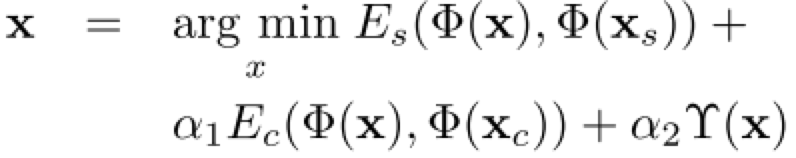
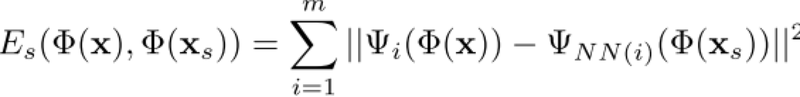
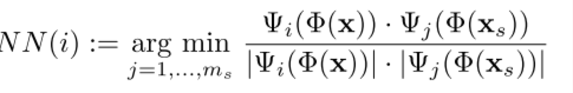
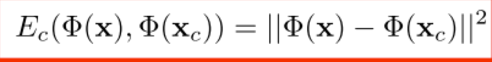
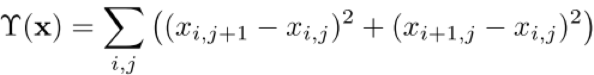
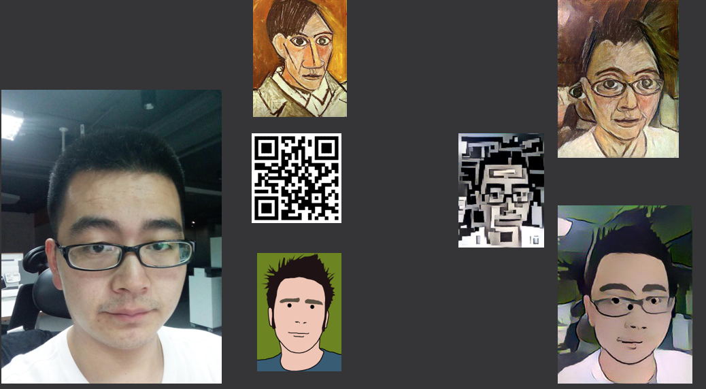
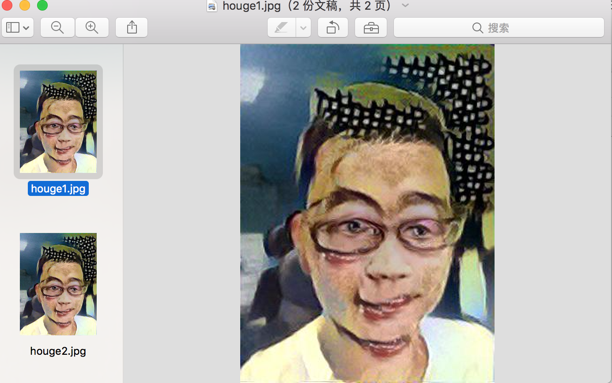
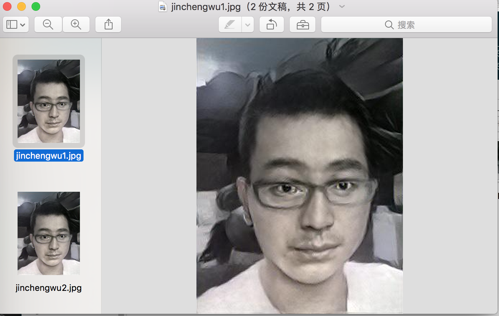
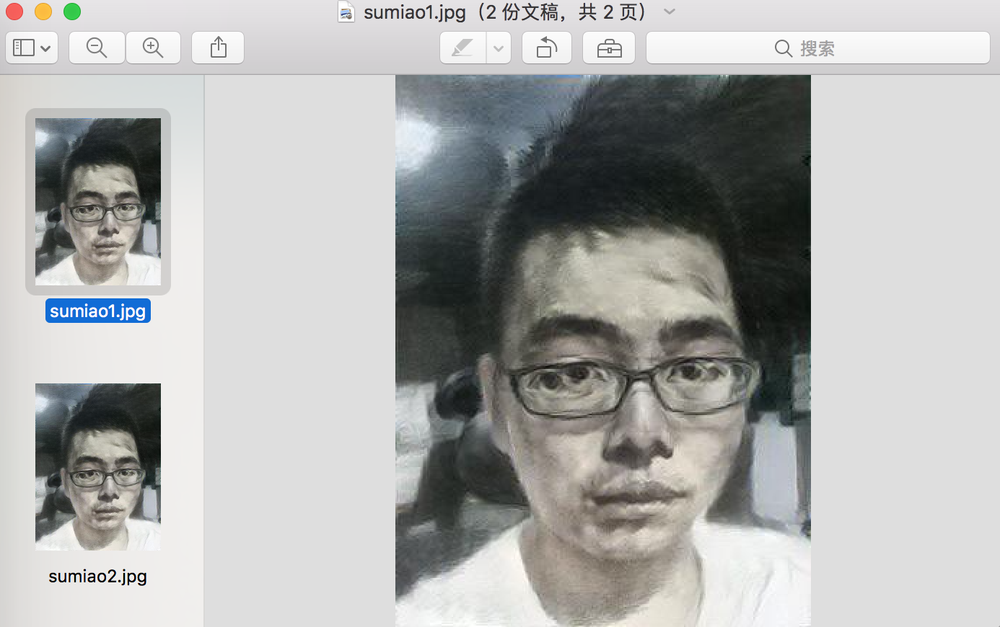

## 前言
前面有两篇将图像风格化的文章[TensorFlow之深入理解Neural Style
](http://hacker.duanshishi.com/?p=1651)、[TensorFlow之深入理解Fast Neural Style](http://hacker.duanshishi.com/?p=1693)，讲了业界关于Neural Style的基本研究，从最开始的基于pretrained的vgg模型，来做loss，前面的会去更新vgg模型中的weight来最小化loss，后面是更新transform network（deep residual network）的weight来使loss Network的total loss 最小化，后面这套，我run了下项目代码，但是除了梵高的星空那张tyle的图像，其他效果太差，合成的图像基本无法看到content，试过各种不同的content|style权重比，好像效果都挺差的，有小伙伴在这块有做过实验，请指导下，或者有其他框架下面效果比较好的开源项目也请告知下，先谢谢了；上次在Deep Meet up， 周昌大神分享风格画，提到结合MRF和CNN的相关工作，感觉挺有意思的，paper在这儿[Combining Markov Random Fields and Convolutional Neural Networks for Image Synthesis](http://arxiv.org/abs/1601.04589)，我找到了两个相关的github项目[https://github.com/chuanli11/CNNMRF](https://github.com/chuanli11/CNNMRF)作者的开源，基于torch的项目代码,[https://github.com/awentzonline/image-analogies](https://github.com/awentzonline/image-analogies)，基于keras的一个开源项目，可以基于tensorflow的backend。

## Paper原理
MRF是在图像处理中一种经典方法， 图像分割、合成均有用到，1999年时就在ICCV上有paper [Texture Synthesis by Non-parametric Sampling](http://citeseerx.ist.psu.edu/viewdoc/download?doi=10.1.1.44.14&rep=rep1&type=pdf),然后还有一篇我觉得比较给力的文章[Markov Random Fields for Super-resolution and Texture Synthesis](http://people.csail.mit.edu/celiu/pdfs/mrfchapt10.pdf),而MRF的能力在于学习数据中所有k*k大小的图像块之间的相关性，通常使用简单的近邻规则，具体原理看看上面两篇paper。

[Combining Markov Random Fields and Convolutional Neural Networks for Image Synthesis](https://arxiv.org/pdf/1601.04589v1.pdf)和[nerual style](https://arxiv.org/abs/1508.06576)那篇文章不同的是在style定义上，nerual style那篇，style是各层不同loss的加权和来做style loss，通过最小化content loss 和style loss来更新像素值，得到合成的图像， 但是这里使用MRF来编码style，最终最小化energy function:

其中，差别最大的就是**MRF loss function**:

对每一个patch，通过normlizaed cross-correlation来找到最匹配的patch：

**Content loss function**：

最后，从图像的neural encoding重构图像时，会产生noisy，文章，通过增加squared gradient norm来保证最终图片的平滑性：

基本的原理就是这些，想要了解更多细节的去读下这篇paper

## 源码
paper作者开源了他的工作，[https://github.com/chuanli11/CNNMRF](https://github.com/chuanli11/CNNMRF),因为之前都没有怎么了解过torch，所以源码看起来有点麻烦， 尤其是MRF那块看得不是特别懂，另外作者自己写了个lbfgs函数，源码部分大家就去看看吧，我也好好研究，尤其是mrf.lua，看起来很复杂，其他的代码模式好像是继承nn.Module，然后重写其中一些函数来满足自己的需求，感觉编程模式和tensorflow差别有点大，适应起来有点麻烦。
另外有个基于keras的实现[https://github.com/awentzonline/image-analogies](https://github.com/awentzonline/image-analogies)。

## Result
代码分析不够，结果来凑，MRF+CNN来做风格化效果相当棒,下面是跑一些结果

以孙悟空的脸为style：

以金城武的人脸为style：

以某张素描分割为style：

## 总结
一系列的Neural Style的工作中，MRF来建模Style，效果看起来最好，但是训练时间由于MRF的patch match，速度挺慢的，前面其他的方法，感觉都可以再次基础上改善效果，另外感觉也可以试着用其他的方法来建模Style，希望之后能看到更多提升的paper。

