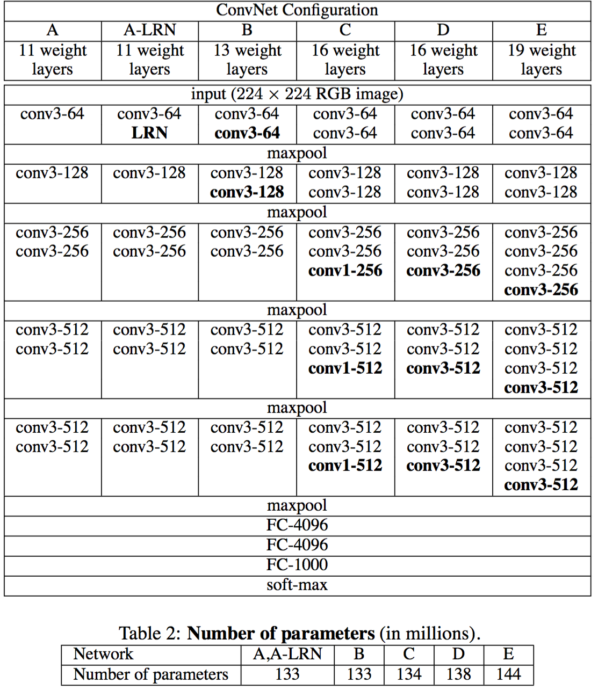
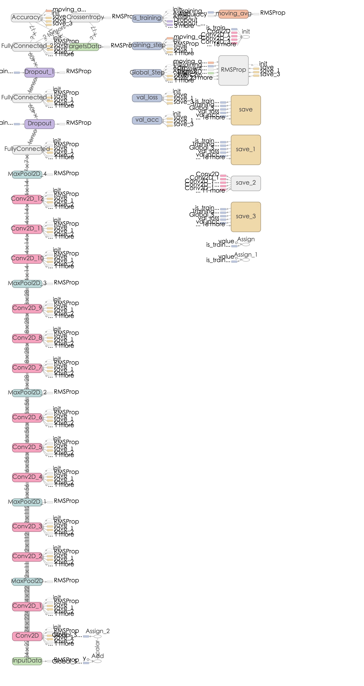
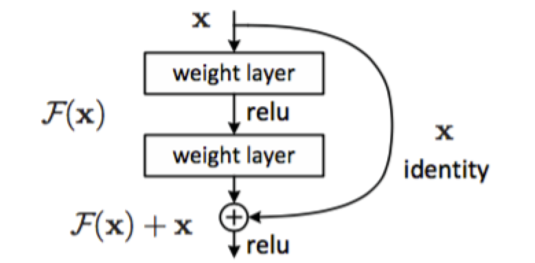
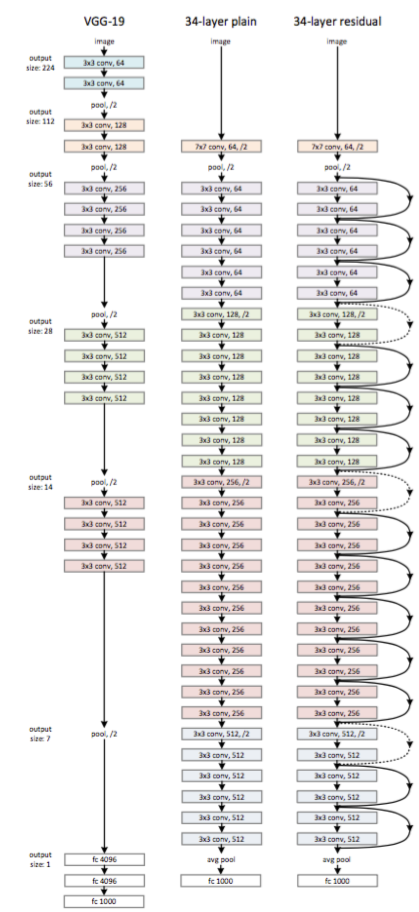

##前言
这段时间到了新公司，工作上开始研究DeepLearning以及TensorFlow，挺忙了，前段时间看了VGG和deep residual的paper，一直没有时间写，今天准备好好把这两篇相关的paper重读下。

###VGGnet
####VGG解读
VGGnet是Oxford的Visual Geometry Group的team，在ILSVRC 2014上的相关工作，主要工作是证明了增加网络的深度能够在一定程度上影响网络最终的性能，如下图，文章通过逐步增加网络深度来提高性能，虽然看起来有一点小暴力，没有特别多取巧的，但是确实有效，很多pretrained的方法就是使用VGG的model（主要是16和19），VGG相对其他的方法，参数空间很大，最终的model有500多m，alnext只有200m，googlenet更少，所以train一个vgg模型通常要花费更长的时间，所幸有公开的pretrained model让我们很方便的使用，前面neural style这篇文章就使用的pretrained的model，paper中的几种模型如下：

可以从图中看出，从A到最后的E，他们增加的是每一个卷积组中的卷积层数，最后D，E是我们常见的VGG-16，VGG-19模型，C中作者说明，在引入1\*1是考虑做线性变换（这里channel一致， 不做降维），后面在最终数据的分析上来看C相对于B确实有一定程度的提升，但不如D、VGG主要得优势在于

 - 减少参数的措施，对于一组（假定3个，paper里面只stack of three 3\*3）卷积相对于7\*7在使用3层的非线性关系（3层RELU）的同时保证参数数量为3\*（3^2C^2）=27C^2的，而7\*7为49C^2，参数约为7\*7的81%。
 - 去掉了LRN，减少了内存的小消耗和计算时间

####VGG-16 tflearn实现
tflearn 官方github上有给出基于tflearn下的VGG-16的实现
	from __future__ import division, print_function, absolute_import

    import tflearn
    from tflearn.layers.core import input_data, dropout, fully_connected
    from tflearn.layers.conv import conv_2d, max_pool_2d
    from tflearn.layers.estimator import regression

    # Data loading and preprocessing
    import tflearn.datasets.oxflower17 as oxflower17
    X, Y = oxflower17.load_data(one_hot=True)

    # Building 'VGG Network'
    network = input_data(shape=[None, 224, 224, 3])

    network = conv_2d(network, 64, 3, activation='relu')
    network = conv_2d(network, 64, 3, activation='relu')
    network = max_pool_2d(network, 2, strides=2)

    network = conv_2d(network, 128, 3, activation='relu')
    network = conv_2d(network, 128, 3, activation='relu')
    network = max_pool_2d(network, 2, strides=2)

    network = conv_2d(network, 256, 3, activation='relu')
    network = conv_2d(network, 256, 3, activation='relu')
    network = conv_2d(network, 256, 3, activation='relu')
    network = max_pool_2d(network, 2, strides=2)

    network = conv_2d(network, 512, 3, activation='relu')
    network = conv_2d(network, 512, 3, activation='relu')
    network = conv_2d(network, 512, 3, activation='relu')
    network = max_pool_2d(network, 2, strides=2)

    network = conv_2d(network, 512, 3, activation='relu')
    network = conv_2d(network, 512, 3, activation='relu')
    network = conv_2d(network, 512, 3, activation='relu')
    network = max_pool_2d(network, 2, strides=2)

    network = fully_connected(network, 4096, activation='relu')
    network = dropout(network, 0.5)
    network = fully_connected(network, 4096, activation='relu')
    network = dropout(network, 0.5)
    network = fully_connected(network, 17, activation='softmax')

    network = regression(network, optimizer='rmsprop',
                         loss='categorical_crossentropy',
                         learning_rate=0.001)

    # Training
    model = tflearn.DNN(network, checkpoint_path='model_vgg',
                        max_checkpoints=1, tensorboard_verbose=0)
    model.fit(X, Y, n_epoch=500, shuffle=True,
              show_metric=True, batch_size=32, snapshot_step=500,
              snapshot_epoch=False, run_id='vgg_oxflowers17')
              
              
VGG-16 graph如下：

对VGG，我个人觉得他的亮点不多，pre-trained的model我们可以很好的使用，但是不如GoogLeNet那样让我有眼前一亮的感觉。

###Deep Residual Network
####Deep Residual Network解读
一般来说越深的网络，越难被训练，[Deep Residual Learning for Image Recognition](https://arxiv.org/abs/1512.03385)中提出一种residual learning的框架，能够大大简化模型网络的训练时间，使得在可接受时间内，模型能够更深(152甚至尝试了1000)，该方法在ILSVRC2015上取得最好的成绩。

随着模型深度的增加，会产生以下问题：
 
 - vanishing/exploding gradient，导致了训练十分难收敛，这类问题能够通过norimalized initialization 和intermediate normalization layers解决；
 - 对合适的额深度模型再次增加层数，模型准确率会迅速下滑（不是overfit造成），training error和test error都会很高，相应的现象在CIFAR-10和ImageNet都有提及

为了解决因深度增加而产生的性能下降问题，作者提出下面一种结构来做residual learning：

假设潜在映射为H(x)，使stacked nonlinear layers去拟合F(x):=H(x)-x，残差优化比优化H(x)更容易。
F(x)+x能够很容易通过"shortcut connections"来实现。

这篇文章主要得改善就是对传统的卷积模型增加residual learning，通过残差优化来找到近似最优identity mappings。

paper当中的一个网络结构：

####Deep Residual Network tflearn实现
tflearn官方有一个cifar10的实现， 代码如下：

	from __future__ import division, print_function, absolute_import

    import tflearn

    # Residual blocks
    # 32 layers: n=5, 56 layers: n=9, 110 layers: n=18
    n = 5

    # Data loading
    from tflearn.datasets import cifar10
    (X, Y), (testX, testY) = cifar10.load_data()
    Y = tflearn.data_utils.to_categorical(Y, 10)
    testY = tflearn.data_utils.to_categorical(testY, 10)

    # Real-time data preprocessing
    img_prep = tflearn.ImagePreprocessing()
    img_prep.add_featurewise_zero_center(per_channel=True)

    # Real-time data augmentation
    img_aug = tflearn.ImageAugmentation()
    img_aug.add_random_flip_leftright()
    img_aug.add_random_crop([32, 32], padding=4)

    # Building Residual Network
    net = tflearn.input_data(shape=[None, 32, 32, 3],
                             data_preprocessing=img_prep,
                             data_augmentation=img_aug)
    net = tflearn.conv_2d(net, 16, 3, regularizer='L2', weight_decay=0.0001)
    net = tflearn.residual_block(net, n, 16)
    net = tflearn.residual_block(net, 1, 32, downsample=True)
    net = tflearn.residual_block(net, n-1, 32)
    net = tflearn.residual_block(net, 1, 64, downsample=True)
    net = tflearn.residual_block(net, n-1, 64)
    net = tflearn.batch_normalization(net)
    net = tflearn.activation(net, 'relu')
    net = tflearn.global_avg_pool(net)
    # Regression
    net = tflearn.fully_connected(net, 10, activation='softmax')
    mom = tflearn.Momentum(0.1, lr_decay=0.1, decay_step=32000, staircase=True)
    net = tflearn.regression(net, optimizer=mom,
                             loss='categorical_crossentropy')
    # Training
    model = tflearn.DNN(net, checkpoint_path='model_resnet_cifar10',
                        max_checkpoints=10, tensorboard_verbose=0,
                        clip_gradients=0.)

    model.fit(X, Y, n_epoch=200, validation_set=(testX, testY),
              snapshot_epoch=False, snapshot_step=500,
              show_metric=True, batch_size=128, shuffle=True,
              run_id='resnet_cifar10')
              
              
其中，residual_block实现了shortcut，代码写的十分棒：

	def residual_block(incoming, nb_blocks, out_channels, downsample=False,
                       downsample_strides=2, activation='relu', batch_norm=True,
                       bias=True, weights_init='variance_scaling',
                       bias_init='zeros', regularizer='L2', weight_decay=0.0001,
                       trainable=True, restore=True, reuse=False, scope=None,
                       name="ResidualBlock"):
        """ Residual Block.

        A residual block as described in MSRA's Deep Residual Network paper.
        Full pre-activation architecture is used here.

        Input:
            4-D Tensor [batch, height, width, in_channels].

        Output:
            4-D Tensor [batch, new height, new width, nb_filter].

        Arguments:
            incoming: `Tensor`. Incoming 4-D Layer.
            nb_blocks: `int`. Number of layer blocks.
            out_channels: `int`. The number of convolutional filters of the
                convolution layers.
            downsample: `bool`. If True, apply downsampling using
                'downsample_strides' for strides.
            downsample_strides: `int`. The strides to use when downsampling.
            activation: `str` (name) or `function` (returning a `Tensor`).
                Activation applied to this layer (see tflearn.activations).
                Default: 'linear'.
            batch_norm: `bool`. If True, apply batch normalization.
            bias: `bool`. If True, a bias is used.
            weights_init: `str` (name) or `Tensor`. Weights initialization.
                (see tflearn.initializations) Default: 'uniform_scaling'.
            bias_init: `str` (name) or `tf.Tensor`. Bias initialization.
                (see tflearn.initializations) Default: 'zeros'.
            regularizer: `str` (name) or `Tensor`. Add a regularizer to this
                layer weights (see tflearn.regularizers). Default: None.
            weight_decay: `float`. Regularizer decay parameter. Default: 0.001.
            trainable: `bool`. If True, weights will be trainable.
            restore: `bool`. If True, this layer weights will be restored when
                loading a model.
            reuse: `bool`. If True and 'scope' is provided, this layer variables
                will be reused (shared).
            scope: `str`. Define this layer scope (optional). A scope can be
                used to share variables between layers. Note that scope will
                override name.
            name: A name for this layer (optional). Default: 'ShallowBottleneck'.

        References:
            - Deep Residual Learning for Image Recognition. Kaiming He, Xiangyu
                Zhang, Shaoqing Ren, Jian Sun. 2015.
            - Identity Mappings in Deep Residual Networks. Kaiming He, Xiangyu
                Zhang, Shaoqing Ren, Jian Sun. 2015.

        Links:
            - [http://arxiv.org/pdf/1512.03385v1.pdf]
                (http://arxiv.org/pdf/1512.03385v1.pdf)
            - [Identity Mappings in Deep Residual Networks]
                (https://arxiv.org/pdf/1603.05027v2.pdf)

        """
        resnet = incoming
        in_channels = incoming.get_shape().as_list()[-1]

        with tf.variable_op_scope([incoming], scope, name, reuse=reuse) as scope:
            name = scope.name #TODO

            for i in range(nb_blocks):

                identity = resnet

                if not downsample:
                    downsample_strides = 1

                if batch_norm:
                    resnet = tflearn.batch_normalization(resnet)
                resnet = tflearn.activation(resnet, activation)

                resnet = conv_2d(resnet, out_channels, 3,
                                 downsample_strides, 'same', 'linear',
                                 bias, weights_init, bias_init,
                                 regularizer, weight_decay, trainable,
                                 restore)

                if batch_norm:
                    resnet = tflearn.batch_normalization(resnet)
                resnet = tflearn.activation(resnet, activation)

                resnet = conv_2d(resnet, out_channels, 3, 1, 'same',
                                 'linear', bias, weights_init,
                                 bias_init, regularizer, weight_decay,
                                 trainable, restore)

                # Downsampling
                if downsample_strides > 1:
                    identity = tflearn.avg_pool_2d(identity, 1,
                                                   downsample_strides)

                # Projection to new dimension
                if in_channels != out_channels:
                    ch = (out_channels - in_channels)//2
                    identity = tf.pad(identity,
                                      [[0, 0], [0, 0], [0, 0], [ch, ch]])
                    in_channels = out_channels

                resnet = resnet + identity

        return resnet
        
Deep Residual Network tflearn这个里面有一个downsample， 我在run这段代码的时候出现一个error，是tensorflow提示kernel size 1 小于stride，我看了好久， sample确实要这样，莫非是tensorflow不支持kernel小于stride的情况？我这里往tflearn里提了个issue [issue-331](https://github.com/tflearn/tflearn/issues/331)

kaiming He在新的paper里面提了proposed Residualk Unit，相比于上面提到的采用pre-activation的理念，相对于原始的residual unit能够更容易的训练，并且得到更好的泛化能力。

##总结
前面一段时间，大部分花在看CV模型上，研究其中的原理，从AlexNet到deep residual network,从大牛的paper里面学到了很多，接下来一段时间，我会去github找一些特别有意思的相关项目，可能会包括GAN等等的东西来玩玩，还有在DL meetup上听周昌大神说的那些neural style的各种升级版本，也许还有强化学习的一些框架以及好玩的东西。