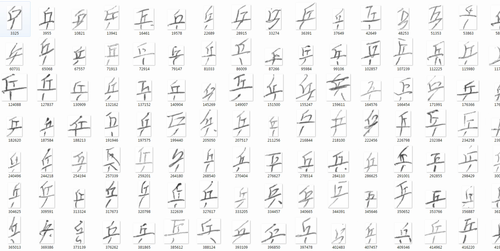
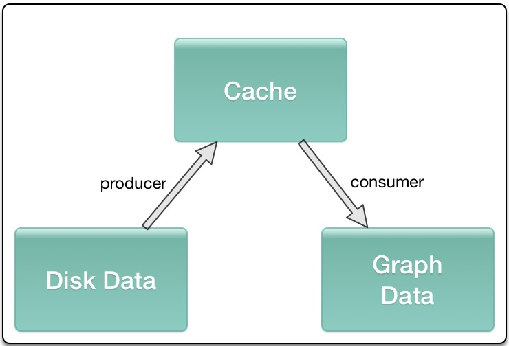
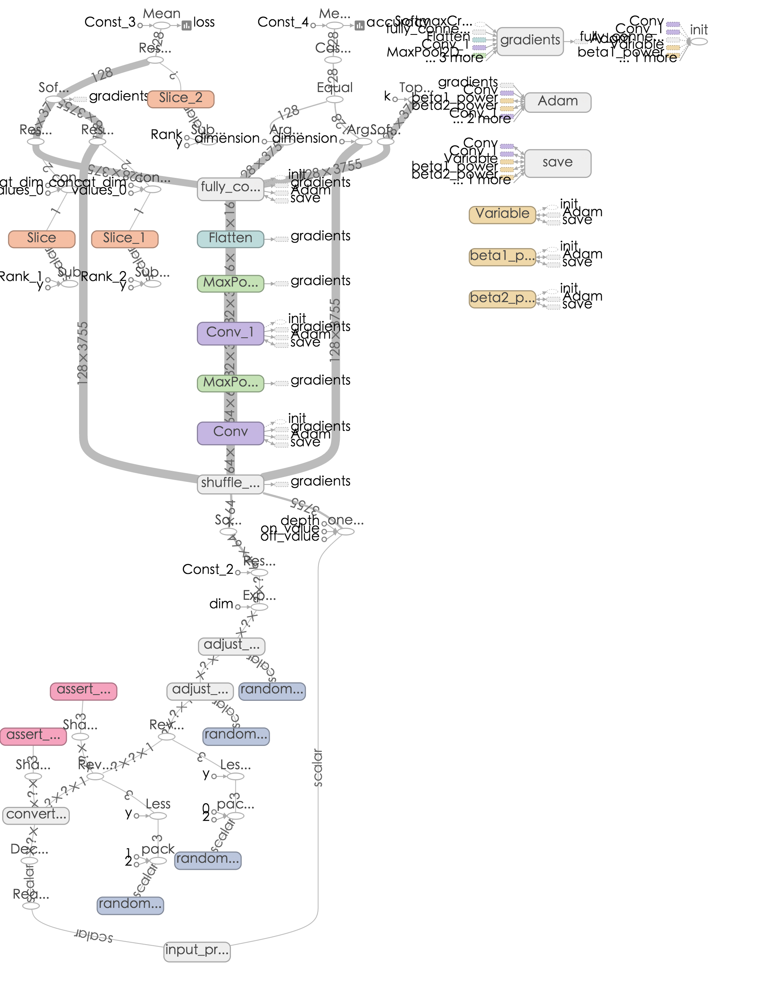
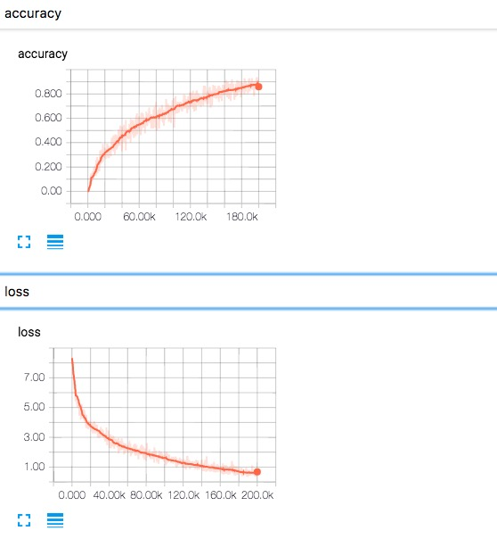
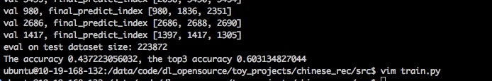
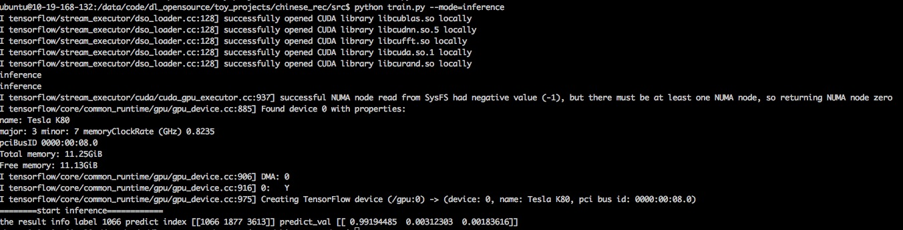

## Goal
本文目标是利用TensorFlow做一个简单的图像分类器，在比较大的数据集上，尽可能高效地做图像相关处理，从Train，Validation到Inference，是一个比较基本的Example，
从一个基本的任务学习如果在TensorFlow下做高效地图像读取，基本的图像处理，整个项目很简单，但其中有一些trick，在实际项目当中有很大的好处， 比如绝对不要一次读入所有的
的数据到内存（尽管在Mnist这类级别的例子上经常出现)...

最开始看到是这篇blog里面的[TensorFlow练习22: 手写汉字识别](http://blog.topspeedsnail.com/archives/10897), 但是这篇文章只用了140训练与测试，试了下代码
很快，但是当扩展到所有的时，发现32g的内存都不够用，这才注意到原文中都是用numpy，会先把所有的数据放入到内存，但这个不必须的，无论在MXNet还是TensorFlow中都是不必
须的，MXNet使用的是DataIter，会在程序运行的过程中异步读取数据，TensorFlow也是这样的，TensorFlow封装了高级的api，用来做数据的读取，比如TFRecord，还有就是从filenames中读取，
来异步读取文件，然后做shuffle batch，再feed到模型的Graph中来做模型参数的更新。具体在tf如何做数据的读取可以看看[reading data in tensorflow](https://www.tensorflow.org/how_tos/reading_data/)

这里我会拿到所有的数据集来做训练与测试，算作是对`斗大的熊猫`上面那篇文章的一个扩展。

## Batch Generate
数据集来自于[中科院自动化研究所](http://www.nlpr.ia.ac.cn/CN/folder/folder8.shtml)，感谢分享精神！！！具体下载:

    wget http://www.nlpr.ia.ac.cn/databases/download/feature_data/HWDB1.1trn_gnt.zip
    wget http://www.nlpr.ia.ac.cn/databases/download/feature_data/HWDB1.1tst_gnt.zip

解压后发现是一些gnt文件，然后用了`斗大的熊猫`里面的代码，将所有文件都转化为对应label目录下的所有png的图片。（注意在HWDB1.1trn_gnt.zip解压后是alz文件，需要再次解压
我在mac没有找到合适的工具，windows上有alz的解压工具)。

    import os
    import numpy as np
    import struct
    from PIL import Image

        
    data_dir = '../data'
    train_data_dir = os.path.join(data_dir, 'HWDB1.1trn_gnt')
    test_data_dir = os.path.join(data_dir, 'HWDB1.1tst_gnt')

    def read_from_gnt_dir(gnt_dir=train_data_dir):
        def one_file(f):
            header_size = 10
            while True:
                header = np.fromfile(f, dtype='uint8', count=header_size)
                if not header.size: break
                sample_size = header[0] + (header[1]<<8) + (header[2]<<16) + (header[3]<<24)
                tagcode = header[5] + (header[4]<<8)
                width = header[6] + (header[7]<<8)
                height = header[8] + (header[9]<<8)
                if header_size + width*height != sample_size:
                    break
                image = np.fromfile(f, dtype='uint8', count=width*height).reshape((height, width))
                yield image, tagcode
        for file_name in os.listdir(gnt_dir):
            if file_name.endswith('.gnt'):
                file_path = os.path.join(gnt_dir, file_name)
                with open(file_path, 'rb') as f:
                    for image, tagcode in one_file(f):
                        yield image, tagcode
    char_set = set()
    for _, tagcode in read_from_gnt_dir(gnt_dir=train_data_dir):
        tagcode_unicode = struct.pack('>H', tagcode).decode('gb2312')
        char_set.add(tagcode_unicode)
    char_list = list(char_set)
    char_dict = dict(zip(sorted(char_list), range(len(char_list))))
    print len(char_dict)
    import pickle
    f = open('char_dict', 'wb')
    pickle.dump(char_dict, f)
    f.close()
    train_counter = 0
    test_counter = 0
    for image, tagcode in read_from_gnt_dir(gnt_dir=train_data_dir):
        tagcode_unicode = struct.pack('>H', tagcode).decode('gb2312')
        im = Image.fromarray(image)
        dir_name = '../data/train/' + '%0.5d'%char_dict[tagcode_unicode]
        if not os.path.exists(dir_name):
            os.mkdir(dir_name)
        im.convert('RGB').save(dir_name+'/' + str(train_counter) + '.png')
        train_counter += 1
    for image, tagcode in read_from_gnt_dir(gnt_dir=test_data_dir):
        tagcode_unicode = struct.pack('>H', tagcode).decode('gb2312')
        im = Image.fromarray(image)
        dir_name = '../data/test/' + '%0.5d'%char_dict[tagcode_unicode]
        if not os.path.exists(dir_name):
            os.mkdir(dir_name)
        im.convert('RGB').save(dir_name+'/' + str(test_counter) + '.png')
        test_counter += 1
处理好的数据，放到了云盘，大家可以直接在我的云盘来下载处理好的数据集[HWDB1](https://pan.baidu.com/s/1o84jIrg). 这里说明下，char_dict是汉字和对应的数字label的记录。

得到数据集后，就要考虑如何读取了，一次用numpy读入内存在很多小数据集上是可以行的，但是在稍微大点的数据集上内存就成了瓶颈，但是不要害怕，TensorFlow有自己的方法：

    def batch_data(file_labels,sess, batch_size=128):
        image_list = [file_label[0] for file_label in file_labels]
        label_list = [int(file_label[1]) for file_label in file_labels]
        print 'tag2 {0}'.format(len(image_list))
        images_tensor = tf.convert_to_tensor(image_list, dtype=tf.string)
        labels_tensor = tf.convert_to_tensor(label_list, dtype=tf.int64)
        input_queue = tf.train.slice_input_producer([images_tensor, labels_tensor])

        labels = input_queue[1]
        images_content = tf.read_file(input_queue[0])
        # images = tf.image.decode_png(images_content, channels=1)
        images = tf.image.convert_image_dtype(tf.image.decode_png(images_content, channels=1), tf.float32)
        # images = images / 256
        images =  pre_process(images)
        # print images.get_shape()
        # one hot
        labels = tf.one_hot(labels, 3755)
        image_batch, label_batch = tf.train.shuffle_batch([images, labels], batch_size=batch_size, capacity=50000,min_after_dequeue=10000)
        # print 'image_batch', image_batch.get_shape()

        coord = tf.train.Coordinator()
        threads = tf.train.start_queue_runners(sess=sess, coord=coord)
        return image_batch, label_batch, coord, threads

简单介绍下，首先你需要得到所有的图像的path和对应的label的列表，利用`tf.convert_to_tensor`转换为对应的tensor， 利用`tf.train.slice_input_producer`将image_list
,label_list做一个slice处理，然后做图像的读取、预处理，以及label的one_hot表示，然后就是传到`tf.train.shuffle_batch`产生一个个shuffle batch，这些就可以feed到你的
模型。 `slice_input_producer`和`shuffle_batch`这类操作内部都是基于queue，是一种异步的处理方式,会在设备中开辟一段空间用作cache，不同的进程会分别一直往cache中塞数据
和取数据，保证内存或显存的占用以及每一个mini-batch不需要等待，直接可以从cache中获取。
 

## Data Augmentation
由于图像场景不复杂，只是做了一些基本的处理，包括图像翻转，改变下亮度等等，这些在TensorFlow里面有现成的api，所以尽量使用TensorFlow来做相关的处理：

    def pre_process(images):
        if FLAGS.random_flip_up_down:
            images = tf.image.random_flip_up_down(images)
        if FLAGS.random_flip_left_right:
            images = tf.image.random_flip_left_right(images)
        if FLAGS.random_brightness:
            images = tf.image.random_brightness(images, max_delta=0.3)
        if FLAGS.random_contrast:
            images = tf.image.random_contrast(images, 0.8, 1.2)
        new_size = tf.constant([FLAGS.image_size,FLAGS.image_size], dtype=tf.int32)
        images = tf.image.resize_images(images, new_size)
        return images

## Build Graph

这里很简单的构造了一个两个卷积+一个全连接层的网络，没有做什么更深的设计，感觉意义不大，设计了一个dict，用来返回后面要用的所有op，还有就是为了方便再训练中查看loss和accuracy，
没有什么特别的，很容易理解, labels 为None时 方便做inference。

    def network(images, labels=None):
        endpoints = {}
        conv_1 = slim.conv2d(images, 32, [3,3],1, padding='SAME')
        max_pool_1 = slim.max_pool2d(conv_1, [2,2],[2,2], padding='SAME')
        conv_2 = slim.conv2d(max_pool_1, 64, [3,3],padding='SAME')
        max_pool_2 = slim.max_pool2d(conv_2, [2,2],[2,2], padding='SAME')
        flatten = slim.flatten(max_pool_2)
        out = slim.fully_connected(flatten,3755, activation_fn=None)
        global_step = tf.Variable(initial_value=0)
        if labels is not None:
            loss = tf.reduce_mean(tf.nn.softmax_cross_entropy_with_logits(out, labels))
            train_op = tf.train.AdamOptimizer(learning_rate=0.0001).minimize(loss, global_step=global_step)
            accuracy = tf.reduce_mean(tf.cast(tf.equal(tf.argmax(out, 1), tf.argmax(labels, 1)), tf.float32))
            tf.summary.scalar('loss', loss)
            tf.summary.scalar('accuracy', accuracy)
            merged_summary_op = tf.summary.merge_all()
        output_score = tf.nn.softmax(out)
        predict_val_top3, predict_index_top3 = tf.nn.top_k(output_score, k=3)

        endpoints['global_step'] = global_step
        if labels is not None:
            endpoints['labels'] = labels
            endpoints['train_op'] = train_op
            endpoints['loss'] = loss
            endpoints['accuracy'] = accuracy
            endpoints['merged_summary_op'] = merged_summary_op
        endpoints['output_score'] = output_score
        endpoints['predict_val_top3'] = predict_val_top3
        endpoints['predict_index_top3'] = predict_index_top3
        return endpoints

## Train
train函数包括从已有checkpoint中restore，得到step，快速恢复训练过程，训练主要是每一次得到mini-batch，更新参数，每隔eval_steps后做一次train batch的eval，每隔save_steps
后保存一次checkpoint。

    def train():
        sess = tf.Session()
        file_labels = get_imagesfile(FLAGS.train_data_dir)
        images, labels, coord, threads = batch_data(file_labels, sess)
        endpoints = network(images, labels)
        saver = tf.train.Saver()
        sess.run(tf.global_variables_initializer())
        train_writer = tf.train.SummaryWriter('./log' + '/train',sess.graph)
        test_writer = tf.train.SummaryWriter('./log' + '/val')
        start_step = 0
        if FLAGS.restore:
            ckpt = tf.train.latest_checkpoint(FLAGS.checkpoint_dir)
            if ckpt:
                saver.restore(sess, ckpt)
                print "restore from the checkpoint {0}".format(ckpt)
                start_step += int(ckpt.split('-')[-1])
        logger.info(':::Training Start:::')
        try:
            while not coord.should_stop():
            # logger.info('step {0} start'.format(i))
                start_time = time.time()
                _, loss_val, train_summary, step = sess.run([endpoints['train_op'], endpoints['loss'], endpoints['merged_summary_op'], endpoints['global_step']])
                train_writer.add_summary(train_summary, step)
                end_time = time.time()
                logger.info("the step {0} takes {1} loss {2}".format(step, end_time-start_time, loss_val))
                if step > FLAGS.max_steps:
                    break
                # logger.info("the step {0} takes {1} loss {2}".format(i, end_time-start_time, loss_val))
                if step % FLAGS.eval_steps == 1:
                    accuracy_val,test_summary, step = sess.run([endpoints['accuracy'], endpoints['merged_summary_op'], endpoints['global_step']])
                    test_writer.add_summary(test_summary, step)
                    logger.info('===============Eval a batch in Train data=======================')
                    logger.info( 'the step {0} accuracy {1}'.format(step, accuracy_val))
                    logger.info('===============Eval a batch in Train data=======================')
                if step % FLAGS.save_steps == 1:
                    logger.info('Save the ckpt of {0}'.format(step))
                    saver.save(sess, os.path.join(FLAGS.checkpoint_dir, 'my-model'), global_step=endpoints['global_step'])
        except tf.errors.OutOfRangeError:
            # print "============train finished========="
            logger.info('==================Train Finished================')
            saver.save(sess, os.path.join(FLAGS.checkpoint_dir, 'my-model'), global_step=endpoints['global_step'])
        finally:
            coord.request_stop()
        coord.join(threads)
        sess.close()
Graph

Loss and Accuracy

## Validation
训练完成之后，想对最终的模型在测试数据集上做一个评估，这里我也曾经尝试利用batch_data，将slice_input_producer中epoch设置为1，来做相关的工作，但是发现这里无法和train
共用，会出现epoch无初始化值的问题（train中传epoch为None），所以这里自己写了shuffle batch的逻辑，将测试集的images和labels通过feed_dict传进到网络，得到模型的输出，
然后做相关指标的计算：

    def validation():
        # it should be fixed by using placeholder with epoch num in train stage
        sess = tf.Session()

        file_labels = get_imagesfile(FLAGS.test_data_dir)
        test_size = len(file_labels)
        print test_size
        val_batch_size = FLAGS.val_batch_size
        test_steps = test_size / val_batch_size
        print test_steps
        # images, labels, coord, threads= batch_data(file_labels, sess)
        images = tf.placeholder(dtype=tf.float32, shape=[None, 64, 64, 1])
        labels = tf.placeholder(dtype=tf.int32, shape=[None,3755])
        # read batch images from file_labels
        # images_batch = np.zeros([128,64,64,1])
        # labels_batch = np.zeros([128,3755])
        # labels_batch[0][20] = 1
        #
        endpoints = network(images, labels)
        saver = tf.train.Saver()
        ckpt = tf.train.latest_checkpoint(FLAGS.checkpoint_dir)
        if ckpt:
            saver.restore(sess, ckpt)
            # logger.info("restore from the checkpoint {0}".format(ckpt))
        # logger.info('Start validation')
        final_predict_val = []
        final_predict_index = []
        groundtruth = []
        for i in range(test_steps):
            start = i* val_batch_size
            end = (i+1)*val_batch_size
            images_batch = []
            labels_batch = []
            labels_max_batch = []
            logger.info('=======start validation on {0}/{1} batch========='.format(i, test_steps))
            for j in range(start,end):
                image_path = file_labels[j][0]
                temp_image = Image.open(image_path).convert('L')
                temp_image = temp_image.resize((FLAGS.image_size, FLAGS.image_size),Image.ANTIALIAS)
                temp_label = np.zeros([3755])
                label = int(file_labels[j][1])
                # print label
                temp_label[label] = 1
                # print "====",np.asarray(temp_image).shape
                labels_batch.append(temp_label)
                # print "====",np.asarray(temp_image).shape
                images_batch.append(np.asarray(temp_image)/255.0)
                labels_max_batch.append(label)
            # print images_batch
            images_batch = np.array(images_batch).reshape([-1, 64, 64, 1])
            labels_batch = np.array(labels_batch)
            batch_predict_val, batch_predict_index = sess.run([endpoints['predict_val_top3'],
                            endpoints['predict_index_top3']], feed_dict={images:images_batch, labels:labels_batch})
            logger.info('=======validation on {0}/{1} batch end========='.format(i, test_steps))
            final_predict_val += batch_predict_val.tolist()
            final_predict_index += batch_predict_index.tolist()
            groundtruth += labels_max_batch
        sess.close()
        return final_predict_val, final_predict_index, groundtruth

在训练20w个step之后，大概能达到在测试集上能够达到：

相信如果在网络设计上多花点时间能够在一定程度上提升accuracy和top 3 accuracy.有兴趣的小伙伴们可以玩玩这个数据集。

## Inference

    def inference(image):
        temp_image = Image.open(image).convert('L')
        temp_image = temp_image.resize((FLAGS.image_size, FLAGS.image_size),Image.ANTIALIAS)
        sess = tf.Session()
        logger.info('========start inference============')
        images = tf.placeholder(dtype=tf.float32, shape=[None, 64, 64, 1])
        endpoints = network(images)
        saver = tf.train.Saver()
        ckpt = tf.train.latest_checkpoint(FLAGS.checkpoint_dir)
        if ckpt:
            saver.restore(sess, ckpt)
        predict_val, predict_index = sess.run([endpoints['predict_val_top3'],endpoints['predict_index_top3']], feed_dict={images:temp_image})
        sess.close()
        return final_predict_val, final_predict_index

运气挺好，随便找了张图片就能准确识别出来

## Summary

综上，就是利用tensorflow做中文手写识别的全部，从如何使用tensorflow内部的queue来有效读入数据，到如何设计network， 到如何做train，validation，inference，珍格格流程比较清晰，
美中不足的是，原本打算是在训练过程中，来对测试集做评估，但是在使用queue读test_data_dir下的filenames，和train本身的好像有点问题，不过应该是可以解决的，我这里就pass了。另外可能
还有一些可以改善的地方，比如感觉可以把batch data one hot的部分写入到network，这样，减缓在validation时内存会因为onehot的sparse开销比较大。

感觉这个中文手写汉字数据集价值很大，后面感觉会有好多可以玩的，比如

 - 可以参考项亮大神的这篇文章[端到端的OCR：验证码识别](https://zhuanlan.zhihu.com/p/21344595)做定长的字符识别和不定长的字符识别，定长的基本原理是说，可以把最终输出扩展为k个输出，
 每个值表示对应的字符label，这样cnn模型在feature extract之后就可以自己去识别对应字符而无需人工切割；而LSTM+CTC来解决不定长的验证码，类似于将音频解码为汉字
 - 最近GAN特别火，感觉可以考虑用这个数据来做某个字的生成，和text2img那个项目[text-to-image](https://github.com/paarthneekhara/text-to-image)

 这部分的代码都在我的github上[tensorflow-101](https://github.com/burness/tensorflow-101)，有遇到相关功能,想参考代码的可以去上面找找，没准就能解决你们遇到的一些小问题.
