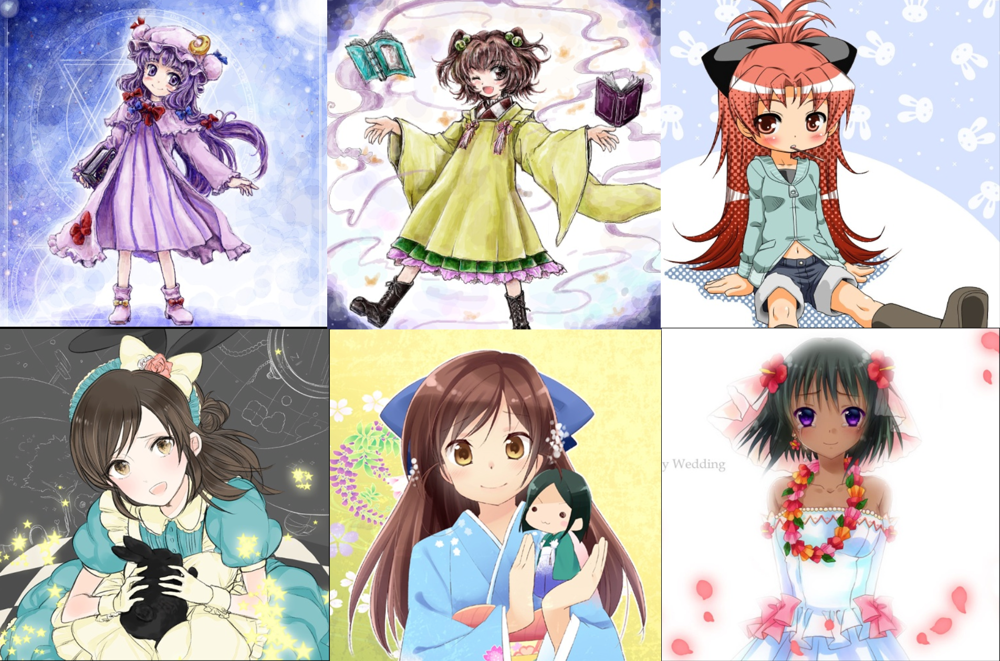
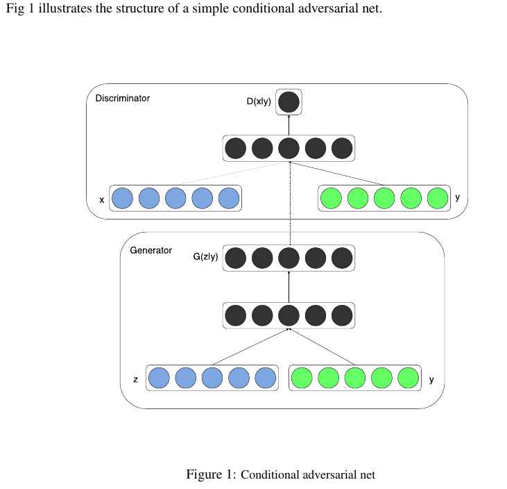
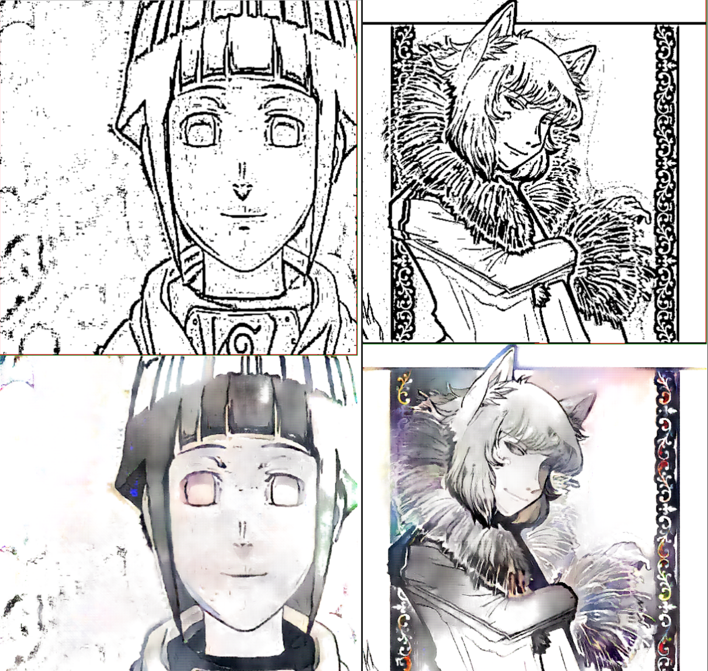

## 前言
很早以前在研究图像超分辨率的时候有看到用GAN的方法做super resolution的工作，后来也陆续看到很多生成图像的东西，有很多好玩的应用：
 - [pix2pix](https://github.com/phillipi/pix2pix)
 - [text2image](https://github.com/emansim/text2image)
前面我的博客里面也提到有一篇[GAN的理解与TF的实现](http://www.duanshishi.com/?p=1766)。今天，我们这里不将啥原理，我们主要跑下最近看到的deepcolor这个项目，这个项目就是使用了
所谓的条件生成式对抗网络（Conditional Generative Adversarial Nets）。

##Deepcolor
原始的github地址在[https://github.com/kvfrans/deepcolor](https://github.com/kvfrans/deepcolor),作者看起来是一个年级特别小的美帝亚裔小伙子，编程还是要从娃娃抓起呀，
我fork了项目，修改了下爬数据的脚本，加了个多线程，然后适配了TensorFlow1.0，项目地址：[tensorflow-101/deepcolor](https://github.com/burness/tensorflow-101/tree/master/deepcolor)

### 爬数据

    import os
    import Queue
    from threading import Thread
    from time import time
    from itertools import chain
    import urllib2
    import untangle
    import numpy as np
    import cv2

    def download_imgs(url):
        # count = 0
        maxsize = 512
        file_name = url.split('=')[-1]
        header = {'Referer':'http://safebooru.org/index.php?page=post&s=list','User-Agent' : 'Mozilla/5.0 (Macintosh; Intel Mac OS X 10_12_3) AppleWebKit/537.36 (KHTML, like Gecko) Chrome/56.0.2924.87 Safari/537.36'}
        request = urllib2.Request(url, headers=header)
        stringreturn = urllib2.urlopen(request).read()
        xmlreturn = untangle.parse(stringreturn)
        count = 0
        print xmlreturn.posts[0]['sample_url']
        try:
            for post in xmlreturn.posts.post:
                try:
                    imgurl = "http:" + post["sample_url"]
                    print imgurl
                    if ("png" in imgurl) or ("jpg" in imgurl):
                        resp = urllib2.urlopen(imgurl)
                        image = np.asarray(bytearray(resp.read()), dtype="uint8")
                        image = cv2.imdecode(image, cv2.IMREAD_COLOR)
                        height, width = image.shape[:2]
                        if height > width:
                            scalefactor = (maxsize*1.0) / width
                            res = cv2.resize(image,(int(width * scalefactor), int(height*scalefactor)), interpolation = cv2.INTER_CUBIC)
                            cropped = res[0:maxsize,0:maxsize]
                        if width >= height:
                            scalefactor = (maxsize*1.0) / height
                            res = cv2.resize(image,(int(width * scalefactor), int(height*scalefactor)), interpolation = cv2.INTER_CUBIC)
                            center_x = int(round(width*scalefactor*0.5))
                            print center_x
                            cropped = res[0:maxsize,center_x - maxsize/2:center_x + maxsize/2]
                        count += 1
                        cv2.imwrite("imgs-valid/"+file_name+'_'+str(count)+'.jpg',cropped)
                except:
                    continue
        except:
            print "no post in xml"
            return

    class DownloadWorker(Thread):
        def __init__(self, queue):
            Thread.__init__(self)
            self.queue = queue

        def run(self):
            while True:
                # Get the work from the queue and expand the tuple
                url = self.queue.get()
                if url is None:
                    break
                # download_link(directory, link)
                download_imgs(url)
                self.queue.task_done()

    if __name__ == '__main__':
        start = time()
        download_queue = Queue.Queue(maxsize=100)
        for x in range(8):
            worker = DownloadWorker(download_queue)
            worker.daemon = True
            worker.start()
        
        url_links = ["http://safebooru.org/index.php?page=dapi&s=post&q=index&tags=1girl%20solo&pid="+str(i+5000) for i in xrange(10000)]
        # print url_links[:10]

        for link in url_links:
            download_queue.put(link)
        download_queue.join()
        print "the images num is {0}".format(len(url_links))
        print "took time : {0}".format(time() - start)

貌似从web页面见交互的json文件拿到image的公开链地址，然后下载，但是这里有点小问题：我这里` ["http://safebooru.org/index.php?page=dapi&s=post&q=index&tags=1girl%20solo&pid="+str(i+5000) for i in xrange(10000)]`当i到288之后就跑不了，以为被封了ip，但是从新开始又是可以的，而且浏览器都是可以浏览的，很奇怪，不过也不care了，我这里大概拿到28059张
动漫的图像
随便找了几张:

不要问我为啥都是妹纸的图，我也不知道，也许美帝的小伙伴口味就是这样（如果是我的话，我肯定关注火影，秦时明月这种的）
为了节省想要玩下的小伙伴的时间，我把爬到的照片放到了百度云上，地址在这儿[https://pan.baidu.com/s/1c1HOIHU](https://pan.baidu.com/s/1c1HOIHU)

### 从原图中拿到边缘灰度图

为了让计算机学会去自动给漫画涂上颜色，我们首先需要有一批需要上色的图像，这里我们拿到了一批网上的漫画图，我们只需要用OpenCV这个工具来生成对应的线图就好啦，这和超分辨率很类似，是在
cv上少数的不需要做相关标注工作的应用

`base_edge = np.array([cv2.adaptiveThreshold(cv2.cvtColor(ba, cv2.COLOR_BGR2GRAY), 255, cv2.ADAPTIVE_THRESH_MEAN_C, cv2.THRESH_BINARY, blockSize=9, C=2) for ba in base]) / 255.0`
一行代码，就可以搞定，但是个人认为他这里的处理太粗糙，这里可以做一些精致的提升，比如梯度，当然这里还有个脚本演示，如何生成对应的灰度图

    import cv2
    import numpy as np
    from matplotlib import pyplot as plt
    from glob import glob
    from random import randint

    data = glob("imgs-valid/*.jpg")
    for imname in data:

        cimg = cv2.imread(imname,1)
        cimg = np.fliplr(cimg.reshape(-1,3)).reshape(cimg.shape)
        cimg = cv2.resize(cimg, (256,256))

        img = cv2.imread(imname,0)

        # kernel = np.ones((5,5),np.float32)/25
        for i in xrange(30):
            randx = randint(0,205)
            randy = randint(0,205)
            cimg[randx:randx+50, randy:randy+50] = 255
        blur = cv2.blur(cimg,(100,100))

        # img_gray = cv2.cvtColor(img, cv2.COLOR_RGB2GRAY)
        img_edge = cv2.adaptiveThreshold(img, 255,
                                        cv2.ADAPTIVE_THRESH_MEAN_C,
                                        cv2.THRESH_BINARY,
                                        blockSize=9,
                                        C=2)
        # img_edge = cv2.cvtColor(img_edge, cv2.COLOR_GRAY2RGB)
        # img_cartoon = cv2.bitwise_and(img, img_edge)

        plt.subplot(131),plt.imshow(cimg)
        plt.title('Original Image'), plt.xticks([]), plt.yticks([])

        plt.subplot(132),plt.imshow(blur)
        plt.title('Edge Image'), plt.xticks([]), plt.yticks([])

        plt.subplot(133),plt.imshow(img_edge,cmap = 'gray')
        plt.title('Edge Image'), plt.xticks([]), plt.yticks([])

        plt.show()

### 构造CGAN网络
Conditional Generative Adversarial Nets网络如下图所示，和原始的GAN相比，不是有随机的噪声生成，而且input的图像的值和label值，这里就是线图和真实我们爬下的图:

G和D的网络结构如下：

    def discriminator(self, image, y=None, reuse=False):
        # image is 256 x 256 x (input_c_dim + output_c_dim)
        with tf.variable_scope("discriminator") as scope:
            if reuse:
                tf.get_variable_scope().reuse_variables()
            else:
                assert tf.get_variable_scope().reuse == False

            h0 = lrelu(conv2d(image, self.df_dim, name='d_h0_conv')) # h0 is (128 x 128 x self.df_dim)
            h1 = lrelu(self.d_bn1(conv2d(h0, self.df_dim*2, name='d_h1_conv'))) # h1 is (64 x 64 x self.df_dim*2)
            h2 = lrelu(self.d_bn2(conv2d(h1, self.df_dim*4, name='d_h2_conv'))) # h2 is (32 x 32 x self.df_dim*4)
            h3 = lrelu(self.d_bn3(conv2d(h2, self.df_dim*8, d_h=1, d_w=1, name='d_h3_conv'))) # h3 is (16 x 16 x self.df_dim*8)
            h4 = linear(tf.reshape(h3, [self.batch_size, -1]), 1, 'd_h3_lin')
            return tf.nn.sigmoid(h4), h4

    def generator(self, img_in):
        with tf.variable_scope("generator") as scope:
            s = self.output_size
            s2, s4, s8, s16, s32, s64, s128 = int(s/2), int(s/4), int(s/8), int(s/16), int(s/32), int(s/64), int(s/128)
            # image is (256 x 256 x input_c_dim)
            e1 = conv2d(img_in, self.gf_dim, name='g_e1_conv') # e1 is (128 x 128 x self.gf_dim)
            e2 = bn(conv2d(lrelu(e1), self.gf_dim*2, name='g_e2_conv')) # e2 is (64 x 64 x self.gf_dim*2)
            e3 = bn(conv2d(lrelu(e2), self.gf_dim*4, name='g_e3_conv')) # e3 is (32 x 32 x self.gf_dim*4)
            e4 = bn(conv2d(lrelu(e3), self.gf_dim*8, name='g_e4_conv')) # e4 is (16 x 16 x self.gf_dim*8)
            e5 = bn(conv2d(lrelu(e4), self.gf_dim*8, name='g_e5_conv')) # e5 is (8 x 8 x self.gf_dim*8)

            self.d4, self.d4_w, self.d4_b = deconv2d(tf.nn.relu(e5), [self.batch_size, s16, s16, self.gf_dim*8], name='g_d4', with_w=True)
            d4 = bn(self.d4)
            d4 = tf.concat(axis=3, values=[d4, e4])
            # d4 is (16 x 16 x self.gf_dim*8*2)

            self.d5, self.d5_w, self.d5_b = deconv2d(tf.nn.relu(d4), [self.batch_size, s8, s8, self.gf_dim*4], name='g_d5', with_w=True)
            d5 = bn(self.d5)
            d5 = tf.concat(axis=3, values=[d5, e3])
            # d5 is (32 x 32 x self.gf_dim*4*2)

            self.d6, self.d6_w, self.d6_b = deconv2d(tf.nn.relu(d5), [self.batch_size, s4, s4, self.gf_dim*2], name='g_d6', with_w=True)
            d6 = bn(self.d6)
            d6 = tf.concat(axis=3, values=[d6, e2])
            # d6 is (64 x 64 x self.gf_dim*2*2)

            self.d7, self.d7_w, self.d7_b = deconv2d(tf.nn.relu(d6), [self.batch_size, s2, s2, self.gf_dim], name='g_d7', with_w=True)
            d7 = bn(self.d7)
            d7 = tf.concat(axis=3, values=[d7, e1])
            # d7 is (128 x 128 x self.gf_dim*1*2)

            self.d8, self.d8_w, self.d8_b = deconv2d(tf.nn.relu(d7), [self.batch_size, s, s, self.output_colors], name='g_d8', with_w=True)
            # d8 is (256 x 256 x output_c_dim)

        return tf.nn.tanh(self.d8)
值得说的是因为G是做image transform，在G的最后基层是做反卷积的操作， 其他没啥好说的 不是很复杂。
然后就是G和D的loss的定义：

    combined_preimage = tf.concat(axis=3, values=[self.line_images, self.color_images])
    self.generated_images = self.generator(combined_preimage)
    self.real_AB = tf.concat(axis=3, values=[combined_preimage, self.real_images])
    self.fake_AB = tf.concat(axis=3, values=[combined_preimage, self.generated_images])
    self.disc_true, disc_true_logits = self.discriminator(self.real_AB, reuse=False)
    self.disc_fake, disc_fake_logits = self.discriminator(self.fake_AB, reuse=True)
    self.d_loss_real = tf.reduce_mean(tf.nn.sigmoid_cross_entropy_with_logits(logits=disc_true_logits, labels=tf.ones_like(disc_true_logits)))
    self.d_loss_fake = tf.reduce_mean(tf.nn.sigmoid_cross_entropy_with_logits(logits=disc_fake_logits, labels=tf.zeros_like(disc_fake_logits)))
    self.d_loss = self.d_loss_real + self.d_loss_fake
    self.g_loss = tf.reduce_mean(tf.nn.sigmoid_cross_entropy_with_logits(logits=disc_fake_logits, labels=tf.ones_like(disc_fake_logits))) \
                    + self.l1_scaling * tf.reduce_mean(tf.abs(self.real_images - self.generated_images))
    t_vars = tf.trainable_variables()
    self.d_vars = [var for var in t_vars if 'd_' in var.name]
    self.g_vars = [var for var in t_vars if 'g_' in var.name]
    self.d_optim = tf.train.AdamOptimizer(0.0002, beta1=0.5).minimize(self.d_loss, var_list=self.d_vars)
    self.g_optim = tf.train.AdamOptimizer(0.0002, beta1=0.5).minimize(self.g_loss, var_list=self.g_vars)

整个代码结构就是这样，如果不太理解的可以去看下GAN和CGAN的paper:[https://arxiv.org/pdf/1406.2661.pdf](https://arxiv.org/pdf/1406.2661.pdf), [https://arxiv.org/pdf/1411.1784.pdf](https://arxiv.org/pdf/1411.1784.pdf)

### 结果
用爬到的28000来训练这个GAN，大概60度个epoch，最后试了两张图片，下过如下：

虽然效果一般，但是对一些描色的工作人员可以做一些辅助的设计，这个还是蛮赞的