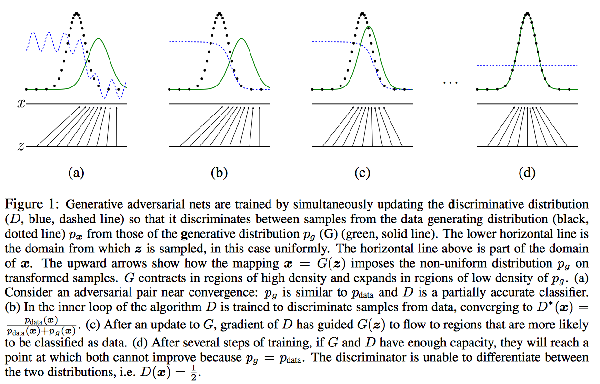

## 前言
本文会从头了解生成对抗式网络的一些内容，从生成式模型开始说起，到GAN的基本原理，InfoGAN，AC-GAN的基本科普，如果有任何有错误的地方，请随时喷，我
刚开始研究GAN这块的内容，希望和大家一起学习这块内容。

## 生成式模型
何为生成式模型？在很多machine learning的教程或者公开课上，通常会把machine learning的算法分为两类： 生成式模型、判别式模型；其区别在于：
对于输入x，类别标签y，在生成式模型中估计其联合概率分布，而判别式模型估计其属于某类的条件概率分布。
常见的判别式模型包括：LogisticRegression， SVM, Neural Network等等，生成式模型包括：Naive Bayes， GMM， Bayesian Network， MRF
等等

### 研究生成式模型的意义
生成式模型的特性主要包括以下几个方面：

 - 在应用数学和工程方面，生成式模型能够有效地表征高维数据分布；
 - 生成式模型能够作为一种技术手段辅助强化学习，能够有效表征强化学习模型中的state状态(这里不扩展，后面会跟RL的学习笔记)；
 - 对semi-supervised learning也有比较好的效果，能够在miss data下训练模型，并在miss data下给出相应地输出；
 - 在对于一个输入伴随多个输出的场景下，生成式模型也能够有效工作，而传统的机器学习方法通过最小化模型输出和期望输出的某个object function的值
 无法训练单输入多输出的模型，而生成式模型，尤其是GAN能够hold住这种场景，一个典型的应用是通过场景预测video的下一帧；

生成式模型一些典型的应用：

 - 图像的超分辨率
 - iGAN：[Generative Visual Manipulation on the Natural Image Manifold](https://www.youtube.com/watch?v=9c4z6YsBGQ0)
 - 图像转换

### 生成式模型族谱

上图涵盖了基本的生成式模型的方法，主要按是否需要定义概率密度函数分为：

**Explicit density models**
explicit density models 又分为tractable explicit models和逼近的explicit model，怎么理解呢，tractable explicit
model通常可以直接通过数学方法来建模求解，而基于逼近的explicit model通常无法直接对数据分布进行建模，可以利用数学里的一些近似方法来做数据建模，
通常基于逼近的explicit model分为确定性（变分方法：如VAE的lower bound）和随机性的方法（马尔科夫链蒙特卡洛方法）。

 - VAE lower bound：

 - 马尔科夫链蒙特卡洛方法（MCMC），一种经典的基于马尔科夫链的抽样方法，通过多次来拟合分布。比较好的教程：[A Beginner's Guide to Monte Carlo Markov Chain MCMC Analysis](https://www.youtube.com/watch?v=vTUwEu53uzs), [An Introduction to MCMC for Machine Learning](http://www.cs.princeton.edu/courses/archive/spr06/cos598C/papers/AndrieuFreitasDoucetJordan2003.pdf).

**Implicit density models**
无需定义明确的概率密度函数，代表方法包括马尔科夫链、生成对抗式网络（GAN），该系列方法无需定义数据分布的描述函数。

### 生成对抗式网络与其他生成式网络对比
生成对抗式网络（GAN）能够有效地解决很多生成式方法的缺点，主要包括：

 - 并行产生samples；
 - 生成式函数的限制少，如无需合适马尔科夫采样的数据分布（Boltzmann machines），生成式函数无需可逆、latent code需与sample同维度（nonlinear ICA）；
 - 无需马尔科夫链的方法（Boltzmann machines， GSNs）；
 - 相对于VAE的方法，无需variational bound；
 - GAN比其他方法一般来说性能更好。
s

## GAN工作原理

GAN主要由两部分构成：generator和discriminator，generator主要是从训练数据中产生相同分布的samples，而discriminator
则是判断输入是真实数据还是generator生成的数据，discriminator采用传统的监督学习的方法。这里我们可以这样类比，generator
是一个伪造假币的专业人士，discriminator是警察，generator的目的是制造出尽可能以假乱真的假钞，而discriminator是为了能
鉴别是否为假钞，最终整个gan会达到所谓的纳什均衡，Goodfellow在他的paper中有严格的数学证明，当$p_G$==$p_{data}$时达到
全局最优：

另一个比较明显看得懂的图如下：

图中黑色点线为真实数据分布$p_{data}$，绿色线为generator生成的数据分布$p_{G}$,而Discriminator就是蓝色点线，其目的是为了将$p_{data}$和$p_{G}$
区分，(a)中是初始状态，然后会更新Discriminator中的参数，若干次step之后，Discriminator有了较大的判断力即到了(b)的状态，之后会更新G的模型使其生成的数据分布（绿色线）更加趋近与真实数据分布，
若干次G和D的模型参数更新后，理论上最终会达到(d)的状态即G能够产生和真实数据完全一致的分布(证明见上一张图)，如从随机数据分布生成人脸像。

### 如何训练GAN
因为GAN结构的不同，和常规训练一个dl model方法不同， 这里采用simultaneous SGD，每一个step中，会有两个两个梯度优化的
过程，一个是更新discriminator的参数来最小化$J_{(D)}$，一个是更新generator的参数来最小$J_{(G)}$，通常会选用Adam来作为最优化的优化器，
也有人建议可以不等次数地更新generator和discriminator（有相关工作提出，1：1的在实际中更有效：[Adam: A Method for Stochastic Optimization](https://arxiv.org/abs/1412.6980)）
如何训练GAN，在Goodfellow的GAN的tutorial还有一些代码中有更多的描述包括不同的cost function， 这里我就不详细展开了。

### DCGAN

GAN出来后很多相关的应用和方法都是基于DCGAN的结构，DCGAN即"Deep Convolution GAN"，通常会有一些约定俗成的规则：

 - 在Discriminator和generator中大部分层都使用batch normalization，而在最后一层时通常不会使用batch normalizaiton，目的
 是为了保证模型能够学习到数据的正确的均值和方差；
 - 因为会从random的分布生成图像，所以一般做需要增大图像的空间维度时如7*7->14*14， 一般会使用strdie为2的deconv（transposed convolution）；
 - 通常在DCGAN中会使用Adam优化算法而不是SGD。

### 各种GAN

这里有个大神把各种gan的paper都做了一个统计[AdversarialNetsPapers](https://github.com/zhangqianhui/AdversarialNetsPapers)

这里大家有更多的兴趣可以直接去看对应的paper，我接下来会尽我所能描述下infogan和AC-GAN这两块的内容

## InfoGAN
InfoGAN是一种能够学习disentangled representation的GAN([https://arxiv.org/pdf/1606.03657v1.pdf](https://arxiv.org/pdf/1606.03657v1.pdf))，何为disentangled representation？比如人脸数据集中有各种不同的属性特点，如脸部表情、是否带眼睛、头发的风格眼珠的颜色等等，这些很明显的相关表示，
InfoGAN能够在完全无监督信息（是否带眼睛等等）下能够学习出这些disentangled representation，而相对于传统的GAN，只需修改loss来最大化GAN的input的noise（部分fixed的子集）和最终输出之间的互信息。

### 原理
为了达到上面提到的效果，InfoGAN必须在input的noise来做一些文章，将noise vector划分为两部分：

 - z: 和原始的GAN input作用一致；
 - c: latent code，能够在之后表示数据分布中的disentangled representation

那么如何从latent code中学到相应的disentangled representation呢？
在原始的GAN中，忽略了c这部分的影响，即GAN产生的数据分布满足$P_{G}(x|C)=P(x)$,为了保证能够利用c这部分信息，
作者提出这样一个假设：c与generator的输出相关程度应该很大，而在信息论中，两个数据分布的相关程度即互信息，
即generator的输出和input的c的$I(c;G(z,c))$应该会大。
所以，InfoGAN就变成如下的优化问题：

因为互信息的计算需要后验概率的分布（下图红线部分），在实际中很难直接使用，因此，在实际训练中一般不会直接最大化$I(c;G(z,c))$

这里作者采用和VAE类似的方法，增加一个辅助的数据分布为后验概率的low bound：
所以，这里互信息的计算如下：

这里相关的证明就不深入了，有兴趣的可以去看看paper。

### 实验
我写的一版基于TensorFlow的Info-GAN实现：[Info-GAN]()https://github.com/burness/tensorflow-101/tree/master/GAN/Info-GAN
random的label信息，和对应生成的图像：

不同random变量控制产生同一class下的不同输出：

## AC-GAN
AC-GAN即auxiliary classifier GAN，对应的paper：[https://arxiv.org/abs/1610.09585](https://arxiv.org/abs/1610.09585), 如前面的示意图中所示，AC-GAN的Discriminator中会输出相应的class label的概率，然后更改loss fuction，增加class预测正确的概率，
[ac-gan](https://github.com/buriburisuri/ac-gan)是一个tensorflow相关的实现，基于作者自己开发的sugartensor，感觉和paper里面在loss函数的定义上差异，看源码的时候注意下，我这里有参考写了一个基于原生tensorflow的版本[AC-GAN](https://github.com/burness/tensorflow-101/tree/master/GAN/Acgan).

### 实验
各位有兴趣的可以拿代码在其他的数据集上也跑一跑，AC-GAN能够有效利用class label的信息，不仅可以在G时指定需要生成的image的label，同事该class label也能在Discriminator用来扩展loss函数，增加整个对抗网络的性能。
random的label信息，和对应生成的图像：

不同random变量控制产生同一class下的不同输出：

## Summary
照例总结一下，本文中，我基本介绍了下生成式模型方法的各个族系派别，到GAN的基本内容，到InfoGAN、AC-GAN，大部分的工作都来自于阅读相关的paper，自己相关的工作就是
tensorflow下参考sugartensor的内容重现了InfoGAN、AC-GAN的相关内容。
当然，本人菜鸟一枚，难免有很多理解不到位的地方，写出来更多的是作为分享，让更多人了解GAN这块的内容，如果任何错误或不合适的地方，尽情在评论中指出，我们一起讨论一起学习
另外我的所有相关的代码都在github上:[GAN](https://github.com/burness/tensorflow-101/tree/master/GAN),相信读一下无论是对TensorFlow的理解还是GAN的理解都会
有一些帮助，简单地参考mnist.py修改下可以很快的应用到你的数据集上，如果有小伙伴在其他数据集上做出有意思的实验效果的，欢迎分享。

