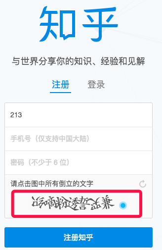
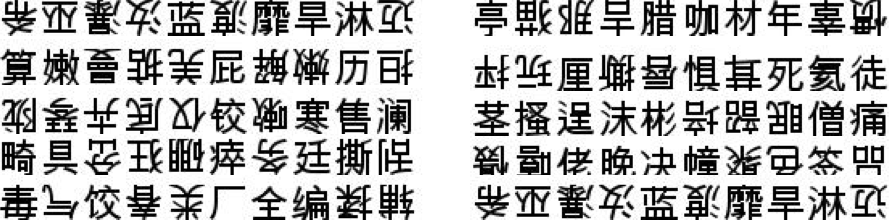
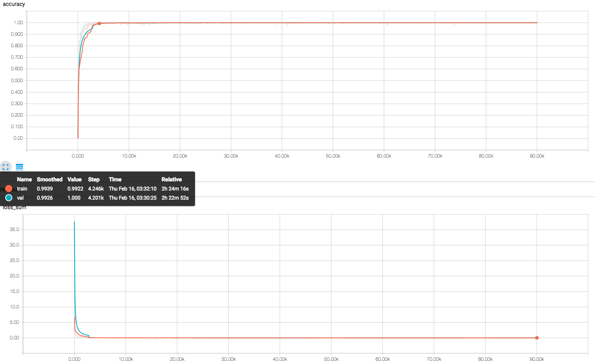
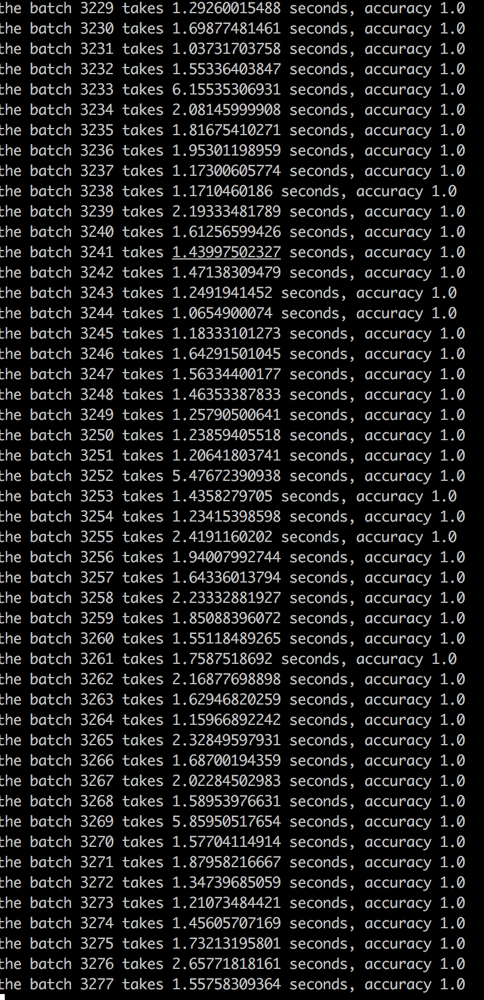
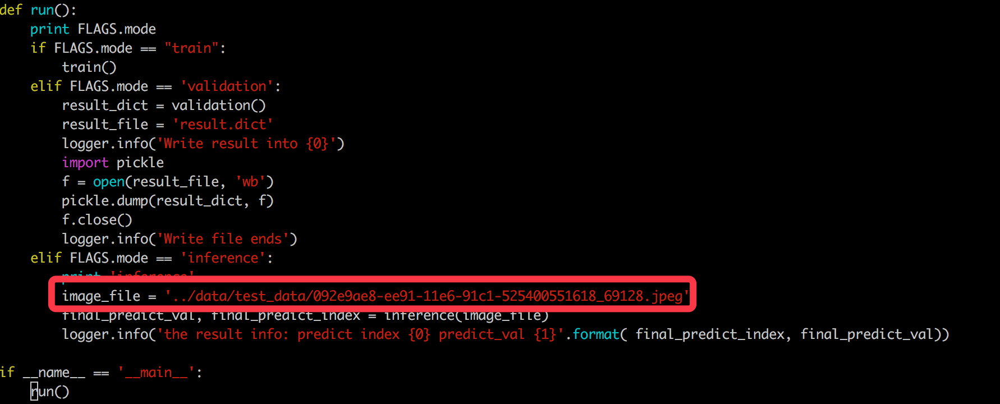
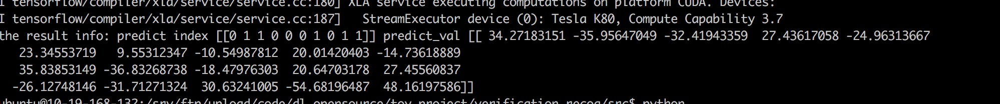

## 前言
前段时间心血来潮，打算用TensorFlow做些好玩的东西，做什么呢，看到一个小哥能爬到知乎上的个人信息，我就想着是否可以拿到用户的个人信息，然后通过用户的头像来判断用户的性别、职业等等，后来搜了好几个知乎的爬虫，
但是都没有效，在登录的时候发现有问题，最后一看，奶奶的，知乎把原先的验证码改成这样的了：

需要在一排汉字中找到,简单看了下，大概7个汉字，不定数个汉字是倒置的，需要人为指出哪些汉字是倒置的，和以往常规的验证码识别有点区别，有点意思！！！

所以需要弄个模型来解决这个咯，问题很明确，主要是那个：

 - 数据问题？如何生成这些数据
 - 切字+单个分类器，还是直接输出所有的倒置情况（保证验证码字数一致）

## 数据准备

有天沙神在群里发了个链接，python生成汉字的代码， 正好用得上，改改然后很快就搞定了，代码如下：

    # -*- coding: utf-8 -*-
    from PIL import Image,ImageDraw,ImageFont
    import random
    import math, string
    import logging
    # logger = logging.Logger(name='gen verification')

    class RandomChar():
        @staticmethod
        def Unicode():
            val = random.randint(0x4E00, 0x9FBF)
            return unichr(val)    

        @staticmethod
        def GB2312():
            head = random.randint(0xB0, 0xCF)
            body = random.randint(0xA, 0xF)
            tail = random.randint(0, 0xF)
            val = ( head << 8 ) | (body << 4) | tail
            str = "%x" % val
            return str.decode('hex').decode('gb2312')    

    class ImageChar():
        def __init__(self, fontColor = (0, 0, 0),
        size = (100, 40),
        fontPath = '/Library/Fonts/Arial Unicode.ttf',
        bgColor = (255, 255, 255),
        fontSize = 20):
            self.size = size
            self.fontPath = fontPath
            self.bgColor = bgColor
            self.fontSize = fontSize
            self.fontColor = fontColor
            self.font = ImageFont.truetype(self.fontPath, self.fontSize)
            self.image = Image.new('RGB', size, bgColor)

        def drawText(self, pos, txt, fill):
            draw = ImageDraw.Draw(self.image)
            draw.text(pos, txt, font=self.font, fill=fill)
            del draw    
        
        def drawTextV2(self, pos, txt, fill, angle=180):
            image=Image.new('RGB', (25,25), (255,255,255))
            draw = ImageDraw.Draw(image)
            draw.text( (0, -3), txt,  font=self.font, fill=fill)
            w=image.rotate(angle,  expand=1)
            self.image.paste(w, box=pos)
            del draw

        def randRGB(self):
            return (0,0,0)

        def randChinese(self, num, num_flip):
            gap = 1
            start = 0
            num_flip_list = random.sample(range(num), num_flip)
            # logger.info('num flip list:{0}'.format(num_flip_list))
            print 'num flip list:{0}'.format(num_flip_list)
            char_list = []
            for i in range(0, num):
                char = RandomChar().GB2312()
                char_list.append(char)
                x = start + self.fontSize * i + gap + gap * i
                if i in num_flip_list:
                    self.drawTextV2((x, 6), char, self.randRGB())
                else:
                    self.drawText((x, 0), char, self.randRGB())
            return char_list, num_flip_list
        def save(self, path):
            self.image.save(path)

    err_num = 0
    for i in range(10):
        try:
            ic = ImageChar(fontColor=(100,211, 90), size=(280,28), fontSize = 25)
            num_flip = random.randint(3,6)
            char_list, num_flip_list = ic.randChinese(10, num_flip)
            ic.save(''.join(char_list)+'_'+''.join(str(i) for i in num_flip_list)+".jpeg")
        except:
            err_num += 1
            continue
为了简单，没有在生成的字加一些噪声，颜色什么的干扰的东西， 生成的图像差不多这样

所以，接下来就是在tensorflow构建网络来识别了

## 模型
## 网络设计
受项亮的[end2end定长的OCR识别](http://blog.xlvector.net/2016-05/mxnet-ocr-cnn/)的启发, 因为我这里的验证码都是长度为10的，所以我们只需要构造网络，最后的output有10个输出，每个输出为1个二类分类器：
其中，0表示正常，1表示倒置，这样就可以构造一个input到10个binary classification的网络，网络结构很简单（小伙伴们可以在这里都试试网络的设计，多试试黑科技），好吧，废话不多说，show you code：

    def network():
        images = tf.placeholder(dtype=tf.float32, shape=[None, 28, 280, 1], name='image_batch')
        labels = tf.placeholder(dtype=tf.int32, shape=[None, 10], name='label_batch')
        endpoints = {}
        conv_1 = slim.conv2d(images, 32, [5,5],1, padding='SAME')
        avg_pool_1 = slim.avg_pool2d(conv_1, [2,2],[1,1], padding='SAME')
        conv_2 = slim.conv2d(avg_pool_1, 32, [5,5], 1,padding='SAME')
        avg_pool_2 = slim.avg_pool2d(conv_2, [2,2],[1,1], padding='SAME')
        conv_3 = slim.conv2d(avg_pool_2, 32, [3,3])
        avg_pool_3 = slim.avg_pool2d(conv_3, [2,2], [1,1])
        flatten = slim.flatten(avg_pool_3)
        fc1 = slim.fully_connected(flatten, 512, activation_fn=None)
        out0 = slim.fully_connected(fc1,2, activation_fn=None)
        out1 = slim.fully_connected(fc1,2, activation_fn=None)
        out2 = slim.fully_connected(fc1,2, activation_fn=None)
        out3 = slim.fully_connected(fc1,2, activation_fn=None)
        out4 = slim.fully_connected(fc1,2, activation_fn=None)
        out5 = slim.fully_connected(fc1,2, activation_fn=None)
        out6 = slim.fully_connected(fc1,2, activation_fn=None)
        out7 = slim.fully_connected(fc1,2, activation_fn=None)
        out8 = slim.fully_connected(fc1,2, activation_fn=None)
        out9 = slim.fully_connected(fc1,2, activation_fn=None)
        global_step = tf.Variable(initial_value=0)
        out0_argmax = tf.expand_dims(tf.argmax(out0, 1), 1)
        out1_argmax = tf.expand_dims(tf.argmax(out1, 1), 1)
        out2_argmax = tf.expand_dims(tf.argmax(out2, 1), 1)
        out3_argmax = tf.expand_dims(tf.argmax(out3, 1), 1)
        out4_argmax = tf.expand_dims(tf.argmax(out4, 1), 1)
        out5_argmax = tf.expand_dims(tf.argmax(out5, 1), 1)
        out6_argmax = tf.expand_dims(tf.argmax(out6, 1), 1)
        out7_argmax = tf.expand_dims(tf.argmax(out7, 1), 1)
        out8_argmax = tf.expand_dims(tf.argmax(out8, 1), 1)
        out9_argmax = tf.expand_dims(tf.argmax(out9, 1), 1)
        out_score = tf.concat([out0, out1, out2, out3, out4, out5, out6, out7, out8, out9], axis=1)
        out_final = tf.cast(tf.concat([out0_argmax, out1_argmax, out2_argmax, out3_argmax, out4_argmax, out5_argmax, out6_argmax, out7_argmax, out8_argmax, out9_argmax], axis=1), tf.int32)

        loss = tf.reduce_mean(tf.nn.softmax_cross_entropy_with_logits(logits=out0, labels=tf.one_hot(labels[:,0],depth=2)))
        loss1 = tf.reduce_mean(tf.nn.softmax_cross_entropy_with_logits(logits=out1, labels=tf.one_hot(labels[:,1],depth=2)))
        loss2 = tf.reduce_mean(tf.nn.softmax_cross_entropy_with_logits(logits=out2, labels=tf.one_hot(labels[:,2],depth=2)))
        loss3 = tf.reduce_mean(tf.nn.softmax_cross_entropy_with_logits(logits=out3, labels=tf.one_hot(labels[:,3],depth=2)))
        loss4 = tf.reduce_mean(tf.nn.softmax_cross_entropy_with_logits(logits=out4, labels=tf.one_hot(labels[:,4],depth=2)))
        loss5 = tf.reduce_mean(tf.nn.softmax_cross_entropy_with_logits(logits=out5, labels=tf.one_hot(labels[:,5],depth=2)))
        loss6 = tf.reduce_mean(tf.nn.softmax_cross_entropy_with_logits(logits=out6, labels=tf.one_hot(labels[:,6],depth=2)))
        loss7 = tf.reduce_mean(tf.nn.softmax_cross_entropy_with_logits(logits=out7, labels=tf.one_hot(labels[:,7],depth=2)))
        loss8 = tf.reduce_mean(tf.nn.softmax_cross_entropy_with_logits(logits=out8, labels=tf.one_hot(labels[:,8],depth=2)))
        loss9 = tf.reduce_mean(tf.nn.softmax_cross_entropy_with_logits(logits=out9, labels=tf.one_hot(labels[:,9],depth=2)))
        loss_list= [loss, loss1, loss2, loss3,loss4, loss5, loss6, loss7, loss8, loss9]
        loss_sum = tf.reduce_sum(loss_list)
        train_op = tf.train.AdamOptimizer(learning_rate=0.0001).minimize(loss_sum, global_step=global_step)
        accuracy = tf.reduce_mean(tf.cast(tf.reduce_all(tf.equal(out_final, labels), axis=1), tf.float32))
        tf.summary.scalar('loss_sum', loss_sum)
        tf.summary.scalar('accuracy', accuracy)
        merged_summary_op = tf.summary.merge_all()

        endpoints['global_step'] = global_step
        endpoints['images'] = images
        endpoints['labels'] = labels
        endpoints['train_op'] = train_op
        endpoints['loss_sum'] = loss_sum
        endpoints['accuracy'] = accuracy
        endpoints['merged_summary_op'] = merged_summary_op
        endpoints['out_final'] = out_final
        endpoints['out_score'] = out_score
        return endpoints
注意tf1.0和tf0.n里面有一些api接口改了，这里的代码是tf1.0的要改成0.n大概需要改下tf.concat，另外因为label是10为binary的数，所以这里很显然，loss续传重新设计，这里把10为的loss全加起来作为去优化的object func
其实我觉得这里可以用更多的方法，因为这里的label可以看出一个10位上的数据分布，因为我们的predict和原先的groundtruth的分布的差异，比如kl距离都可以尝试，我这里简单粗暴的直接加起来了，另外就是`tf.reduce_all`的使用
意思是只要其中有任意为false，则结果为false，恰好满足我这里必须10位都相同才视为识别正确
其他的代码没什么特别好说明的，想要学习这些api的直接run下代码就好了，再有不懂的直接在我文章下面留言，我会第一时间回复

### 模型训练

    def train():
        train_feeder = DataIterator(data_dir=FLAGS.train_data_dir)
        test_feeder = DataIterator(data_dir=FLAGS.test_data_dir)
        with tf.Session() as sess:
            train_images, train_labels = train_feeder.input_pipeline(batch_size=FLAGS.batch_size, aug=True)
            test_images, test_labels = test_feeder.input_pipeline(batch_size=FLAGS.batch_size)
            endpoints = network()
            sess.run(tf.global_variables_initializer())
            coord = tf.train.Coordinator()
            threads = tf.train.start_queue_runners(sess=sess, coord=coord)
            saver = tf.train.Saver()

            train_writer = tf.summary.FileWriter('./log' + '/train',sess.graph)
            test_writer = tf.summary.FileWriter('./log' + '/val')
            start_step = 0
            if FLAGS.restore:
                ckpt = tf.train.latest_checkpoint(FLAGS.checkpoint_dir)
                if ckpt:
                    saver.restore(sess, ckpt)
                    print "restore from the checkpoint {0}".format(ckpt)
                    start_step += int(ckpt.split('-')[-1])
            logger.info(':::Training Start:::')
            try:
                while not coord.should_stop():
                    start_time = time.time()
                    train_images_batch, train_labels_batch = sess.run([train_images, train_labels])
                    feed_dict = {endpoints['images']: train_images_batch, endpoints['labels']: train_labels_batch}
                    _, loss_val, train_summary, step = sess.run([endpoints['train_op'], endpoints['loss_sum'], endpoints['merged_summary_op'], endpoints['global_step']], feed_dict=feed_dict)
                    train_writer.add_summary(train_summary, step)
                    end_time = time.time()
                    logger.info("[train] the step {0} takes {1} loss {2}".format(step, end_time-start_time, loss_val))
                    if step > FLAGS.max_steps:
                        break
                    if step % FLAGS.eval_steps == 1:
                        logger.info('========Begin eval stage =========')
                        start_time = time.time()
                        # can't run 
                        test_images_batch, test_labels_batch = sess.run([test_images, test_labels])
                        logger.info('[test] gen test batch spend {0}'.format(time.time()-start_time))
                        feed_dict = {
                            endpoints['images']: test_images_batch,
                            endpoints['labels']: test_labels_batch
                        }
                        accuracy_val,test_summary = sess.run([endpoints['accuracy'], endpoints['merged_summary_op']], feed_dict=feed_dict)
                        end_time = time.time()
                        test_writer.add_summary(test_summary, step)
                        logger.info( '[test] the step {0} accuracy {1} spend time {2}'.format(step, accuracy_val, (end_time-start_time)))
                    if step % FLAGS.save_steps == 1:
                        logger.info('Save the ckpt of {0}'.format(step))
                        saver.save(sess, os.path.join(FLAGS.checkpoint_dir, 'my-model'), global_step=endpoints['global_step'])
            except tf.errors.OutOfRangeError:
                # print "============train finished========="
                logger.info('==================Train Finished================')
                saver.save(sess, os.path.join(FLAGS.checkpoint_dir, 'my-model'), global_step=endpoints['global_step'])
            finally:
                coord.request_stop()
            coord.join(threads)
训练过程会新建两个DataIterator的对象，这样就可以在训练的过程中对test的dataset来做训练的验证，训练过程的loss和accuracy见下图：

大家可以看看大概到了4000多个step的时候，train和val的batch就的accuracy就特别高了，可能是我这里的train和val的dataset都太simple的，所以模型的训练很快就可以达到很高的性能，为了测试这里的模型是不是扯淡，
照常写了validation来做所有test dataset的数据集上accuracy的验证

### 模型验证

    def validation():
        # it should be fixed by using placeholder with epoch num in train stage
        logger.info("=======Validation Beigin=======")
        test_feeder = DataIterator(data_dir='../data/test_data/')
        predict_labels_list = []
        groundtruth = []
        with tf.Session() as sess:
            test_images, test_labels = test_feeder.input_pipeline(batch_size=FLAGS.batch_size,num_epochs=1)
            endpoints = network()
            sess.run(tf.global_variables_initializer())
            sess.run(tf.local_variables_initializer())
            coord = tf.train.Coordinator()
            threads = tf.train.start_queue_runners(sess=sess, coord=coord)
            saver = tf.train.Saver()
            ckpt = tf.train.latest_checkpoint(FLAGS.checkpoint_dir)
            if ckpt:
                saver.restore(sess, ckpt)
                logger.info('restore from the checkpoint {0}'.format(ckpt))
            logger.info('======Start Validation=======')
            try:
                i = 0
                acc_sum = 0.0
                while not coord.should_stop():
                    i += 1
                    start_time = time.time()
                    test_images_batch, test_labels_batch = sess.run([test_images, test_labels])
                    feed_dict = {endpoints['images']:test_images_batch, endpoints['labels']: test_labels_batch}
                    labels_batch, predict_labels_batch, acc = sess.run([endpoints['labels'],endpoints['out_final'], endpoints['accuracy']], feed_dict=feed_dict)
                    predict_labels_list += predict_labels_batch.tolist()
                    groundtruth += labels_batch.tolist()
                    acc_sum += acc
                    logger.info('the batch {0} takes {1} seconds, accuracy {2}'.format(i, time.time()-start_time, acc))
            except tf.errors.OutOfRangeError:
                logger.info('==================Validation Finished===================')
                logger.info('The finally accuracy {0}'.format(acc_sum/i))
            finally:
                coord.request_stop()
            coord.join(threads)
        return {'predictions':predict_labels_list, 'gt_labels':groundtruth}

因为我这边太暴力了，在生成数据集的时候，训练数据100w（有生成异常，最终80多万张），测试数据60w（最后好像有40多w成功生成的）， 跑一次全测试数据集也好长时间，但是看了好久的输出，都是下面的结果，吓死我了，全是1：

### 模型inference
有点害怕是不是代码写错的原因，再次确认，写了个inference：

    def inference(image):
        logger.info('============inference==========')
        temp_image = Image.open(image).convert('L')
        # temp_image = temp_image.resize((FLAGS.image_height, FLAGS.image_size),Image.ANTIALIAS)
        temp_image = np.asarray(temp_image) / 255.0
        temp_image = temp_image.reshape([-1, 28, 280, 1])
        sess = tf.Session()
        logger.info('========start inference============')
        # images = tf.placeholder(dtype=tf.float32, shape=[None, 280, 28, 1])
        endpoints = network()
        saver = tf.train.Saver()
        ckpt = tf.train.latest_checkpoint(FLAGS.checkpoint_dir)
        if ckpt:
            saver.restore(sess, ckpt)
        feed_dict = {endpoints['images']: temp_image}
        predict_val, predict_index = sess.run([endpoints['out_score'],endpoints['out_final']], feed_dict=feed_dict)
        sess.close()
        return predict_val, predict_index
        
随机找了张图像,然后做了下inference，结果是

这里稍微做下解释`../data/test_data/092e9ae8-ee91-11e6-91c1-525400551618_69128.jpeg`文件名前面有uuid+'_'+'label'组成，最开始我是把uuid部分用汉字表示，这样生成的图像既有汉字信息又有label信息，
在我本地mac上是ok的可以生成的，但是在ubuntu的云主机上，可能是汉字的不支持的原因，写入文件为汉字的时候，就生成不了，太忙了暂时没有解决这个问题。这里的label 69128转换为10位binary 就是0110001011,看看我
的结果

所以好像是没有大的问题

## 总结
照例做个总结，综上，这次主要是设计一个小的网络做一个单input，多output的网络，然后确定一个loss作为目标函数来最小化，整个网络很简单，但是确实是很有效，另外因为数据还有字数都是自己DIY的，当然不能直接使用到知乎
上，但是选择好合适字体，做一些扭曲变换，应该会很快cover到真正的知乎的生产环境上来，对此很有信心，有兴趣的小伙帮可以fork下项目，然后探索下把知乎的验证码搞定，以上的东西纯属抛砖引玉，有兴趣的小伙伴一起玩呀 
所有的代码都在[tensorflow-101/zhihu_code](https://github.com/burness/tensorflow-101/tree/master/zhihu_code/src)，感觉有意思的star下吧，有兴趣把知乎这块的验证码搞定的fork下，我们一起来玩，
另外你可能在生成的时候要找下相应的字体，这里由于字体文件太大我就没有push上去，有兴趣的可以自己去找下知乎生成的字体来玩